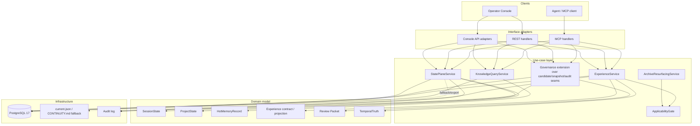

# Architecture: Agent Knowledge and Experience Layer

## 1. Project type and detection rationale

Engram here — brownfield **modular monolith**: Go server with REST API + MCP surface, promoted browser operator console, PostgreSQL 17 persistence, Docker deployment on remote host.

Evidence:
- server entry point — `cmd/engram-server/main.go`
- deployment/runtime shape — `docs/DEPLOYMENT.md`
- current product contract — `.agent/specs/memory-product-layer/prd.md`, `.agent/specs/memory-product-layer/spec.md`
- existing principal-memory architecture seam — `.agent/specs/principal-memory-query-domain-registry/architecture.md`

Detected application type:
- **REST API / MCP server** — primary system type
- **Web operator console** — first-class companion surface
- **PostgreSQL-backed stateful service** — persistence boundary matters

This is not greenfield. New architecture must coexist with and gradually demote existing running paths.

## 2. Legacy seam map

Gate answer — **YES**. Architecture coexists with an existing running system and replaces parts of its current behavior in-place.

### 2.1 Legacy unit public surface

| Surface | Current role | Evidence |
| --- | --- | --- |
| `.agent/session-state/current.json` | practical first-read resume oracle | `outputs/agent-memory-design.md` |
| `.agent/CONTINUITY.md` | human fallback for recovery/handoff | `outputs/agent-memory-design.provenance.md` |
| MCP `get_memory_brief` | project-scoped adaptive helper for delegation briefs | `internal/mcp/server.go`, `internal/mcp/tools_brief.go` |
| Existing memory query/mutation substrate | current hot-memory ownership/privacy surface | `.agent/specs/principal-memory-query-domain-registry/architecture.md` |
| Memory Lab row-centric operator UX | current governance interaction model | `apps/operator-console/i18n/locales/en.json` |

### 2.2 Full consumer list

| Consumer | Depends on legacy unit | Evidence |
| --- | --- | --- |
| Agent resume workflow | `current.json` / `CONTINUITY.md` for cheap recovery | `outputs/agent-memory-design.md` |
| MCP clients / subagent workflows | `get_memory_brief` for compact delegation context | `internal/mcp/server.go`, `internal/mcp/tools_brief.go` |
| Operator console memory workflows | row-centric Memory Lab copy and actions | `apps/operator-console/i18n/locales/en.json` |
| Existing memory/privacy/query flows | current principal/domain substrate remains base layer | `.agent/specs/principal-memory-query-domain-registry/architecture.md` |

### 2.3 Facade insertion point

Single insertion point — **shared use-case service layer behind MCP/REST handlers and operator-console adapters**.

Meaning:
- state reads/writes stop talking “filesystem oracle first” directly;
- brief/retrieval/governance flows stop hanging off helper-level seams directly;
- handlers call explicit services:
  - `StatePlaneService`
  - `KnowledgeQueryService`
  - `ExperienceService`
  - `ArchiveResurfacingService`
- memory-quality review and rollback paths should first extend existing candidate/snapshot/audit seams before introducing new governance workflow artifacts.

Strangler flavor — **module → strangler** inside the existing server. No new network hop.

### 2.4 Data stores

| Store | Current use | Future role |
| --- | --- | --- |
| PostgreSQL 17 | memories, rules, issues, docs, credentials | primary store for state, memory, experience, governance packets |
| Filesystem `.agent/session-state/current.json` | operational resume oracle | fallback/export cache only |
| Filesystem `.agent/CONTINUITY.md` | human continuity fallback | human-readable fallback only |

### 2.5 At-risk Hyrum behaviors

| Behavior | Risk |
| --- | --- |
| Resume is cheap because `current.json` is tiny and direct | native state plane must preserve cheap first read |
| `CONTINUITY.md` acts as operator-readable fallback | keep human fallback even after native state exists |
| `get_memory_brief` returns compact top-N scored snippets | principal-scoped successor must stay bounded, not row dump |
| Current Memory Lab implies row-by-row operator decisions | touched UI must migrate carefully; do not silently preserve old mental model |

## 3. Architecture diagram

## 4. Component map

| Component | Responsibility | Dependencies | Owner layer |
| --- | --- | --- | --- |
| `StatePlaneService` | Native read/write for session, goal, task, and project state; deterministic resume packet | Auth identity, PostgreSQL, audit log, filesystem fallback adapter | Use case |
| `KnowledgeQueryService` | Principal/domain/project-scoped hot memory queries and bounded briefs | Memory store, scope/privacy policy, retrieval scoring | Use case |
| `ExperienceService` | Retrieve/store contextualized historical experience via a first-class contract; V1 storage may begin as projection/materialization rather than dedicated tables | Existing evidence sources, archive service, applicability gate | Use case |
| `ApplicabilityGate` | Decide whether historical lesson applies, blocks, or downgrades | Current context, experience envelope, anti-applicability rules | Domain/use case |
| `Governance extension` | Forgetting taxonomy and review loop built atop existing candidate/snapshot/audit seams first | Candidate store, snapshot store, audit log, memory store | Use case |
| `ArchiveResurfacingService` | Trigger-gated archive lookup and bounded resurfacing packets | Archive index/store, trigger classifier, applicability gate | Use case |
| `DesignContractMap` | Machine-readable control/UX-to-backend wiring contract for touched operator surfaces | Designer artifact, PM review, scenario branches, REST/MCP/API map, honesty-state rules | Contract artifact |
| `Operator Console` | Human-facing state / knowledge / experience / packet surface | REST/console adapters, i18n, audit evidence, approved design contract | Interface adapter |
| `MCP handlers` | Tool surface for state, knowledge, brief, retrieval, governance | Use-case services, auth identity | Interface adapter |
| `REST handlers` | Browser/API surface for operator workflows | Use-case services, auth identity | Interface adapter |

## 5. Layer boundaries

### Entry layer

Validates input shape, auth, and caller scope. Must not decide:
- how resume packet is built,
- whether experience applies,
- whether archive may resurface,
- whether consolidation is structurally safe.
- what operator-facing control set exists; that comes from reviewed design contracts.

### Use-case layer

Owns system workflows:
- build deterministic resume packet,
- query principal knowledge,
- retrieve/store experience contract,
- classify forgetting actions,
- extend candidate/snapshot/audit seams into packet-centric review flows,
- invoke archive resurfacing only for named trigger classes.

### Domain layer

Owns invariants:
- state is not generic memory,
- experience is not atomic memory,
- anti-applicability can block reuse,
- archive is not hot retrieval,
- moderation queue is exception-only,
- consolidation cannot silently lose unique meaning.

### Infrastructure layer

Owns PostgreSQL persistence, legacy filesystem fallback/export, audit emission, and adapter-level serialization.

## 6. Data flow

### Happy path A — deterministic resume

1. Agent asks for current work state.
2. Entry layer authenticates caller and resolves project/session.
3. `StatePlaneService` reads native state tables.
4. Service builds one resume packet: freshness, drift/conflict, next action, next verification.
5. If native state absent or unreadable, service uses filesystem adapter as explicit fallback.
6. Response returns bounded packet, not broad file archaeology.

### Happy path B — principal knowledge query

1. Operator/agent requests principal/domain/project knowledge.
2. Entry layer validates widening and privacy scope.
3. `KnowledgeQueryService` fetches hot memory rows with indexed filters.
4. Optional bounded brief generation runs on scoped rows only.
5. Response returns attributed hot-memory result set and/or compact brief.

### Happy path C — experience retrieval

1. Caller asks historical/causal question or archive trigger fires.
2. Entry layer tags trigger class.
3. `ExperienceService` retrieves experience candidates.
4. `ApplicabilityGate` labels each candidate: applies / uncertain / blocked.
5. If trigger class allows archive search, `ArchiveResurfacingService` adds bounded historical context.
6. Response returns experience result plus applicability rationale.

### Happy path D — forgetting / consolidation governance

1. Operator or policy path identifies low-value / duplicate / risky knowledge.
2. Governance extension over existing candidate/snapshot/audit seams classifies operation: suppress / expire / archive / consolidate / destroy.
3. Safe low-risk actions auto-resolve with audit.
4. Risky consolidation or destructive cases emit bounded review packets to moderation queue.
5. Operator reviews packet, not raw rows.
6. Final decision updates stores and audit trail.

### Flow E — designer-contract gate for UI work

1. PM identifies touched operator-facing surface.
2. PM writes designer task with intended behavior and backend context.
3. Designer returns contract + wiring map + scenario branches.
4. PM runs thought experiment from operator seat across meaningful branches.
5. Only after scenario-proof contract exists does developer wire UI to server seams.
6. Missing or unusable contract blocks UI implementation.

### Error paths

- **Native state missing** → explicit fallback to filesystem, emit drift/fallback marker.
- **Cross-principal private widening** → fail closed.
- **Archive trigger absent** → archive path skipped.
- **Applicability blocked** → experience shown as blocked/warning, not auto-applied.
- **Structural-loss risk** → consolidation blocked and packet emitted.
- **Underfed telemetry** → sparse metric status, no fake completeness.

## 7. Data architecture

| Field | Content |
| --- | --- |
| Data owners | `StatePlaneService` owns state tables; `KnowledgeQueryService` owns hot-memory query projections over existing memories; `ExperienceService` owns the experience contract and may start with projection/materialization over existing evidence before dedicated storage exists; governance review flows extend existing candidate/snapshot/audit seams first; `ArchiveResurfacingService` owns archive index/lookup metadata; existing memory store remains owner of atomic memory rows. |
| Invariants | State records are distinct from generic memories. Experience contract preserves situation → decision → outcome → lesson semantics even if V1 storage is not a dedicated table family. Anti-applicability can block automatic reuse. Archive rows do not enter hot retrieval by default. Destroy is rare and policy-gated. Principal-private visibility stays fail-closed. |
| Migration shape | Expand-first. Add dedicated state tables first. Extend PMQ + adaptive brief seams for principal visibility. Extend candidate/snapshot/audit seams for review loop. Prove whether experience needs dedicated storage before committing to full parallel families. Introduce read path duality: native-first + filesystem fallback. Decommission filesystem primacy only after parity/proof. |
| Engine constraints | PostgreSQL 17 already deployed and primary system store. Existing Go server/runtime and operator-console deployment stay in place; no new service boundary needed. |
| Plan handoff | `nvmd-plan` must decide exact schemas, migration order, fallback parity tests, archive trigger enum, applicability envelope V1 fields, and rollback path when native state disagrees with filesystem fallback. |

### Proposed storage split

| Table family / store | Purpose |
| --- | --- |
| `session_state_records`, `project_state_records`, optional `assignment_state_records` | native handoff / resume truth |
| existing `memories` + retrieval projections | hot atomic memory |
| projection/materialized experience view first; later optional `experience_records` family if V1 proves distinct storage need | contextualized experience |
| archive metadata columns or dedicated archive index once trigger taxonomy stabilizes | archive/cold routing |
| existing candidate + snapshot + audit seams, optionally wrapped by new review packet projections | bounded moderation queue |
| `temporal_truth_records`, `temporal_truth_events` only if MPL-6 proves need | selected high-value evolving truths |

Architecture choice here:
- **dedicated parallel state-plane tables** — yes;
- **full parallel families for experience/governance/archive right now** — not yet proven.

Reason:
- state-plane reads need deterministic cheap shape;
- PMQ + adaptive brief seams already exist for principal knowledge;
- candidate/snapshot/audit seams already exist for review/governance;
- experience needs a distinct contract, but V1 storage may start as projection/materialization;
- temporal truth remains late and intentionally narrow.

## 8. Reusability awareness

Potential reusable components detected, but **no extraction now**:

| Candidate | Why reusable later | Current verdict |
| --- | --- | --- |
| `ApplicabilityGate` | Generic guard for historical-policy reuse across future agent products | Keep Engram-local until second consumer appears |
| `GovernancePacket` model | Portable exception-surface pattern for risky moderation decisions | Keep local; extraction premature |
| `StatePlaneService` resume packet contract | Likely reusable in future multi-agent/handoff systems | Keep local until stable V1 proven |
| `DesignContractMap` | Portable PM/designer/developer handoff artifact for backend-backed operator surfaces | Keep local until second UI-heavy consumer appears |

No library extraction in this architecture slice.

## 9. Domain modeling

DDD evaluation — **yes, light DDD worth it**.

Bounded contexts are distinct:
- **State Continuity** — session/goal/task/project handoff
- **Knowledge Retrieval** — hot memory, scoped query, briefs
- **Experience & Applicability** — historical trajectories and reuse guards
- **Governance & Forgetting** — review packets over candidate/snapshot/audit seams, consolidation, retention decisions
- **Temporal Truth** — selected evolving facts

Core entities / aggregates:
- `SessionState`
- `ProjectState`
- `HotMemoryRecord`
- `ExperienceContract`
- `ReviewPacket`
- `TemporalTruth`

Suggested next step — keep one modular monolith, but draw repository/service seams by bounded context now so later extraction stays possible without rewriting domain language.

## 10. Deployment strategy

Stay on current deployment topology:
- Go server remains single runtime entry point on `:37777`
- operator console remains promoted browser host proxied by worker
- PostgreSQL 17 remains single primary data store
- Docker/Unraid deployment unchanged at topology level

What changes:
- new tables and handlers inside current server
- new operator-console surfaces over existing proxy/browser host
- no new microservice, queue broker, or external graph DB in V1

Rollout shape:
1. add state tables + inert read/write seams,
2. ship native state read path behind explicit fallback,
3. extend PMQ + adaptive brief seams into principal knowledge + brief surfaces,
4. extend candidate/snapshot/audit seams into packet-centric review loop and touched-surface UX migration,
5. ship experience/applicability contract,
6. ship forgetting/consolidation atop the proven review loop,
7. ship selective temporal truth last.

## 11. ADRs

## ADR-001: Keep modular monolith deployment
**Status:** Accepted  
**Context:** Feature adds major new semantics, but existing deployment is already a Go server + browser console + PostgreSQL stack.  
**Decision:** Implement state, experience, archive, and governance inside the existing server as internal modules, not new network services.  
**Consequences:** Lower ops cost, easier transactional boundaries, simpler rollout. Less independent scaling.  
**Reversibility:** REVERSIBLE.

## ADR-002: Separate state plane from generic memory
**Status:** Accepted  
**Context:** Resume must be deterministic and cheap; generic memory retrieval is probabilistic and semantically different.  
**Decision:** Use dedicated state-plane table family and service layer.  
**Consequences:** Clear semantics, cheap reads, cleaner audit. More schema surface.  
**Reversibility:** PARTIALLY REVERSIBLE.

## ADR-003: Start with first-class experience contract, prove storage shape before dedicated tables
**Status:** Accepted  
**Context:** User requirement explicitly separates memory from experience, but current code proves only the need for a distinct retrieval/behavior contract, not yet a mandatory dedicated storage family. Existing repo evidence does not justify jumping straight to full parallel experience tables.  
**Decision:** Introduce a first-class experience contract now; allow V1 implementation to begin as projection/materialization over existing evidence, and promote to dedicated `ExperienceRecord` storage only if retrieval/workflow proof demands it.  
**Consequences:** Preserves the product boundary without overcommitting schema too early. Adds one proof step before full storage separation.  
**Reversibility:** REVERSIBLE.

## ADR-004: Trigger-gate archive retrieval
**Status:** Accepted  
**Context:** Always-on archive search would pollute hot path and increase cost/noise.  
**Decision:** Archive lookup runs only for named trigger classes and produces bounded resurfacing packets.  
**Consequences:** Hot path stays cheap. Need trigger taxonomy and logging.  
**Reversibility:** REVERSIBLE.

## ADR-005: Make moderation queue an exception surface by extending existing candidate/snapshot/audit seams first
**Status:** Accepted  
**Context:** Operator explicitly rejects row-by-row memory sorting as default workflow, but current code already has candidate tools, snapshot rollback, audit seams, and a dormant queue surface. Rebuilding governance from zero would duplicate existing substrate.  
**Decision:** Safe low-risk actions auto-resolve; risky or ambiguous cases emit review packets into moderation queue, built first as an extension over existing candidate/snapshot/audit seams.  
**Consequences:** Lower operator burden, stronger product posture, less duplicate implementation. Some legacy seams may need reshaping instead of replacement.  
**Reversibility:** PARTIALLY REVERSIBLE.

## ADR-006: Migrate touched UI away from row-centric semantics
**Status:** Accepted  
**Context:** Current copy (`Operator decides`, `keep this record in prompts`) encodes the wrong operator role.  
**Decision:** Any touched governance UI must move to packet/queue-centric interaction and honest state labels.  
**Consequences:** Better product truthfulness, but some transitional UI churn.  
**Reversibility:** REVERSIBLE.

## ADR-007: Defer temporal truth graph to the last milestone
**Status:** Accepted  
**Context:** Temporal truth is powerful but easy to overbuild into graph-first detour.  
**Decision:** Ship after state, knowledge, experience, and governance semantics stabilize.  
**Consequences:** Faster path to real product value. Delays time-travel features.  
**Reversibility:** REVERSIBLE.

## 12. Selected patterns and rationale

| Pattern | Why here |
| --- | --- |
| Modular monolith | Current deployment and data boundaries already favor in-process evolution |
| Clean Architecture | Needed to insert service-layer strangler between handlers/UI and legacy seams |
| Repository pattern | Lets state/experience/governance stores evolve independently |
| Strangler module seam | Replaces filesystem-first resume and helper-level governance incrementally |
| Event/provenance-backed audit | Required for risky forgetting, archive resurfacing, and state mutation traceability |
| Trigger-gated retrieval | Keeps archive/history out of ordinary hot path |
| Exception-surface moderation | Matches operator-light governance requirement |
| Designer-contract pipeline | Forces PM/designer/developer split and blocks hallucinated unusable UI |
| Scenario-driven UX proof | Forces operator-seat walkthrough before any UI wiring starts |

## 13. Open questions

1. Exact V1 `ExperienceRecord` schema.
2. Exact state packet schema and conflict markers.
3. Archive trigger taxonomy and logging contract.
4. Minimum applicability envelope fields.
5. Whether archive metadata lives in separate tables or tier columns first.

## 14. Evidence status table

| Decision | Status | Evidence |
| --- | --- | --- |
| Brownfield modular monolith | VERIFIED | `cmd/engram-server/main.go`, `docs/DEPLOYMENT.md` |
| Native state plane not live yet | VERIFIED | `pkg/cognitive/interfaces.go`, `pkg/cognitive/types.go`, grep results showing only noop/tests |
| `get_memory_brief` is project-scoped helper, not principal-first product primitive | VERIFIED | `internal/mcp/server.go`, `internal/mcp/tools_brief.go` |
| Existing candidate/snapshot/audit seams exist and should be extended before governance rebuild | VERIFIED | `internal/mcp/tools_candidates.go`, `internal/worker/service.go`, `apps/operator-console/composables/useOperatorOverview.ts` |
| Row-centric operator UX is stale target | VERIFIED | `apps/operator-console/i18n/locales/en.json` |
| Existing principal/domain substrate is valid base layer | VERIFIED | `.agent/specs/principal-memory-query-domain-registry/architecture.md` |
| Need separate experience contract | VERIFIED | `.agent/specs/memory-product-layer/prd.md`, user contract, `outputs/agent-memory-design.md` |
| Dedicated `ExperienceRecord` storage in V1 | INFERRED | Product direction is clear, but dedicated storage shape still needs proof |
| Full parallel families beyond state plane | INFERRED | State-plane split is justified; broader table-family split still needs plan-stage proof |
| Trigger-gated archive retrieval | VERIFIED | `.agent/specs/memory-product-layer/prd.md`, `outputs/agent-memory-design.md` |
| Moderation queue must be exception-only | VERIFIED | `.agent/specs/memory-product-layer/prd.md`, user contract |
