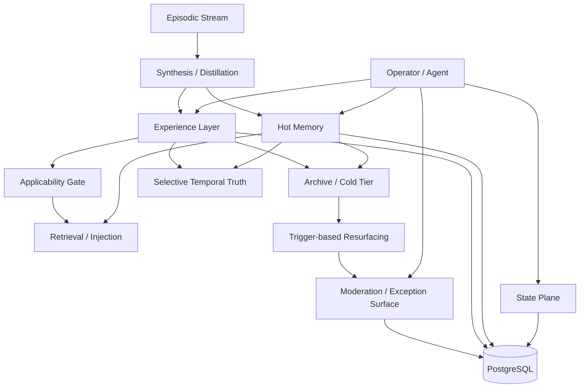

# Design: Agent Knowledge and Experience Layer

**Status:** DRAFT — product contract aligned to PRD
**Date:** 2026-06-28
**Author:** PM session
**Legacy slug:** `memory-product-layer` retained for continuity

**Seed sources:**
- `.agent/specs/memory-product-layer/prd.md`
- `.agent/specs/memory-product-layer/milestone-map.md`
- `outputs/agent-memory-design.md`
- `outputs/agent-memory-design.provenance.md`
- `.agent/specs/principal-memory-query-domain-registry/architecture.md`
- `pkg/cognitive/interfaces.go`
- `internal/mcp/tools_brief.go`
- `apps/operator-console/i18n/locales/en.json`

---

## 1. Purpose

Turn Engram from a memory substrate into a full **agent knowledge and experience layer**.

The target is broader than memory governance alone. The system must separate:
- native state and resume truth,
- episodic traces,
- semantic memory,
- contextualized experience,
- applicability and anti-applicability,
- archive/cold retrieval,
- selective temporal truth,
- bounded operator moderation.

The operator still needs a control surface, but must not become a human garbage collector for memory rows.

## 2. Product framing

This feature keeps the historical slug `memory-product-layer`, but the actual product frame is now:

> **Agent Knowledge and Experience Layer** — the Engram-native system that decides what the agent carries forward, what it forgets, what it archives, what past experience applies here, and how work resumes cheaply after interruption.

That means the epic is no longer just:
- inspect memory,
- suppress noise,
- generate briefs.

It is now:
- resume from native state,
- inspect principal-scoped knowledge,
- retrieve contextualized experience,
- apply bounded moderation only on risky cases,
- forget or consolidate safely,
- preserve high-value changing truths over time.

## 3. Core design rules

### 3.1 State is not memory

Session / goal / task / project handoff must live in a dedicated state plane. Resume should not depend on broad filesystem archaeology.

### 3.2 Experience is not memory

A memory can be an atomic fact, rule, preference, or observation. An experience is a contextualized trajectory: situation, action/decision, outcome, revision, lesson, applicability, and anti-applicability.

### 3.3 Archive-first, not delete-first

Historical value should leave the hot path before it is destroyed. Destroy remains rare and policy-gated.

### 3.4 Applicability before reuse

Past knowledge must not auto-apply by semantic similarity alone. The system needs explicit applicability and anti-applicability checks.

### 3.5 Moderation is exception-only

Operator review belongs on bounded packets and risky cases, not on raw row sludge.

### 3.6 No fake controls

If a server seam is absent, the UI must say `mustbuild` or equivalent. No pretend-live product surface.

## 4. Architecture layers

## 5. Layer responsibilities

### 5.1 State Plane

Purpose: cheap, deterministic handoff and resume.

Responsibilities:
- session / goal / task / project state records
- deterministic resume packet
- freshness markers
- drift/conflict flags
- exact next action and next verification step
- audit trail for state mutation

### 5.2 Episodic Stream

Purpose: raw traces used for synthesis and audit, not prompt injection.

Responsibilities:
- transcripts
- tool outcomes
- attention events
- session traces
- provenance for later consolidation / experience extraction

### 5.3 Hot Memory

Purpose: bounded retained knowledge for active retrieval and injection.

Responsibilities:
- atomic facts, preferences, constraints, stable lessons
- principal/domain/project/privacy scoping
- usefulness ranking
- suppression / expiry / archive routing

### 5.4 Experience Layer

Purpose: retain contextualized historical lessons that span time and revision.

Responsibilities:
- `ExperienceRecord`
- situation / decision / outcome / reversal / lesson
- applicability envelope
- anti-applicability conditions
- separate retrieval contract from hot memory

### 5.5 Archive / Cold Tier

Purpose: preserve value without polluting normal hot-path retrieval.

Responsibilities:
- archived memory and experience
- trigger-based resurfacing only
- bounded archive packet output
- explicit rationale for why archive was searched

### 5.6 Moderation / Exception Surface

Purpose: bounded operator governance.

Responsibilities:
- policy decision packets
- risky consolidation packets
- archive resurfacing packets
- rare escalation packets
- queue SLO and bounded backlog

### 5.7 Selective Temporal Truth

Purpose: preserve high-value evolving truths without graphifying everything.

Responsibilities:
- validity windows
- invalidation history
- provenance-first “true now vs true then” retrieval
- narrow scope: only selected high-value changing facts

## 6. Current seam classification

| Surface | Status | Evidence | Meaning |
| --- | --- | --- | --- |
| Principal/domain memory substrate | live | `.agent/specs/principal-memory-query-domain-registry/architecture.md` | Good base for scoped memory inspection. |
| Retrieval / injection / feedback / decay seeds | live | `outputs/agent-memory-design.provenance.md` | Ranking substrate exists; not a finished product loop. |
| `StateWriter` | must-build | `pkg/cognitive/interfaces.go` | Interface exists; live primary state plane does not. |
| `get_memory_brief` | partial / legacy helper | `internal/mcp/tools_brief.go` | Project-scoped adaptive helper, not principal-first product surface. |
| Row-centric Memory Lab operator copy | stale target | `apps/operator-console/i18n/locales/en.json` | Old interaction model must be migrated away. |
| ExperienceRecord | must-build | PRD + research only | No first-class experience layer yet. |
| Applicability / anti-applicability | must-build | PRD + research only | No bounded gate yet. |
| Archive trigger taxonomy | must-build | PRD + research only | Archive is not yet a disciplined product path. |
| Selective temporal truth | must-build | PRD + research only | Explicitly deferred late. |

## 7. Main product flows

### Flow A — Deterministic resume

Agent resumes → reads native state packet first → sees freshness marker, drift/conflict flags, exact next action, exact next verification → uses filesystem only as fallback/export.

### Flow B — Principal knowledge inspection

Operator selects principal/domain/project → Engram returns scoped memory and summary surfaces → operator sees what is hot, archived, experiential, or blocked by privacy.

### Flow C — Experience retrieval

Agent/operator asks a historical or causal question → system uses experience contract, not hot-memory contract → returns what happened, why it changed, and where applicability is uncertain.

### Flow D — Safe forgetting / consolidation

Policy or review surface identifies low-value or duplicate knowledge → system suppresses / expires / archives automatically when safe → escalates only risky consolidation or destructive cases.

### Flow E — Archive resurfacing

A trigger class fires (`why did we change this`, regression, rollback, old decision revisit, similar prior failure) → archive search runs in bounded mode → `Archive Resurfacing Packet` explains why history was searched and why applicability is or is not strong.

## 8. Milestone mapping

### MPL-1 — Native State Plane

Ship first. Everything later gets cheaper if resume stops depending on file archaeology.

### MPL-2 — Principal Memory Explorer + Briefs

Visibility before mutation. Show what a principal knows/carries. Make briefs real and scoped.

### MPL-3 — Usefulness / Noise Review Loop

Move operator from row sorting to packet/queue governance.

### MPL-4 — Experience + Applicability Layer

Bound this tightly. V1 is heuristic and explicit, not learned and magical.

### MPL-5 — Forgetting / Consolidation

Only after visibility, briefs, and exception-surface semantics are real.

### MPL-6 — Selective Temporal Truth Graph

Last. Narrow scope. No full graphification detour.

## 9. V1 scoping guard for MPL-4

To avoid research-swamp drift, MPL-4 V1 must include:
- first-class experience contract
- explicit applicability envelope
- explicit anti-applicability fields
- bounded archive resurfacing packet
- separate retrieval contract
- dedicated `ExperienceRecord` storage only if proof warrants it

MPL-4 V1 must exclude:
- learned applicability model
- broad graph projection
- universal historical search on every request
- opaque “mental model” automation without audit

## 10. Operator-console migration rule

Touched UI must migrate away from row-centric language such as:
- `Operator decides`
- `keep this record in prompts`
- `hide as noise`

Target interaction model:
- inspect state / knowledge / experience,
- receive bounded packets,
- approve risky changes,
- let safe low-value handling auto-resolve,
- see evidence of effect.

## 11. Testing direction

The epic needs proof at three levels:
- state-plane tests for deterministic resume
- scope/privacy tests for principal memory and brief surfaces
- experience/applicability tests for historical reuse boundaries
- moderation/packet tests for risky cases
- browser smoke for touched operator-facing flows

## 12. Open design questions for architecture

1. Should the state plane live in a dedicated store/table family or be layered onto the existing memory store with hard type boundaries?
2. What minimum fields make an `ExperienceRecord` worth persistence?
3. Which forgetting modes are fully automatic by default, and which escalate?
4. Which exact trigger classes may invoke archive retrieval automatically?
5. What is the minimal applicability envelope for V1 that actually blocks bad reuse?

## 13. Recommended direction

Proceed under the **Agent Knowledge and Experience Layer** frame.

Meaning:
1. keep `memory-product-layer` as legacy slug only,
2. architect the real system as state + memory + experience + archive + exception surface,
3. do not let implementation collapse back into a narrower “memory governance only” epic.
