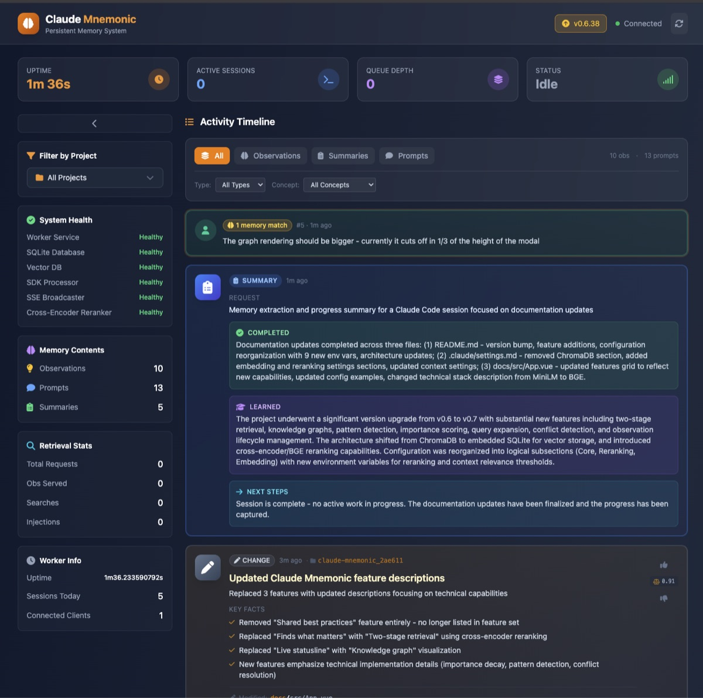

# Claude Mnemonic

**Give Claude Code a memory that actually remembers.**

[](https://github.com/lukaszraczylo/claude-mnemonic/releases)
[](LICENSE)
[](https://go.dev)

---

Claude Code forgets everything when your session ends. Claude Mnemonic fixes that.

It captures what Claude learns during your coding sessions - bug fixes, architecture decisions, patterns that work - and brings that knowledge back in future conversations. No more re-explaining your codebase.



## What's New in v0.7

- **Two-Stage Retrieval** - Cross-encoder reranking for dramatically improved search relevance
- **Knowledge Graph** - Automatic relationship detection between observations with visual graph in dashboard
  
- **Pattern Detection** - Identifies recurring patterns across sessions and projects
- **Importance Scoring** - Time decay and voting system to surface the most valuable memories
- **Query Expansion** - Reformulates searches to find semantically related content
- **Conflict Detection** - Identifies and resolves contradictory observations
- **Observation Lifecycle** - Memories can be superseded when better information arrives

<details>
<summary>Previous: v0.6</summary>

- **Auto-Updates** - Automatically stays up-to-date with the latest version
- **Slash Command: `/restart`** - Restart the worker directly from Claude Code
- **Local Embeddings** - All semantic search runs locally via ONNX Runtime (no external API calls)
- **Async Queue Processing** - Non-blocking observation capture for faster sessions
- **Smarter Storage** - Filters out system/agent summaries to keep knowledge relevant
- **Improved Reliability** - Better handling of connectivity issues and dead connections
</details>

## Requirements

| Dependency | Required | Purpose |
|------------|----------|---------|
| **Claude Code CLI** | Yes | Host application (this is a plugin) |
| **jq** | Yes | JSON processing during installation |

That's it. No Python. No external services. Everything runs locally.

> **No API keys needed!** Claude Mnemonic uses Claude Code CLI, which works with your existing Claude Pro or Max subscription. No separate API costs.

## Install

**One command. That's it.**

```bash
curl -sSL https://raw.githubusercontent.com/lukaszraczylo/claude-mnemonic/main/scripts/install.sh | bash
```

<details>
<summary>Windows (PowerShell)</summary>

```powershell
irm https://raw.githubusercontent.com/lukaszraczylo/claude-mnemonic/main/scripts/install.ps1 | iex
```
</details>

<details>
<summary>Build from source</summary>

```bash
git clone https://github.com/lukaszraczylo/claude-mnemonic.git
cd claude-mnemonic
make build && make install
```

Requires: Go 1.24+, Node.js 18+, CGO-compatible compiler
</details>

After install, open **http://localhost:37777** to see the dashboard. Start a new Claude Code session - memory is now active.

### Verifying Release Signatures

All release checksums are signed with [cosign](https://github.com/sigstore/cosign) using keyless signing. To verify:

```bash
# Download the checksum file and its sigstore bundle from the release
cosign verify-blob \
  --certificate-identity-regexp "https://github.com/lukaszraczylo/claude-mnemonic/.*" \
  --certificate-oidc-issuer "https://token.actions.githubusercontent.com" \
  --bundle "checksums.txt.sigstore.json" \
  checksums.txt
```

## What it does

| Feature | Description |
|---------|-------------|
| **Persistent Memory** | Observations survive across sessions and restarts |
| **Project Isolation** | Each project has its own knowledge base |
| **Global Patterns** | Best practices are shared across all projects |
| **Semantic Search** | Find relevant context with natural language (local embeddings) |
| **Live Statusline** | Real-time metrics in Claude Code: `[mnemonic] ● served:42 | project:28 memories` |
| **Web Dashboard** | Browse and manage memories at `localhost:37777` |
| **Auto-Updates** | Automatically downloads and applies new versions |
| **Slash Commands** | Control the worker directly from Claude Code |

### How knowledge flows

```
You code with Claude
        ↓
Claude learns something useful
        ↓
Mnemonic captures it automatically
        ↓
Next session: Claude remembers
```

Behind the scenes: hooks capture Claude's observations → SQLite stores with full-text search → sqlite-vec enables semantic search with local embeddings (all-MiniLM-L6-v2) → relevant context is injected at session start.

## Configuration

Config file: `~/.claude-mnemonic/settings.json`

```json
{
  "CLAUDE_MNEMONIC_WORKER_PORT": 37777,
  "CLAUDE_MNEMONIC_CONTEXT_OBSERVATIONS": 100,
  "CLAUDE_MNEMONIC_CONTEXT_FULL_COUNT": 25,
  "CLAUDE_MNEMONIC_RERANKING_ENABLED": true
}
```

### Core Settings

| Variable | Default | What it does |
|----------|---------|--------------|
| `WORKER_PORT` | `37777` | Dashboard & API port |
| `CONTEXT_OBSERVATIONS` | `100` | Max memories per session |
| `CONTEXT_FULL_COUNT` | `25` | Full detail memories (rest are condensed) |
| `CONTEXT_SESSION_COUNT` | `10` | Recent sessions to reference |
| `CONTEXT_RELEVANCE_THRESHOLD` | `0.3` | Minimum similarity score (0.0-1.0) for inclusion |
| `CONTEXT_MAX_PROMPT_RESULTS` | `10` | Max results per prompt search |

### Reranking Settings (Two-Stage Retrieval)

| Variable | Default | What it does |
|----------|---------|--------------|
| `RERANKING_ENABLED` | `true` | Enable cross-encoder reranking |
| `RERANKING_CANDIDATES` | `100` | Candidates to retrieve before reranking |
| `RERANKING_RESULTS` | `10` | Final results after reranking |
| `RERANKING_ALPHA` | `0.7` | Score blend: alpha×rerank + (1-alpha)×original |
| `RERANKING_PURE_MODE` | `false` | Use pure cross-encoder scores only |

### Embedding Settings

| Variable | Default | What it does |
|----------|---------|--------------|
| `EMBEDDING_MODEL` | `bge-v1.5` | Embedding model for semantic search |

All variables are prefixed with `CLAUDE_MNEMONIC_` in the config file.

## Project vs Global scope

Observations are automatically scoped:

- **Project scope** (default) - stays within the project directory
- **Global scope** - shared everywhere

Global scope triggers on tags like: `best-practice`, `security`, `architecture`, `pattern`, `performance`

Example: A bug fix in your auth module stays local. "Always validate JWT server-side" goes global.

## MCP Tools

These search tools are available via MCP:

- `search` - semantic search across all memories
- `timeline` - browse by time
- `decisions` - find architecture decisions
- `changes` - find code modifications
- `how_it_works` - system understanding queries

## Slash Commands

Available commands within Claude Code:

| Command | Description |
|---------|-------------|
| `/restart` | Restart the worker process when experiencing issues |

## Auto-Updates

Claude Mnemonic automatically checks for updates and applies them. Updates are downloaded in the background and applied on restart.

- Automatic update checks on startup
- Background downloads (up to 250MB)
- Seamless restart after update
- Manual trigger: `curl -X POST http://127.0.0.1:37777/api/update/apply`

Check update status: `curl http://127.0.0.1:37777/api/update/status`

## Troubleshooting

**Worker won't start?**
```bash
lsof -i :37777              # check if port is in use
cat /tmp/claude-mnemonic-worker.log  # view logs
```

**Database locked?**
```bash
rm -f ~/.claude-mnemonic/*.db-wal ~/.claude-mnemonic/*.db-shm
```

**Worker unresponsive?**
```bash
# Restart via API
curl -X POST http://127.0.0.1:37777/api/restart

# Or use the slash command in Claude Code
/restart
```

**Check health status:**
```bash
curl http://127.0.0.1:37777/api/selfcheck
```

## Uninstall

```bash
# Remove everything
curl -sSL https://raw.githubusercontent.com/lukaszraczylo/claude-mnemonic/main/scripts/uninstall.sh | bash

# Keep your data
curl -sSL https://raw.githubusercontent.com/lukaszraczylo/claude-mnemonic/main/scripts/uninstall.sh | bash -s -- --keep-data
```

## Architecture

- **SQLite + FTS5** - Full-text search for exact matches
- **sqlite-vec** - Vector database embedded in SQLite
- **Two-Stage Retrieval** - Bi-encoder (embedding) + cross-encoder (reranking) for high accuracy
- **Local Models** - all-MiniLM-L6-v2 for embeddings, BGE reranker for relevance scoring
- **Go** - Single binary, no external dependencies

Everything runs locally. No Python. No external vector database. No API calls.

## Platform support

| Platform | Status |
|----------|--------|
| macOS Intel | Supported |
| macOS Apple Silicon | Supported |
| Linux amd64 | Supported |
| Linux arm64 | Supported |
| Windows amd64 | Supported |

## Development

```bash
make build          # build all
make test           # run tests
make dev            # dev mode with hot reload
make install        # install to Claude plugins
```

## License

MIT

---

**Links:** [Releases](https://github.com/lukaszraczylo/claude-mnemonic/releases) · [Issues](https://github.com/lukaszraczylo/claude-mnemonic/issues)
