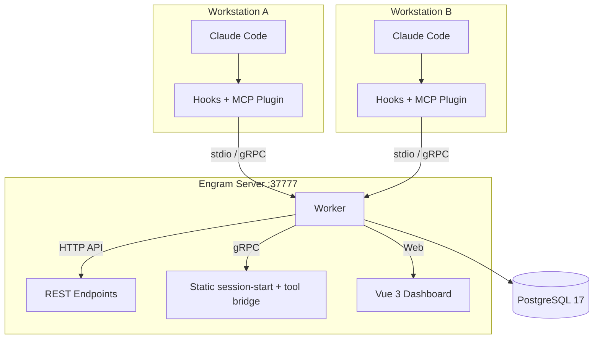

<!-- redoc:start:header -->
<p align="center">
  
</p>

[English](README.md) | **Русский** | [中文](README.zh.md)

[](https://go.dev/)
[](https://www.postgresql.org/)
[](https://www.docker.com/)
[](https://github.com/thebtf/engram/actions/workflows/docker-publish.yml)
[](LICENSE)
<!-- redoc:end:header -->

<!-- redoc:start:intro -->
# Engram

**Инфраструктура персистентной общей памяти для AI-агентов программирования.**

AI-агенты программирования забывают всё между сессиями. Каждый новый разговор начинается с нуля — прошлые решения, исправления багов, архитектурные выборы и выученные паттерны теряются. Вы тратите время на повторное объяснение контекста, а агенты повторяют одни и те же ошибки.

Engram решает эту проблему, оставляя только те примитивы памяти, которые реально работали в продакшене: явные issues, documents, memories, behavioral rules, credentials и API tokens. Один сервер, несколько рабочих станций, ноль потерь контекста.

В v5.0.0 session-start inject был упрощён до статического composite payload: открытые issues, always-inject behavioral rules и recent memories. Старый динамический relevance / graph / reranking / extraction stack ушёл с основного продуктного пути.

После этого ветка v6 достроила governance поверх стабильного ядра: per-workstation keycards, proposal-only rule arbiter, bounded session-start rule router и rule-governance telemetry / rollback controls. Горячий путь по-прежнему детерминированный — без LLM на session-start — но durable guidance теперь можно проверять и откатывать.
<!-- redoc:end:intro -->

---

<!-- redoc:start:whats-new -->
## Что нового

| Версия | Основное изменение |
|--------|-------------------|
| **Кандидат v6.50.1** | **Operator Workspace (Feature 011 D-A)** — путь Home → Workspace для настроенного однопользовательского HTTP LAN с отключённой авторизацией. Проверки исходников не подтверждают установку; см. [руководство оператора](docs/operating-engram.md). |
| **v6.38.0** | **V7 Meta-memory Discovery (ENG-V7-S2)** — content-free MCP-инструмент `know_about`, S2 `CandidateProposer` и session-start `meta_summary` за v7-флагами. |
| **v6.37.0** | **V7 State Subsystem (ENG-V7-S1)** — v7-адаптер `StateWriter` и усиленная проверка bounded native state resume. |
| **v6.32.0** | **Usefulness / Noise Review Loop (CR-008, MPL-3)** — packet-centric bounded review queue с явными empty/gated/error/sparse состояниями, раздельные preview/apply, атомарный snapshot+audit-backed suppress/preserve, честные метрики. |
| **v6.31.0** | **Native State Plane + Principal Explorer (CR-006 + CR-007, MPL-1/2)** — Engram-native session/goal/task/project state plane с детерминированным resume packet; principal/domain/project memory explorer + principal-scoped briefs; hardening контракта CR-005. |
| **v6.30.0** | **Agent Knowledge & Experience Layer foundations (ENG-MPL-1)** — native state plane, principal briefs, packet-centric review loop, first-class experience retrieval с applicability gates, forgetting taxonomy и selective temporal truth контракты. |
| **v6.29.0** | **Rule Governance Telemetry (RG-3)** — lifecycle health, exception queues, transition controls, rollback-aware snapshots и usefulness telemetry поверх rule-governance milestones. |
| **v5.0.0** | Cleaned Baseline — static-only storage, split observations, session-start gRPC + cache fallback |
| **v4.4.0** | Loom tenant — background task execution и daemon-side project event bridge |
| **v4.0.0** | Daemon architecture — muxcore engine, gRPC transport, local persistent daemon, auto-binary plugin |

Полный список изменений — в разделе [Releases](https://github.com/thebtf/engram/releases).

### Режим авторизации

Текущий однопользовательский путь использует `ENGRAM_AUTH_DISABLED=true` на сервере и настроенный HTTP LAN origin. Для него не нужны вход в браузер, выпуск keycard, браузерные grants, HTTPS или обратный прокси. Используйте только доверенную сеть. В режиме с авторизацией разделение операторского токена и workstation keycard, браузерная личность и явные права чтения сохраняются; этот режим пока не входит в данное руководство по Workspace. Не передавайте операторский токен на рабочую станцию.

Для кодового Workspace используйте [инструкцию по настройке и проверке F1–F7](docs/operating-engram.md). Текущие MCP-инструменты `codebase_*` работают через UCI. Остальные разделы этого перевода не заменяют английскую документацию по старым возможностям.
<!-- redoc:end:whats-new -->

---

<!-- redoc:start:architecture -->
## Архитектура

Единый сервер на порту `37777` обслуживает HTTP REST API, gRPC-сервис (через cmux), Vue 3 dashboard и статическую surface хранения/чтения. Каждая рабочая станция запускает локальный daemon, который подключается к серверу по gRPC. Несколько сессий Claude Code делят один daemon.


```mermaid
graph TB
    subgraph "Workstation A"
        CC_A[Claude Code]
        H_A[Hooks + MCP Plugin]
        CC_A --> H_A
    end

    subgraph "Workstation B"
        CC_B[Claude Code]
        H_B[Hooks + MCP Plugin]
        CC_B --> H_B
    end

    H_A -- "stdio / gRPC" --> Server
    H_B -- "stdio / gRPC" --> Server

    subgraph "Engram Server :37777"
        Server[Worker]
        Server --> |HTTP API| API[REST Endpoints]
        Server --> |gRPC| GRPC[Static session-start + tool bridge]
        Server --> |Web| Dash["Vue 3 Dashboard"]
    end

    Server --> PG[(PostgreSQL 17)]
```

**Сервер** (Docker на удалённом хосте / Unraid / NAS):
- PostgreSQL 17
- Worker — HTTP API, gRPC, Vue 3 dashboard, static entity stores

**Клиент** (каждая рабочая станция):
- Hooks — session-start, session-end и связанные Claude Code lifecycle integrations
- MCP Plugin — подключает Claude Code к локальному daemon / server bridge
- Slash-команды — `/setup`, `/doctor`, `/restart` и memory-related workflows
<!-- redoc:end:architecture -->

---

<!-- redoc:start:features -->
## Возможности

### Поиск и извлечение
- **Static session-start payload** — issues + behavioral rules + memories через gRPC `GetSessionStartContext`
- **Project-scoped memory recall** — простой SQL-backed retrieval для static memories
- **Document search** — versioned documents и collection-backed search остаются доступны

### Хранение и организация
- **Memories** — явные project-scoped notes в таблице `memories`
- **Behavioral rules** — always-inject guidance в таблице `behavioral_rules`
- **Версионные документы** — коллекции с историей и комментариями
- **Зашифрованное хранилище** — AES-256-GCM шифрование учётных данных с разграничением доступа
- **Cross-project issues** — явная operational coordination между агентами и проектами

### Устойчивость и эксплуатация
- **Session-start cache fallback** — `${ENGRAM_DATA_DIR}/cache/session-start-{project-slug}.json` используется при временной недоступности сервера
- **Version negotiation** — явная проверка major-version compatibility на session-start path
- **Горячая перезагрузка конфигурации** — изменение настроек без перезапуска
- **Graceful daemon restart** — сохраняется binary swap и control socket flow

### Dashboard и UX
- **Vue 3 dashboard** — сфокусирован на surviving static entity surface
- **Lifecycle hooks** — session-start / session-end и связанные integrations остаются установленными
- **Multi-workstation support** — один сервер, несколько локальных daemon’ов, общая static memory surface
<!-- redoc:end:features -->

---

<!-- redoc:start:use-cases -->
## Сценарии использования

- **Непрерывность контекста** — начните новую сессию и автоматически получите релевантные решения, паттерны и предыдущую работу
- **Архитектурная память** — запросите прошлые дизайн-решения перед принятием новых
- **Осведомлённость перед редактированием** — проверьте, что известно о файле, прежде чем его изменять
- **Обнаружение паттернов** — выявление повторяющихся паттернов между сессиями и рабочими станциями
- **Обмен знаниями в команде** — несколько рабочих станций используют один сервер памяти
- **Управление учётными данными** — хранение и извлечение API-ключей и секретов без .env-файлов
- **Ретроспективы сессий** — анализ прошлых сессий для выявления инсайтов по продуктивности
<!-- redoc:end:use-cases -->

---

<!-- redoc:start:quick-start -->
## Быстрый старт

Для локального Compose-стека нужны Docker с Compose и пароль PostgreSQL. Для однопользовательского HTTP LAN задайте `ENGRAM_AUTH_DISABLED=true` в `.env`. Три имени образов и версия сборки обязательны даже при сборке из исходников:

```bash
git clone https://github.com/thebtf/engram.git
cd engram
cp .env.example .env
commit=$(git rev-parse HEAD)
cat >> .env <<EOF
ENGRAM_SERVER_IMAGE=engram-local-server
ENGRAM_OPERATOR_IMAGE=engram-local-operator-console
ENGRAM_POSTGRES_IMAGE=engram-local-postgres
ENGRAM_BUILD_VERSION=sha-$commit
EOF
# Перед запуском задайте POSTGRES_PASSWORD и ENGRAM_AUTH_DISABLED=true в .env.
docker compose up -d --build
docker compose ps
```

Стек запускает PostgreSQL 17 с pgvector, сервер на `WORKER_PORT` (по умолчанию `37777`) и отдельную консоль на `OPERATOR_CONSOLE_PORT` (по умолчанию `3000`). Для развёртывания только из опубликованных образов используйте три digest-идентификатора и проверку публикации из [руководства по развёртыванию](docs/DEPLOYMENT.md), а не этот исходный build.

Проверьте ответ HTTP-процесса и готовность сервиса отдельно:

```bash
curl -fsS http://localhost:37777/health
curl -fsS http://localhost:37777/api/ready
docker compose logs --tail=100 server
```

Если изменили `WORKER_PORT`, используйте новый порт. Эти проверки не подтверждают работу плагина или готовность кодового индекса.

Затем установите плагин в Claude Code:

```
/plugin marketplace add thebtf/engram-marketplace
/plugin install engram
```

Задайте рабочей станции `ENGRAM_URL` как настроенный адрес сервера без `/mcp`; для `ENGRAM_AUTH_DISABLED=true` токен не нужен:

```bash
export ENGRAM_URL=http://your-server:37777
```

Для нового Git-репозитория из его корня выполните `engram project init --name "Example Workspace"` **без подключения к серверу**. Затем явно выполните `git add -- .engram-project` и `git commit -m "Initialize Engram project anchor"`. Инициализация не добавляет файл в Git. Не заменяйте старый маркер: новая регистрация Source не переносит прежние memories и issues. Установленный плагин подключайте отдельно от старого клиента памяти.

1. Настройте `ENGRAM_URL` как HTTP LAN-адрес сервера **без** `/mcp`. Для выбранного режима `ENGRAM_AUTH_DISABLED=true` токен, keycard, вход в браузер, grants, HTTPS и прокси не нужны. В новой обычной агентской сессии проверьте наличие шести инструментов: `codebase_context`, `codebase_index`, `codebase_status`, `codebase_search`, `codebase_graph`, `codebase_read`.
2. В копии A вызовите `codebase_context` с `{"action":"register","source_label":"my-repository","locator":"file:///absolute/local/worktree-A"}`. Сохраните **выданный** `source_id` и `context_handle`. Для копии B вызовите `{"action":"register","source_id":"<source_id из ответа A>","locator":"file:///absolute/local/worktree-B"}`. Пути принадлежат локальному daemon; не вводите их в браузер. Не угадывайте идентификаторы.
3. Для каждой копии вызовите `codebase_status` с её `context_handle`, затем `codebase_index` с `{"context_handle":"<выданный handle нужной копии>"}`. Ответ содержит `run_id`, а **не** готовый View. Следите за результатом через daemon-side `codebase_status` с `{"context_handle":"<handle>","after_barrier":{"token":"<run_id>","wait_ms":5000}}`. Дождитесь публикации View и готовности кодовых эмбеддингов. Провайдер `ENGRAM_EMBEDDING_URL` укажите базовым URL (допустим суффикс `/v1`), а `ENGRAM_EMBEDDING_MODEL` должен выдавать 1536-мерные векторы. Если job завершился ошибкой, проверьте её код, провайдер и установленную модель; старый опубликованный View не заменяйте.
4. На настроенном HTTP LAN-адресе консоли откройте **Обзор → Рабочее место**. Выберите **Репозиторий → Рабочая копия → Снимок индекса** и нажмите **Закрепить выбранный View**. При одинаковых именах выбирайте репозиторий по числу индексированных копий, а копию по числу снимков. Для пустой копии используйте доступное **Индексировать копию**, затем обновите варианты и отдельно закрепите опубликованный снимок. В интерфейсе проверьте свежесть, покрытие, число готовых эмбеддингов и состояние job. Общее состояние сервера не означает готовность выбранного View.
5. Задайте смысловой запрос без имени известной функции. В результатах проверьте режим `vector` или `hybrid`: `lexical` означает деградацию, а не доказательство семантики. Откройте **Факты графа**, выберите прямую или обратную связь, проверьте тип и точность доказательства, нажмите **Прочитать исходник** для того же закреплённого снимка. Отсутствие динамической связи не доказывает отсутствие зависимости; Go проверен отдельно от JS, TS и TSX, которым нужен установленный совместимый parser bundle. Доступность чтения текста не доказывает граф для языка.
6. Откройте копию B в другой вкладке и закрепите её View. После изменения A обновите её варианты: старый снимок остаётся в первой вкладке до явного перехода к новому, B не должна измениться. После перезагрузки каждой вкладки проверьте отображаемую копию и снимок заново. Если появится «Ожидается reload», прежняя lease ещё активна: закройте прежний документ или дождитесь её истечения и нажмите **Повторить привязку вкладки**. Не используйте UUID из другой вкладки. Подробная диагностика, безопасный откат и проверка установки — в [руководстве оператора](docs/operating-engram.md).
<!-- redoc:end:quick-start -->

---

<!-- redoc:start:installation -->
## Установка

### Установка плагина (рекомендуется)

Плагин автоматически регистрирует MCP-сервер, hooks и slash-команды.

```bash
export ENGRAM_URL=http://your-server:37777
```

```
/plugin marketplace add thebtf/engram-marketplace
/plugin install engram
```

Перезапустите Claude Code и проверьте список MCP-инструментов в новой сессии. Установка плагина не подтверждает готовность сервера, парсера, кодовых embeddings и Workspace; порядок проверки описан в [руководстве оператора](docs/operating-engram.md).

### Docker Compose

Для локальной сборки используйте команды из [быстрого старта](#быстрый-старт). `docker compose up -d` без обязательных `ENGRAM_SERVER_IMAGE`, `ENGRAM_OPERATOR_IMAGE`, `ENGRAM_POSTGRES_IMAGE` и `ENGRAM_BUILD_VERSION` не запускает стек. Для выбранного однопользовательского режима задайте `POSTGRES_PASSWORD` и `ENGRAM_AUTH_DISABLED=true`; операторский токен нужен только режиму с авторизацией.

Для опубликованных образов укажите три digest-идентификатора из манифеста релиза и запустите [проверку и pull-only развёртывание](docs/DEPLOYMENT.md#immutable-image-selection). Если PostgreSQL уже развёрнут отдельно, задайте `DATABASE_DSN` для сервера и проверьте соответствие собственной конфигурации вместо слепого запуска только `server`: Compose-файл содержит зависимость от сервиса `postgres`.

### Binary Installation (v4+)

Скачайте binary daemon из [GitHub Releases](https://github.com/thebtf/engram/releases):

```bash
# Linux (amd64)
curl -L https://github.com/thebtf/engram/releases/latest/download/engram-linux-amd64 -o engram
chmod +x engram && sudo mv engram /usr/local/bin/

# macOS (Apple Silicon)
curl -L https://github.com/thebtf/engram/releases/latest/download/engram-darwin-arm64 -o engram
chmod +x engram && sudo mv engram /usr/local/bin/

# Windows (amd64) — скачайте engram-windows-amd64.exe и добавьте в PATH
```

Затем задайте:

```bash
export ENGRAM_URL=http://your-server:37777
```

Проверка: `echo '{"jsonrpc":"2.0","id":1,"method":"ping"}' | engram`

### Ручная настройка MCP

Если плагин не используется, настройте локальный `engram` как stdio-процесс в конфигурации agent host. Передайте `ENGRAM_URL` как origin сервера; для `ENGRAM_AUTH_DISABLED=true` workstation keycard не нужен. Не добавляйте `/mcp` или `/sse`: daemon общается с сервером по gRPC. В режиме с авторизацией используется отдельный workstation keycard. Никогда не записывайте operator key на рабочую станцию.

### Сборка из исходников

Требуется Go 1.26.9+ и Node.js (для dashboard).

```bash
git clone https://github.com/thebtf/engram.git && cd engram
make build    # собирает dashboard + daemon + release assets
make install  # устанавливает плагин + запускает daemon
```
<!-- redoc:end:installation -->

---

<!-- redoc:start:upgrading -->
## Обновление до v6.x

Главный контракт обновления в v6 — разделение workstation token flow и rule-governance milestones поверх static core.

Что изменилось в v6:
- workstation auth перешёл с общего admin token на per-workstation keycards (`ENGRAM_TOKEN`)
- session-start остался детерминированным, но delivery правил теперь проходит через candidate -> arbiter -> router -> telemetry milestones
- rule-governance snapshots, rollback conflict handling и usefulness telemetry стали частью backend surface
- client и server по-прежнему явно проверяют major-version compatibility на session-start path

Шаги обновления:
1. обновите plugin и daemon до нужного `v6.x` релиза
2. откройте `<server-url>/access` в авторизованной admin-сессии, выпустите workstation keycard и настройте `ENGRAM_TOKEN`
3. перезапустите Claude Code и daemon
4. проверьте plugin update detection, session-start cache fallback и текущую версию сервера

**Docker-образ:** Для обновления опубликованного стека используйте три неизменяемых digest-идентификатора из манифеста релиза и проверку публикации по [руководству по развёртыванию](docs/DEPLOYMENT.md#immutable-image-selection), а не `ghcr.io/thebtf/engram:latest`. Для локальной сборки остаётся [вариант Docker Compose](#docker-compose). Миграции БД запускаются автоматически при старте.
<!-- redoc:end:upgrading -->

---

<!-- redoc:start:configuration -->
## Конфигурация

### Сервер

| Переменная | По умолчанию | Описание |
|-----------|-------------|----------|
| `DATABASE_DSN` | — | Строка подключения к PostgreSQL **(обязательно)** |
| `DATABASE_MAX_CONNS` | `10` | Максимум подключений к БД |
| `ENGRAM_WORKER_PORT` | `37777` | Порт сервера |
| `ENGRAM_AUTH_ADMIN_TOKEN` | — | Operator/admin token. Только для server host. |
| `ENGRAM_VAULT_KEY` | — | Канонический vault key для шифрования credentials |
| `ENGRAM_ENCRYPTION_KEY` | — | Legacy fallback env var для vault key |
| `ENGRAM_DATA_DIR` | auto | Каталог данных daemon’а (включая session-start cache) |

### Клиент (hooks)

| Переменная | По умолчанию | Описание |
|-----------|-------------|----------|
| `ENGRAM_URL` | — | Полный URL сервера / MCP для plugin и hooks |
| `ENGRAM_TOKEN` | — | Workstation keycard для plugin, daemon и hooks |
| `ENGRAM_SERVER_URL` | — | Опциональный alias для `ENGRAM_URL` в некоторых launchers |
| `ENGRAM_DATA_DIR` | auto | Каталог cache и daemon state |
| `ENGRAM_WORKSTATION_ID` | auto | Переопределение workstation ID (8-символьный hex) |
<!-- redoc:end:configuration -->

---

<!-- redoc:start:mcp-tools -->
## MCP-инструменты

Engram предоставляет static-first MCP surface для surviving entity model, расширенную по ходу v6-линии по мере выхода milestone'ов Memory Product Layer.

Static core (v5 baseline):
- issues / issue comments
- memories / behavioral rules
- documents
- credentials / vault
- loom background tasks

Дополнения Memory Product Layer (v6.30–v6.38):
- native state plane — session/goal/task/project resume packet (CR-006)
- principal explorer + briefs — инспекция memory по principal/domain + bounded briefs (CR-007)
- review loop — packet-centric candidate/suppress/preserve governance поверх candidate/snapshot/audit seams (CR-008)
- v7 state subsystem — feature-flagged `StateWriter` adapter и более строгая проверка resume packet (ENG-V7-S1)
- v7 meta-memory discovery — feature-flagged `know_about`, S2 `CandidateProposer` и session-start `meta_summary` (ENG-V7-S2)

Старая dynamic search / graph / learning-oriented tool surface была вырезана в фазе v5 demolition; v6 Memory Product Layer перестраивает durable agent knowledge осознанно, а не воскрешает старый стек.

### `store` — Сохранение и организация

| Действие | Описание |
|----------|----------|
| `create` | Сохранить новое наблюдение (по умолчанию) |
| `edit` | Изменить поля наблюдения |
| `import` | Массово импортировать наблюдения |

### `feedback` — Подавление и результаты

| Действие | Описание |
|----------|----------|
| `suppress` | Подавить некачественное воспоминание |
| `outcome` | Записать результат сессии |

### `vault` — Зашифрованные учётные данные

| Действие | Описание |
|----------|----------|
| `store` | Сохранить зашифрованные учётные данные |
| `get` | Получить учётные данные |
| `list` | Список сохранённых учётных данных |
| `delete` | Удалить учётные данные |
| `status` | Статус и здоровье хранилища |

### `docs` — Версионные документы и коллекции

| Действие | Описание |
|----------|----------|
| `create` | Создать версионный документ |
| `read` | Прочитать содержимое документа |
| `list` | Получить список версионных документов |
| `history` | Прочитать историю версий |
| `comment` | Добавить комментарий к документу |
| `collections` | Получить список настроенных коллекций |
| `documents` | Получить список документов коллекции |
| `get_doc` | Прочитать документ коллекции |
| `remove` | Мягко удалить документ коллекции |
| `ingest` | Добавить или обновить метаданные и содержимое документа коллекции |

### `admin` — Административная телеметрия

`stats` возвращает телеметрию системы памяти. При включённом vNext также доступно действие `purge_project`; оно требует прав администратора и подтверждения именем проекта.

### `check_system_health` — Здоровье системы

Отчёт о состоянии всех подсистем: база данных, embeddings, reranker, LLM, хранилище, граф, консолидация.

### Условные V7-инструменты

Когда `ENGRAM_V7_PLUG_ENABLED=true` и включён флаг нужного среза:

| Инструмент / surface | Флаг | Описание |
|----------------------|------|----------|
| v7-адаптер `get_state` / `set_state` | `ENGRAM_V7_S1_STATE=true` | Проводит native state writes через подсистему v7 S1, сохраняя стабильные state-plane tools. |
| `know_about` | `ENGRAM_V7_S2_METAMEM=true` | Возвращает content-free discovery packet по теме: `topic`, `project`, `count`, `total_candidates`, `top_tags`, `date_range` и `memories`. Пустые совпадения возвращают пустой packet, а не body text памяти и не ошибку инструмента. |
| session-start `meta_summary` | `ENGRAM_V7_S2_METAMEM=true` | Добавляет агрегированные project/count/tag/timestamp данные, чтобы агент мог решить, нужен ли detail fetch. |
<!-- redoc:end:mcp-tools -->

---

<!-- redoc:start:usage -->
## Использование

```python
# Проверка подключения
check_system_health()

# Поиск по памяти
recall(action="search", project="engram", query="authentication architecture")

# Сохранение наблюдения
store(action="create", project="engram", content="Switched from Redis to in-memory cache for dev environments", title="Cache strategy change", tags=["architecture", "caching"])

# Подавление некачественного воспоминания
feedback(action="suppress", id=123)

# Сохранение глобальных учётных данных
vault(action="store", name="OPENAI_KEY", value="sk-...", scope="global")

# Получение глобальных учётных данных
vault(action="get", name="OPENAI_KEY")
```
<!-- redoc:end:usage -->

---

<!-- redoc:start:troubleshooting -->
## Устранение неполадок

| Симптом | Решение |
|---------|---------|
| `check_system_health` показывает нездоровые embeddings | Проверьте `ENGRAM_EMBEDDING_BASE_URL` и API-ключ. Circuit breaker автоматически восстанавливается после временных сбоев. |
| Поиск не возвращает результатов | Убедитесь, что наблюдения существуют: `recall(action="search", project="engram", query="decisions")`. Проверьте состояние embeddings. |
| MCP — отказ в подключении | Убедитесь, что сервер запущен: `curl http://your-server:37777/health`. Проверьте `ENGRAM_URL` в переменных окружения. |
| Vault возвращает "encryption not configured" | Задайте `ENGRAM_ENCRYPTION_KEY` (64-символьная hex-строка = 32 байта AES-256). |
| Dashboard не загружается | Убедитесь, что сборка выполнена через `make build` (включает dashboard). Проверьте консоль браузера на ошибки. |
| Плагин не обнаружен после установки | Перезапустите клиент и проверьте `ENGRAM_URL` и свежий список MCP-инструментов. В режиме `ENGRAM_AUTH_DISABLED=true` `ENGRAM_TOKEN` не нужен; в режиме с авторизацией используйте отдельный workstation keycard, но не operator key. |
| Высокое потребление памяти | Уменьшите `DATABASE_MAX_CONNS`. Отключите консолидацию, если она не нужна. Проверьте `ENGRAM_EMBEDDING_DIMENSIONS`. |

Логи сервера доступны по адресу `http://your-server:37777/api/logs`.
<!-- redoc:end:troubleshooting -->

---

<!-- redoc:start:development -->
## Разработка

```bash
make build            # Собрать dashboard + все Go-бинарники
make test             # Запустить тесты с race detector
make test-coverage    # Отчёт о покрытии
make dev              # Запустить worker на переднем плане
make install          # Собрать + установить плагин + запустить worker
make uninstall        # Удалить плагин
make clean            # Очистить артефакты сборки
```

### Структура проекта

```
cmd/
  worker/             Точка входа: HTTP API + MCP + dashboard
  mcp/                Автономный MCP-сервер
  mcp-stdio-proxy/    Мост stdio -> SSE
  engram-cli/         CLI-клиент
internal/
  chunking/           AST-aware разбивка документов
  collections/        YAML-конфигурация коллекций
  config/             Конфигурация с горячей перезагрузкой
  consolidation/      Затухание, ассоциации, забывание
  crypto/             AES-256-GCM шифрование хранилища
  db/gorm/            PostgreSQL хранилища + миграции
  embedding/          REST-провайдер embeddings + слой устойчивости
  graph/              In-memory CSR + FalkorDB
  instincts/          Парсер и импорт инстинктов
  learning/           Самообучение, LLM-клиент
  maintenance/        Фоновые задачи (summarizer, паттерн-инсайты)
  mcp/                MCP-протокол, 7 основных обработчиков инструментов
  privacy/            Обнаружение и редактирование секретов
  reranking/          Cross-encoder reranker
  scoring/            Оценка важности + релевантности
  search/             Гибридный поиск + RRF-слияние
  sessions/           JSONL-парсер + индексатор
  vector/pgvector/    pgvector-клиент
  worker/             HTTP-обработчики, middleware, сервис
    sdk/              Извлечение наблюдений, обнаружение reasoning
pkg/
  models/             Доменные модели + типы связей
  strutil/            Общие строковые утилиты
plugin/
  engram/             Плагин Claude Code (hooks, команды)
ui/                   Vue 3 dashboard SPA
```

### CI-процессы

| Процесс | Описание |
|---------|----------|
| `docker-publish.yml` | Сборка и публикация Docker-образа в ghcr.io |
| `plugin-publish.yml` | Публикация OpenClaw-плагина |
| `static.yml` | Деплой сайта на GitHub Pages |
| `sync-marketplace.yml` | Синхронизация плагина с marketplace |
<!-- redoc:end:development -->

---

<!-- redoc:start:platform-support -->
## Поддержка платформ

| Платформа | Сервер (Docker) | Клиентский плагин | Сборка из исходников |
|-----------|:-:|:-:|:-:|
| macOS Intel | Yes | Yes | Yes |
| macOS Apple Silicon | Yes | Yes | Yes |
| Linux amd64 | Yes | Yes | Yes |
| Linux arm64 | Yes | Yes | Yes |
| Windows amd64 | WSL2 / Docker Desktop | Yes | Yes |
| Unraid | Docker template | N/A | N/A |
<!-- redoc:end:platform-support -->

---

<!-- redoc:start:uninstall -->
## Удаление

**Сервер:**

```bash
docker compose down       # остановить контейнеры
docker compose down -v    # остановить контейнеры и удалить данные
```

**Клиент (плагин):**

```
/plugin uninstall engram
```
<!-- redoc:end:uninstall -->

---

<!-- redoc:start:license -->
## Лицензия

[MIT](LICENSE)

---

Изначально основан на [claude-mnemonic](https://github.com/lukaszraczylo/claude-mnemonic) от Lukasz Raczylo.
<!-- redoc:end:license -->
