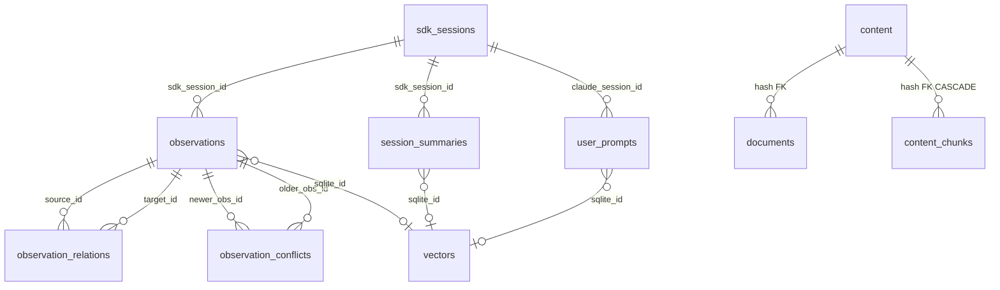

# Data Model

## Overview

The fork uses **PostgreSQL 15+** with the **pgvector** extension. The schema is fully managed by **gormigrate** and contains **13 tables**.

- **Startup behavior**: auto-create on first startup.
- **ORM and migration flow**: GORM models are created with `AutoMigrate`, followed by explicit DDL for pgvector, FTS columns, and indexes.
- **Schema evolution**: 19 gormigrate migrations (`001_core_tables` through `019_extended_relation_types`).
- **Language choices**: SQL text fields store textual payloads and JSON payloads in text/JSON-capable columns as defined below.

## Tables

### observations (core memory store)
Field-aligned struct for CPU cache efficiency. Primary memory unit.

```sql
id BIGSERIAL PRIMARY KEY,
sdk_session_id TEXT NOT NULL,
project TEXT NOT NULL,
scope TEXT DEFAULT 'project' CHECK (scope IN ('project', 'global')),
type TEXT NOT NULL CHECK (type IN ('decision','bugfix','feature','refactor','discovery','change')),
memory_type TEXT,  -- decision|insight|context|pattern (added migration 019)
importance_score REAL DEFAULT 1.0,
is_superseded INTEGER DEFAULT 0,
is_archived INTEGER DEFAULT 0,
archived_at_epoch BIGINT,
archived_reason TEXT,
created_at TEXT NOT NULL,
created_at_epoch BIGINT NOT NULL,
score_updated_at_epoch BIGINT,
last_retrieved_at_epoch BIGINT,
discovery_tokens BIGINT DEFAULT 0,
user_feedback INTEGER DEFAULT 0,
retrieval_count INTEGER DEFAULT 0,
prompt_number BIGINT,
facts TEXT,          -- JSON array of strings
concepts TEXT,       -- JSON array of strings
files_read TEXT,     -- JSON array
files_modified TEXT, -- JSON array
file_mtimes TEXT,    -- JSON map string->int64
narrative TEXT,
title TEXT,
subtitle TEXT,
search_vector TSVECTOR GENERATED ALWAYS AS (
  to_tsvector('english', COALESCE(title,'')||' '||COALESCE(subtitle,'')||' '||COALESCE(narrative,''))
) STORED
```

Indexes:
- GIN on `search_vector`
- `idx_observations_project_scope_importance` (project, scope, importance_score DESC, created_at_epoch DESC)
- `idx_observations_active` (partial on `is_archived=0` and `is_superseded=0`)
- `idx_observations_memory_type` on `memory_type`

### sdk_sessions

```sql
id BIGSERIAL PRIMARY KEY,
claude_session_id TEXT UNIQUE NOT NULL,
sdk_session_id TEXT UNIQUE,
project TEXT NOT NULL,
status TEXT DEFAULT 'active' CHECK (status IN ('active','completed','failed')),
started_at TEXT NOT NULL,
started_at_epoch BIGINT NOT NULL,
completed_at TEXT,
completed_at_epoch BIGINT,
worker_port BIGINT,
user_prompt TEXT,
prompt_counter INTEGER DEFAULT 0
```

### session_summaries

```sql
id BIGSERIAL PRIMARY KEY,
sdk_session_id TEXT NOT NULL,
project TEXT NOT NULL,
request TEXT, investigated TEXT, learned TEXT,
completed TEXT, next_steps TEXT, notes TEXT,
prompt_number BIGINT,
discovery_tokens BIGINT DEFAULT 0,
created_at TEXT NOT NULL,
created_at_epoch BIGINT NOT NULL,
search_vector TSVECTOR GENERATED ALWAYS AS (
  to_tsvector('english',
    COALESCE(request,'')||' '||COALESCE(investigated,'')||' '||COALESCE(learned,'')||' '||
    COALESCE(completed,'')||' '||COALESCE(next_steps,'')||' '||COALESCE(notes,''))
) STORED
```

### user_prompts

```sql
id BIGSERIAL PRIMARY KEY,
claude_session_id TEXT NOT NULL,
prompt_number INTEGER NOT NULL,
UNIQUE(claude_session_id, prompt_number),
prompt_text TEXT NOT NULL,
matched_observations INTEGER DEFAULT 0,
created_at TEXT NOT NULL,
created_at_epoch BIGINT NOT NULL,
search_vector TSVECTOR GENERATED ALWAYS AS (
  to_tsvector('english', COALESCE(prompt_text,''))
) STORED
```

### observation_conflicts

```sql
id BIGSERIAL PRIMARY KEY,
newer_obs_id BIGINT NOT NULL,
older_obs_id BIGINT NOT NULL,
conflict_type TEXT NOT NULL CHECK (conflict_type IN ('superseded','contradicts','outdated_pattern')),
resolution TEXT NOT NULL CHECK (resolution IN ('prefer_newer','prefer_older','manual')),
resolved INTEGER DEFAULT 0,
detected_at TEXT NOT NULL,
detected_at_epoch BIGINT NOT NULL,
reason TEXT
```

### observation_relations (knowledge graph edges)
17 relation types, 7 detection sources.

```sql
id BIGSERIAL PRIMARY KEY,
source_id BIGINT NOT NULL,
target_id BIGINT NOT NULL,
UNIQUE(source_id, target_id, relation_type),
relation_type TEXT NOT NULL CHECK (relation_type IN (
  'causes','fixes','supersedes','depends_on','relates_to','evolves_from','leads_to',
  'similar_to','contradicts','reinforces','invalidated_by','explains',
  'shares_theme','parallel_context','summarizes','part_of','prefers_over'
)),
detection_source TEXT NOT NULL CHECK (detection_source IN (
  'file_overlap','embedding_similarity','temporal_proximity',
  'narrative_mention','concept_overlap','type_progression','creative_association'
)),
confidence REAL DEFAULT 0.5 NOT NULL,
created_at TEXT NOT NULL,
created_at_epoch BIGINT NOT NULL,
reason TEXT
```

Indexes:
- `idx_relations_source_type` (`source_id`, `relation_type`)
- `idx_relations_target_type` (`target_id`, `relation_type`)
- covering indexes for both direction joins to support graph traversal

### patterns

```sql
id BIGSERIAL PRIMARY KEY,
name TEXT NOT NULL,
status TEXT DEFAULT 'active' CHECK (status IN ('active','deprecated','merged')),
type TEXT NOT NULL CHECK (type IN ('bug','refactor','architecture','anti-pattern','best-practice')),
description TEXT, recommendation TEXT,
signature TEXT,       -- JSON array
projects TEXT,        -- JSON array
observation_ids TEXT, -- JSON int64 array
frequency INTEGER DEFAULT 1,
confidence REAL DEFAULT 0.5,
created_at TEXT NOT NULL, created_at_epoch BIGINT NOT NULL,
last_seen_at TEXT NOT NULL, last_seen_at_epoch BIGINT NOT NULL,
merged_into_id BIGINT,
search_vector TSVECTOR GENERATED ALWAYS AS (
  to_tsvector('english', COALESCE(name,'')||' '||COALESCE(description,'')||' '||COALESCE(recommendation,''))
) STORED
```

### concept_weights (importance scoring tuning)

```sql
concept TEXT PRIMARY KEY,
weight REAL DEFAULT 0.1 NOT NULL,
updated_at TEXT NOT NULL
```

Seeded on migration 007:

| Concept | Weight |
|---------|--------|
| security | 0.30 |
| gotcha | 0.25 |
| best-practice | 0.20 |
| anti-pattern | 0.20 |
| architecture | 0.15 |
| performance | 0.15 |
| error-handling | 0.15 |
| pattern | 0.10 |
| testing | 0.10 |
| debugging | 0.10 |
| workflow | 0.05 |
| tooling | 0.05 |

### content (content-addressable document bodies)

```sql
hash TEXT PRIMARY KEY,  -- SHA-256 of document
doc TEXT NOT NULL,
created_at TIMESTAMPTZ NOT NULL DEFAULT NOW()
```

### documents (collection -> path -> content hash mapping)

```sql
id BIGSERIAL PRIMARY KEY,
collection TEXT NOT NULL,
path TEXT NOT NULL,
UNIQUE(collection, path),
title TEXT,
hash TEXT REFERENCES content(hash) ON DELETE SET NULL,
active BOOLEAN DEFAULT true,
created_at TIMESTAMPTZ, updated_at TIMESTAMPTZ,
search_vector TSVECTOR GENERATED ALWAYS AS (
  to_tsvector('english', COALESCE(path,'')||' '||COALESCE(title,''))
) STORED
```

### content_chunks (per-chunk embeddings for document semantic search)

```sql
hash TEXT NOT NULL REFERENCES content(hash) ON DELETE CASCADE,
seq INTEGER NOT NULL,
PRIMARY KEY(hash, seq),
pos INTEGER NOT NULL,  -- byte offset in document
model TEXT NOT NULL,
embedding vector(384),
created_at TIMESTAMPTZ NOT NULL DEFAULT NOW()
```

### vectors (pgvector embeddings for observations/summaries/prompts)

```sql
doc_id TEXT PRIMARY KEY,
embedding vector(384) NOT NULL,
sqlite_id BIGINT,       -- FK to id in observations/session_summaries/user_prompts
doc_type TEXT,          -- observation|session_summary|user_prompt
field_type TEXT,
project TEXT,
scope TEXT,
model_version TEXT
```

- HNSW index: `m=16`, `ef_construction=64`, `vector_cosine_ops`.
- Secondary index: `(doc_type, project, scope)` for filtered vector searches.

### indexed_sessions (JSONL Claude Code session file index)

```sql
id TEXT PRIMARY KEY,          -- UUID from JSONL filename
workstation_id TEXT NOT NULL, -- sha256(hostname+machine_id)[:8]
project_id TEXT NOT NULL,     -- sha256(cwd_path)[:8]
project_path TEXT,
git_branch TEXT,
first_msg_at TIMESTAMPTZ,
last_msg_at TIMESTAMPTZ,
exchange_count INTEGER DEFAULT 0,
tool_counts JSONB,
topics JSONB,
content TEXT,                  -- concatenated exchange text for FTS
file_mtime TIMESTAMPTZ,
indexed_at TIMESTAMPTZ DEFAULT NOW(),
tsv TSVECTOR GENERATED ALWAYS AS (
  to_tsvector('english', COALESCE(content,''))
) STORED
```

Indexes:
- GIN on `tsv`
- `idx_sessions_ws_proj` (`workstation_id`, `project_id`)
- `idx_sessions_last_msg` (`last_msg_at` DESC)

## Full-Text Search Summary

| Table | FTS Column | Indexed Fields | GIN Index |
|-------|------------|----------------|-----------|
| observations | search_vector | title, subtitle, narrative | idx_observations_fts |
| user_prompts | search_vector | prompt_text | idx_user_prompts_fts |
| session_summaries | search_vector | request, investigated, learned, completed, next_steps, notes | idx_session_summaries_fts |
| patterns | search_vector | name, description, recommendation | idx_patterns_fts |
| documents | search_vector | path, title | idx_documents_fts |
| indexed_sessions | tsv | content | idx_sessions_tsv |

All FTS uses `to_tsvector('english', ...)`.

## Vector Embedding Setup

Two tables store pgvector embeddings:
- **vectors**: observation/summary/prompt embeddings (384-dim by default)
- **content_chunks**: document chunk embeddings (384-dim by default)

Both use HNSW index with `m=16`, `ef_construction=64`, cosine distance.

### CRITICAL: Embedding Dimension Mismatch

The migrations hardcode `vector(384)`. The OpenAI provider defaults to `text-embedding-3-small`, which produces 1536-dim vectors and is incompatible with the hardcoded schema. To use a different dimension:

1. Set `EMBEDDING_DIMENSIONS=384` to use a 384-dim OpenAI model, OR
2. Drop and recreate `vectors` and `content_chunks` with `vector(1536)` before switching providers.

Mixing dimension sizes in the same table will cause pgvector errors at query time.

## ERD (Mermaid)



## Migration History (19 migrations)

| ID | Description |
|----|-------------|
| 001_core_tables | sdk_sessions, observations, session_summaries |
| 002_user_prompts | user_prompts table |
| 003_user_prompts_fts | search_vector tsvector + GIN on user_prompts |
| 004_observations_fts | search_vector tsvector + GIN on observations |
| 005_session_summaries_fts | search_vector tsvector + GIN on session_summaries |
| 006_sqlite_vec_vectors | vectors table + HNSW index; enables pgvector extension |
| 007_concept_weights | concept_weights table + 12 seed rows |
| 008_observation_conflicts | observation_conflicts table |
| 009_patterns | patterns table |
| 010_patterns_fts | search_vector tsvector + GIN on patterns |
| 011_observation_relations | observation_relations table (6 initial relation types) |
| 012_query_optimization_indexes | Composite + covering indexes (non-fatal) |
| 013_observation_archival | is_archived, archived_at_epoch, archived_reason on observations |
| 014_performance_indexes | Batch ID lookup, vector search, session, prompt indexes |
| 015_optimized_composite_indexes | project+scope+created composite, global scope partial |
| 016_relation_and_active_indexes | Covering indexes for relation joins + active observations partial |
| 017_content_addressable_storage | content, documents, content_chunks tables + HNSW |
| 018_session_indexing | indexed_sessions table with tsv tsvector + 5 indexes |
| 019_extended_relation_types | 17 relation types, creative_association source, memory_type column + backfill |

Notes:
- Migrations 012-016 use `IF NOT EXISTS` and continue on failure (non-fatal optimization).
- Migration 006 enables pgvector extension: `CREATE EXTENSION IF NOT EXISTS vector` (idempotent).
- Migration 019 drops + re-adds CHECK constraints on `observation_relations` (destructive on conflict).
- The gormigrate library stores applied migration IDs in a `migrations` table.
