# Engram Architecture

Shared memory infrastructure for Claude Code workstations.
PostgreSQL+pgvector backend, Docker deployment, multi-workstation support.

## System Overview

```mermaid
graph TB
    subgraph "Claude Code Workstation"
        CC["Claude Code<br/>(AI Agent)"]

        subgraph "Hooks (JS — plugin/engram/hooks)"
            H1["session-start.js"]
            H2["post-tool-use.js"]
            H3["stop.js"]
            H4["user-prompt.js"]
            H5["statusline.js"]
            H6["subagent-stop.js"]
        end

        CC -->|lifecycle events| H1
        CC -->|every tool call| H2
        CC -->|session end| H3
        CC -->|user message| H4
    end

    subgraph "Engram Server (Go)"
        subgraph "Entry Points"
            WK["Worker<br/>cmd/worker<br/>:37777 HTTP"]
            MCP_STDIO["MCP stdio<br/>cmd/mcp"]
            MCP_PROXY["MCP stdio-proxy<br/>cmd/mcp-stdio-proxy"]
        end

        subgraph "HTTP API Layer (chi router)"
            MW["Middleware<br/>• TokenAuth<br/>• RateLimiter<br/>• ExpensiveOpLimiter"]

            subgraph "API Groups"
                CTX_API["Context API<br/>• /search<br/>• /context<br/>• /file-context"]
                SESS_API["Session API<br/>• /sessions/init<br/>• /sessions/start<br/>• /sessions/observations"]
                INGEST_API["Ingest API<br/>• /events/ingest<br/>⚡ Level 0 Pipeline"]
                DATA_API["Data API<br/>• /observations<br/>• /summaries<br/>• /stats"]
                SCORING_API["Scoring API<br/>• /feedback<br/>• /top-observations<br/>• /explain-score"]
                RELATIONS_API["Relations API<br/>• /relations<br/>• /relation-graph"]
                PATTERNS_API["Patterns API<br/>• /patterns<br/>• /pattern-stats"]
                IMPORT_API["Import/Export<br/>• /bulk-import<br/>• /export<br/>• /archive"]
                UPDATE_API["Update API<br/>• /update/check<br/>• /self-check"]
            end
        end

        subgraph "MCP Protocol Layer"
            MCP_SVR["MCP Server<br/>• SSE transport<br/>• Streamable transport<br/>• stdio transport"]
            MCP_TOOLS["MCP Tools<br/>• engram_search<br/>• engram_recent<br/>• engram_patterns<br/>• engram_relations<br/>• engram_stats<br/>• engram_maintenance"]
        end

        subgraph "Search Pipeline"
            QE["Query Expander<br/>• Intent Detection<br/>&nbsp;&nbsp;question|error|impl|arch|general<br/>• Synonym Expansion<br/>• Vocabulary Expansion"]
            SM["Search Manager<br/>• Cache (30s TTL, 200 max)<br/>• Singleflight dedup<br/>• Cache warming<br/>• Latency tracking"]

            subgraph "Hybrid Search"
                BM25["BM25 FTS<br/>PostgreSQL tsvector"]
                VEC["Vector Cosine<br/>pgvector"]
                RRF_MERGE["RRF Merge<br/>Reciprocal Rank Fusion"]
            end

            RERANK["Reranker<br/>API-based cross-encoder"]
            STALE["Staleness Check<br/>background verification"]
            CLUSTER["Deduplication<br/>cosine clustering"]
        end

        subgraph "Ingest Pipeline (Level 0)"
            DEDUP_CACHE["Dedup Cache<br/>SHA256, TTL"]
            L0["Deterministic Pipeline<br/>• ClassifyEvent<br/>• GenerateTitle<br/>• ExtractConcepts<br/>• ExtractFilePaths<br/>• ExtractFacts"]
            RAW_STORE["Raw Event Store"]
        end

        subgraph "Embedding Layer"
            EMB["Embedding Service<br/>OpenAI API client<br/>text-embedding-3-small<br/>1536 dimensions"]
        end

        subgraph "Consolidation Engine"
            SCHED["Scheduler<br/>3 background cycles"]
            DECAY["⏰ Decay (24h)<br/>Relevance recalculation"]
            ASSOC["⏰ Associations (168h)<br/>Creative discovery<br/>embed → pairwise cosine<br/>type-pair rules"]
            FORGET["⏰ Forgetting (90d)<br/>Archive low-relevance<br/>(disabled by default)"]
        end

        subgraph "Scoring System"
            REL_CALC["Relevance Calculator<br/>R = e^(-λ₁·age) × e^(-λ₂·access)<br/>&nbsp;&nbsp;× (1 + w·relations) × confidence"]
            SCORE_CALC["Score Calculator<br/>concept weights<br/>feedback integration"]
            RECALC["Recalculator<br/>batch reprocessing"]
        end

        subgraph "Pattern Detection"
            PAT["Pattern Detector<br/>recurring concept clusters<br/>cross-session patterns"]
        end

        subgraph "Data Layer"
            subgraph "SQLite (GORM)"
                OBS_STORE["ObservationStore<br/>+ FTS5 index"]
                SESS_STORE["SessionStore"]
                SUM_STORE["SummaryStore"]
                REL_STORE["RelationStore<br/>8 relation types"]
                PAT_STORE["PatternStore"]
                CONF_STORE["ConflictStore"]
                RAW_EVT["RawEventStore"]
                SCORE_STORE["ScoringStore"]
                PROMPT_STORE["PromptStore"]
                DOC_STORE["DocumentStore"]
            end

            subgraph "Vector Store"
                PG["pgvector<br/>(PostgreSQL)<br/>1536-dim embeddings"]
                VSYNC["Vector Sync<br/>async embedding<br/>retry + backoff"]
            end
        end

        subgraph "Supporting Services"
            SSE_BC["SSE Broadcaster"]
            COLL["Collection Registry"]
            SESS_IDX["Session Indexer"]
            PRIV["Privacy<br/>• Secret stripping<br/>• PII redaction"]
            MAINT["Maintenance"]
            UPD["Auto-Updater"]
        end
    end

    subgraph "External Services"
        OAI["OpenAI API<br/>Embedding endpoint"]
        PG_EXT["PostgreSQL + pgvector<br/>(Docker / remote)"]
    end

    %% Hook connections
    H1 -->|POST /sessions/init| WK
    H2 -->|POST /events/ingest| WK
    H3 -->|POST /sessions/summarize| WK
    H4 -->|POST /events/ingest| WK

    %% MCP connections
    MCP_STDIO --> MCP_SVR
    MCP_SSE --> MCP_SVR
    MCP_PROXY --> MCP_SVR
    MCP_SVR --> MCP_TOOLS
    MCP_TOOLS --> SM
    MCP_TOOLS --> OBS_STORE

    %% API flow
    MW --> CTX_API
    MW --> SESS_API
    MW --> INGEST_API
    MW --> DATA_API

    %% Search flow
    CTX_API --> QE
    QE --> SM
    SM --> BM25
    SM --> VEC
    BM25 --> RRF_MERGE
    VEC --> RRF_MERGE
    RRF_MERGE --> RERANK
    RERANK --> STALE
    STALE --> CLUSTER

    %% Ingest flow
    INGEST_API --> DEDUP_CACHE
    DEDUP_CACHE --> L0
    L0 --> RAW_STORE
    L0 --> OBS_STORE
    L0 -->|async| VSYNC

    %% Embedding connections
    EMB --> OAI
    QE -.->|query embedding| EMB
    VSYNC -->|observation embedding| EMB
    ASSOC -->|pair embedding| EMB

    %% Consolidation connections
    SCHED --> DECAY
    SCHED --> ASSOC
    SCHED --> FORGET
    DECAY --> REL_CALC
    DECAY --> OBS_STORE
    ASSOC --> OBS_STORE
    ASSOC --> REL_STORE
    FORGET --> OBS_STORE

    %% Scoring connections
    SCORING_API --> SCORE_CALC
    SCORING_API --> RECALC

    %% Pattern detection
    PAT --> OBS_STORE
    PAT --> PAT_STORE

    %% Vector store connections
    VEC --> PG
    VSYNC --> PG
    PG --> PG_EXT

    %% Data layer connections
    BM25 --> OBS_STORE
    SESS_API --> OBS_STORE
    DATA_API --> OBS_STORE
    RELATIONS_API --> REL_STORE
    PATTERNS_API --> PAT_STORE

    %% SSE
    SSE_BC -.->|real-time events| CC

    %% Styling
    classDef dead fill:#ff6b6b,stroke:#c92a2a,color:#fff
    classDef external fill:#74c0fc,stroke:#1971c2,color:#000
    classDef entry fill:#69db7c,stroke:#2b8a3e,color:#000
    classDef pipeline fill:#ffd43b,stroke:#e67700,color:#000
    classDef storage fill:#da77f2,stroke:#7048e8,color:#000
    classDef bg fill:#a9e34b,stroke:#5c940d,color:#000

    class RERANK pipeline
    class OAI,PG_EXT external
    class WK,MCP_STDIO,MCP_SSE,MCP_PROXY entry
    class L0,QE,RRF_MERGE pipeline
    class OBS_STORE,SESS_STORE,SUM_STORE,REL_STORE,PAT_STORE,PG storage
    class DECAY,ASSOC,FORGET bg
```



## Data Flow

### Ingestion (Hook → Storage)

```
Claude Code tool call
  → post-tool-use hook (Go binary)
    → POST /api/events/ingest
      → Dedup Cache (SHA256, skip duplicates)
        → Level 0 Pipeline (deterministic, no LLM):
          • ClassifyEvent (rule-based: Edit→change, Bash+error→bugfix, etc.)
          • GenerateTitle (tool name + input summary)
          • ExtractConcepts (regex patterns for tech terms)
          • ExtractFilePaths (path extraction from input/output)
          • ExtractFacts (key-value pairs from tool output)
        → Store raw event (source of truth)
        → Store observation (PostgreSQL + tsvector FTS)
        → Async: embed observation → sync to pgvector
```

### Search (Query → Results)

```
Search query (MCP tool or HTTP API)
  → Query Expander:
    • Detect intent (question/error/implementation/architecture/general)
    • Generate variants per intent (synonyms, reformulations)
    • Optional: vocabulary expansion from known concepts
  → Search Manager (cache check, singleflight dedup):
    → Parallel:
      • BM25 FTS (PostgreSQL tsvector full-text search)
      • Vector cosine similarity (pgvector)
    → RRF Merge (Reciprocal Rank Fusion, weighted dedup)
    → Reranker (API-based cross-encoder)
    → Staleness Check (verify file references still exist)
    → Deduplication (cosine clustering, remove near-duplicates)
  → Return ranked observations
```

### Consolidation (Background Cycles)

```
Scheduler runs 3 independent cycles:

⏰ Decay (every 24h):
  → Iterate all observations
  → Recalculate ImportanceScore using:
    R = e^(-0.1 × ageDays) × e^(-0.05 × accessDays)
      × (1 + 0.3 × relationCount) × avgConfidence
  → Update scores in DB

⏰ Associations (every 168h / 1 week):
  → Fetch 100 recent observations per project
  → Sample 20 → embed each → pairwise cosine similarity
  → Apply type-pair rules:
    • Decision + Decision + low sim → CONTRADICTS
    • Insight + Pattern + high sim → EXPLAINS
    • Any + high sim (>0.7) → SHARES_THEME
    • Temporal proximity + low sim → PARALLEL_CONTEXT
  → Store new relations

⏰ Forgetting (every 90d, disabled by default):
  → Find observations below relevance threshold (0.01)
  → Protect: high importance, <90 days old, decisions/discoveries
  → Archive eligible observations
```

## Component Map

| Package | Purpose | Key Types |
|---------|---------|-----------|
| `cmd/worker` | HTTP API server | `main()` |
| `cmd/mcp` | MCP stdio server | `main()` |
| `plugin/engram/hooks/*.js` | JS lifecycle hooks (node) | `session-start.js`, `stop.js`, etc. |
| `internal/worker` | Service orchestrator, HTTP handlers | `Service` |
| `internal/mcp` | MCP protocol implementation | `Server` |
| `internal/pipeline` | Level 0 deterministic extraction | `ClassifyEvent()`, `GenerateTitle()` |
| `internal/search` | Search manager with caching | `Manager`, `SearchMetrics` |
| `internal/search/expansion` | Query intent + expansion | `Expander`, `ExpandedQuery` |
| `internal/embedding` | OpenAI-compatible REST embedding client | `Service` |
| `internal/reranking` | API-based cross-encoder reranking | `Service` |
| `internal/consolidation` | Memory lifecycle scheduler | `Scheduler`, `AssociationEngine` |
| `internal/scoring` | Relevance formula | `RelevanceCalculator`, `Calculator` |
| `internal/pattern` | Pattern detection | `Detector` |
| `internal/db/gorm` | PostgreSQL data layer (GORM) | `Store`, `ObservationStore`, etc. |
| `internal/vector` | Vector store interface | `Client` |
| `internal/vector/pgvector` | pgvector implementation + sync | `Sync` |
| `internal/privacy` | Secret/PII stripping | `Stripper` |
| `internal/config` | Configuration management | `Config` |
| `pkg/models` | Shared domain models | `Observation`, `ObservationRelation` |
| `pkg/similarity` | Cosine similarity/clustering | `CosineSimilarity()` |

## Relation Types

| Type | Semantics | Detection |
|------|-----------|-----------|
| `shares_theme` | High cosine similarity (>0.7) | Association engine |
| `contradicts` | Decision + Decision + low similarity | Association engine |
| `explains` | Insight/Pattern pair + high similarity | Association engine |
| `parallel_context` | Temporal proximity + low similarity | Association engine |
| `evolves_from` | Same type + high sim + age gap >7d | Association engine |
| `causes` | Causal relationship | Manual/LLM |
| `depends_on` | Dependency relationship | Manual/LLM |
| `related_to` | General relation | Manual/LLM |

## Observation Types

| Type | Source | Example |
|------|--------|---------|
| `change` | Edit, Write, Bash (no error) | Code modification |
| `bugfix` | Bash with error indicators | Error fix |
| `discovery` | Read, Grep, test execution | Learning something new |
| `decision` | Keywords: architecture, design, chose | Architectural choice |
| `feature` | New file creation, feature keywords | New functionality |
| `refactor` | Refactor keywords + Edit | Code improvement |
