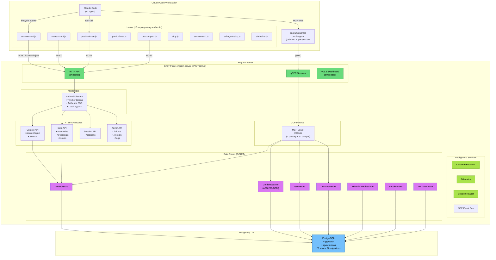

# Engram Architecture

Shared memory infrastructure for Claude Code workstations.
PostgreSQL 17 + pgvector backend, Docker deployment, multi-workstation support.

## System Overview


```mermaid
graph TB
    subgraph "Claude Code Workstation"
        CC["Claude Code<br/>(AI Agent)"]

        subgraph "Hooks (JS — plugin/engram/hooks)"
            H1["session-start.js"]
            H2["user-prompt.js"]
            H3["post-tool-use.js"]
            H4["pre-tool-use.js"]
            H5["pre-compact.js"]
            H6["stop.js"]
            H7["session-end.js"]
            H8["subagent-stop.js"]
            H9["statusline.js"]
        end

        DAEMON["engram daemon<br/>cmd/engram<br/>(stdio MCP, per-session)"]

        CC -->|lifecycle events| H1
        CC -->|tool call| H3
        CC -->|MCP tools| DAEMON
    end

    subgraph "Engram Server"
        subgraph "Entry Point: engram-server :37777 (cmux)"
            HTTP["HTTP API<br/>(chi router)"]
            GRPC["gRPC Services"]
            DASH["Vue.js Dashboard<br/>(embedded)"]
        end

        subgraph "Middleware"
            AUTH["Auth Middleware<br/>• Two-tier tokens<br/>• Authentik SSO<br/>• Local bypass"]
        end

        subgraph "HTTP API Routes"
            CTX_API["Context API<br/>• /context/inject<br/>• /search"]
            DATA_API["Data API<br/>• /memories<br/>• /credentials<br/>• /issues"]
            SESS_API["Session API<br/>• /sessions"]
            ADMIN_API["Admin API<br/>• /tokens<br/>• /version<br/>• /logs"]
        end

        subgraph "MCP Protocol"
            MCP_SVR["MCP Server<br/>39 tools<br/>(7 primary + 32 compat)"]
        end

        subgraph "Background Services"
            OUTCOME["Outcome Recorder"]
            TELE["Telemetry"]
            REAPER["Session Reaper"]
            SSE_BC["SSE Event Bus"]
        end

        subgraph "Data Stores (GORM)"
            MEM_STORE["MemoryStore"]
            CRED_STORE["CredentialStore<br/>(AES-256-GCM)"]
            ISSUE_STORE["IssueStore"]
            DOC_STORE["DocumentStore"]
            RULE_STORE["BehavioralRulesStore"]
            SESS_STORE["SessionStore"]
            TOKEN_STORE["APITokenStore"]
        end
    end

    subgraph "PostgreSQL 17"
        PG["PostgreSQL<br/>+ pgvector<br/>+ pgvectorscale<br/>25 tables, 96 migrations"]
    end

    %% Hook → Server
    H1 -->|POST /context/inject| HTTP
    H2 -->|POST| HTTP
    H3 -->|POST| HTTP
    H5 -->|POST| HTTP

    %% Daemon → Server
    DAEMON -->|gRPC| GRPC

    %% Internal flow
    HTTP --> AUTH
    AUTH --> CTX_API
    AUTH --> DATA_API
    AUTH --> SESS_API
    AUTH --> ADMIN_API

    GRPC --> MCP_SVR
    MCP_SVR --> MEM_STORE
    MCP_SVR --> CRED_STORE
    MCP_SVR --> ISSUE_STORE
    MCP_SVR --> DOC_STORE

    CTX_API --> MEM_STORE
    DATA_API --> MEM_STORE

    %% Stores → DB
    MEM_STORE --> PG
    CRED_STORE --> PG
    ISSUE_STORE --> PG
    DOC_STORE --> PG
    RULE_STORE --> PG
    SESS_STORE --> PG
    TOKEN_STORE --> PG

    %% Styling
    classDef external fill:#74c0fc,stroke:#1971c2,color:#000
    classDef entry fill:#69db7c,stroke:#2b8a3e,color:#000
    classDef storage fill:#da77f2,stroke:#7048e8,color:#000
    classDef bg fill:#a9e34b,stroke:#5c940d,color:#000

    class PG external
    class HTTP,GRPC,DASH entry
    class MEM_STORE,CRED_STORE,ISSUE_STORE,DOC_STORE,RULE_STORE,SESS_STORE,TOKEN_STORE storage
    class OUTCOME,TELE,REAPER bg
```

## Data Flow

### Session Start (Context Injection)

```
Claude Code starts session
  → session-start.js hook fires
    → resolve versioned project identity (git metadata or strict non-git anchor)
    → POST /api/context/inject with identity_only=true
      → transactionally RegisterAndResolve in the existing projects registry
      → return canonical_project before any project-scoped data access
    → POST /api/context/inject with canonical selector
      → retrieve project-scoped context
      → Format as <engram-context>...</engram-context>
      → Return to Claude Code (injected into system prompt)
```

### Memory Storage (MCP Tool)

```
Agent calls store_memory / store MCP tool
  → engram daemon receives stdio JSON-RPC
    → gRPC CallTool carries outer legacy selector + ProjectIdentityV2
      → server transactionally resolves canonical project before dispatch
      → MemoryStore.Create(memory)
        → PostgreSQL INSERT into memories table
        → FTS tsvector auto-updated
```

### Memory Retrieval (MCP Tool)

```
Agent calls recall_memory / recall MCP tool
  → engram daemon receives stdio JSON-RPC
    → gRPC CallTool carries outer legacy selector + ProjectIdentityV2
      → server transactionally resolves canonical project before dispatch
      → Hybrid search: FTS (tsvector) + optional vector (pgvector)
      → Ranked results returned
```

### Hook Events (Observation Pipeline)

```
Claude Code tool call / user prompt / session end
  → JS hook fires (HTTP POST to server)
    → Server records event in sdk_sessions / memories
    → SSE event broadcast to dashboard
```

### OpenClaw Project Access

```
OpenClaw hook / tool / command / file watcher resolves workspace identity
  → EngramRestClient.registerAndResolveProject(identity, outer selector)
    → POST /api/context/inject {project, project_identity, identity_only:true}
    → await canonical_project (concurrent and late calls are deduplicated)
  → only then issue the context/session/memory/issue/vault data request
```

Registration failure is a hard short-circuit: no downstream project request is
sent. `config.project` remains the outer compatibility selector; it is not a
credential and does not override bearer/principal authorization.

## Authentication Flow (v6)

```
Server starts with ENGRAM_AUTH_ADMIN_TOKEN
  → Operator opens dashboard, logs in with admin token
    → Issues worker keycards via /tokens page
      → Each workstation stores its keycard via /engram:setup
        → All MCP + hook traffic uses the worker keycard
          → Server validates token → resolves workstation identity
```

Project identity is a routing and convergence contract, not authentication.
Knowing or supplying a selector, git remote/path, or non-git anchor never grants
access to private data. HTTP/gRPC bearer validation and principal visibility
rules remain independent gates and run before tenant operations.

`ProjectIdentityV2` is additive on the protobuf wire. Old clients continue with
the outer selector only and succeed only while it resolves unambiguously; an
ambiguous legacy selector fails closed with `PROJECT_IDENTITY_AMBIGUOUS` and the
machine-readable action `send_project_identity_v2`. Non-git anchors are 16 random
bytes encoded as 32 lowercase hexadecimal characters in
`.engram-project-v2.json`; sharing is opt-in via an explicit boolean.

## Deployment

```
Docker (production):
  ghcr.io/thebtf/engram:latest  ← engram-server
  PostgreSQL 17 + pgvector      ← separate container or Unraid app

Plugin (workstations):
  thebtf/engram-marketplace     ← Claude Code plugin marketplace
  engram daemon auto-installed  ← runs per-session as MCP server
```
