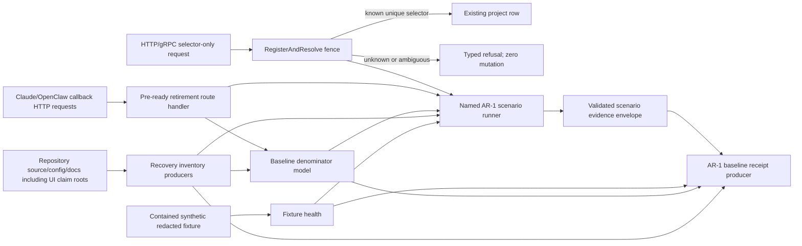

# AR-1 D2 Decomposition — Truth, Fences, and Broken-Loop Closure

**Status:** Accepted after full challenger R3
**Parent program:** `001-engram-architectural-recovery` D3 plan
**Child slice:** AR-1 only — T001–T015 and T088–T091
**Source baseline:** `d21e9b4c645c364072ad83e69c57c2dc0f7629d2`
**Authorization:** `AR1_OPERATOR_AUTH_2026-08-22`

## Calibration

**Rung: D2.** This artifact is bound to the AR-1 implementation slice, not the
whole recovery program: a wrong boundary would cause multi-file rework across
HTTP routing, project persistence, inventory/metric production, fixture tooling,
and installed proof; it remains a contract for multiple maker/checker contexts
until AR-1 ships. The D3 program already cut AR-1 as its first independently
installable release, so this child must not re-plan AR-2 through AR-7.

## Scope and ADR

### ADR-AR1-001: Make existing broken boundaries visible and fail closed before replacement workflows exist

**Status:** Accepted

### Context

AR-1 must close one release-sized user failure: sessions can appear complete
while automatic outcome callbacks are dead, selector-only requests can mint a
new project, and current metrics/inventories do not establish trustworthy
baseline denominators. It must do so without implementing V3 identity, durable
outcome intake, project merge, or an operator surface.

**VERIFIED current facts:**

- `RegisterAndResolve` creates a `projects` row when a valid selector has zero
  candidates and `identity == nil` (`internal/db/gorm/project_store.go`), which
  violates FR-004.
- Claude SessionEnd posts `/api/sessions/{id}/propagate-outcome`; OpenClaw posts
  `/api/sessions/{id}/outcome`; `Service.setupRoutes` registers neither. The
  active Stop path `/api/hooks/session-end` remains separately registered.
- The planned inventory, durable baseline metric, recovery fixture command,
  scenario command, AR-1 receipt producer, and repo-local installed-dogfood
  surfaces do not exist yet. Existing scanner, route, metrics, fixture, backup,
  and smoke code are precedents, not replacement implementations.

### Alternatives

| Alternative | Outcome | Why not chosen |
|---|---|---|
| Leave dead callbacks absent and rely on client logs or a later AR-4 replacement | Rejected | Silent 405/transport behavior remains indistinguishable from a useful outcome contract; it fails FR-018/FR-026 visibility now. |
| Ship only the selector fence and defer inventory, callback diagnostics, and fixture proof | Rejected | It prevents one unsafe write but leaves the broken loop hidden and cannot produce the AR-1 installed observation required by the release map. |
| Implement V3 identity and durable outcome intake in AR-1 | Rejected | It pulls AR-2/AR-4 schema and workflow authority forward, destroys the independently installable release boundary, and widens migration risk. |
| Add truth-producing inventories, explicit retirement responses, a narrow selector fence, and synthetic fixture/receipt proof | **Chosen** | Closes the current broken-loop failure without mutating live data or selecting a new target architecture early. |

### Decision

AR-1 adds four bounded seams:

1. deterministic, redacted source/flag/surface/project-data inventories plus a
   durable baseline-denominator receipt model;
2. explicit HTTP 410 retirement diagnostics for both dead callback URLs. The
   OpenClaw explicit `engram_outcome` tool currently shares `/api/sessions/{id}/outcome`,
   so T007 owns its coupled client/tool behavior as well: a typed, allowlisted
   retirement envelope (`contract_version`, `code`, `action`) is recognized
   before the generic transport failure path, never increments the global
   availability breaker, and is surfaced verbatim as actionable retirement—not
   successful outcome recording—to both the automatic hook and explicit tool.
   The static handler is registered outside `requireReady` so callback clients
   receive the same diagnostic during startup failure. The active Stop path
   `/api/hooks/session-end` remains unchanged; durable automatic outcome intake
   remains AR-4 work;
3. a fail-closed zero-candidate branch for selector-only project resolution,
   while preserving already-known unique legacy selector resolution and all
   descriptor-bearing V2 paths; and
4. repository-local, synthetic/redacted fixture, health, scenario evidence,
   baseline receipt, and staged installed-proof commands.

**Reversibility:**

| Decision | Tag | Reason and rollback |
|---|---|---|
| Source inventories, receipts, and fixture commands | REVERSIBLE | Additive files; previous binary remains the rollback boundary. |
| Explicit 410 retirement routes | PARTIALLY REVERSIBLE | Restores observable behavior without accepting an outcome; rollback restores the previous absent-route behavior but never fabricates a stored outcome. |
| Selector-only zero-candidate fence | PARTIALLY REVERSIBLE | Behavioral tightening is intentional; rollback is the prior binary, and AR-1 must prove the new path creates no data to reverse. |
| Synthetic fixture export/restore contract | REVERSIBLE | Fixture-root data is generated and isolated; no live source is touched. |

## Architecture and Data Flow

| Component | Layer and owner | Responsibility | Must not do |
|---|---|---|---|
| `internal/recoveryinventory` | application / source-analysis | Produce deterministic redacted inventory records from repository source, configuration declarations, routes, hooks, tools, and project-bearing declarations. | Assert live row counts, mutate production-like data, or classify runtime absence as deletion authority. |
| `internal/operability/baseline_metrics.go` | application / baseline evidence | Model numerator, denominator, scope, window, freshness, source, and `not_computable`; retain durable baseline facts separately from process counters. | Treat zero denominator as green or merge process-lifetime counters with durable records without a mapping. |
| `handlers_outcome_retirement.go` | HTTP adapter | Return a stable versioned retirement response for the two known dead callback POSTs. | Persist an outcome, emulate AR-4 intake, return false success, or change `/api/hooks/session-end`. |
| OpenClaw outcome client/tool | client compatibility adapter | Recognize only the versioned 410 retirement envelope, surface its action to automatic and explicit callers, and keep it out of the generic availability circuit breaker. | Treat retirement as success, discard its action, or suppress unrelated Engram tools. |
| `project_store.go:RegisterAndResolve` | persistence boundary | Resolve known unique legacy selectors; refuse unknown zero-candidate selector-only requests before row creation. | Create V3 identity, delete V2 compatibility, or change descriptor-bearing creation behavior. |
| `scripts/recovery` | fixture adapter | Materialize only synthetic/redacted fixture data, prove restore/health/scenario receipt validity, and stage the built payload inside the repository. | Read/write live data, user profiles, installed plugins, external releases, or secret-bearing receipts. |
| `internal/recoveryreceipt/ar1_baseline.go` | application / receipt projection | Bind source/build/fixture/health/scenario facts to one typed AR-1 baseline receipt. | Become a second domain authority or use an AR-3 migration receipt as a false substitute. |

### Data architecture gate

| Field | AR-1 rule |
|---|---|
| Data owners | Existing GORM/PostgreSQL records remain authoritative. AR-1 inventory and receipt data describe evidence; fixture data lives only below a caller-provided `FixtureRoot` that resolves beneath the repository root. |
| Invariants | No raw secret, credential plaintext, transcript payload, remote URL, or live project selector enters an artifact/receipt. `FixtureRoot` rejects outside-root, traversal, reparse-point/symlink escape, and foreign/malformed ownership markers before reset or restore. Database-backed fence tests run only under an explicit owned loopback synthetic-fixture environment; an absent ambient DSN is a skip, never RED evidence. Every denominator declares source, scope, window, freshness, and `not_computable` for zero denominator. |
| Migration shape | No live schema/data migration or project merge in AR-1. The fixture uses synthetic/redacted export → isolated restore → verification; source changes are additive except the fail-closed resolver fence and two retirement route registrations. |
| Engine constraints | PostgreSQL/GORM remain the current persistence authority. Existing backup rehearsal is a fixture precedent, not a production command; the built server is the only allowed fixture-server process. |

## Typed Tracer-Bullet Tickets and Ownership

The unit of delivery is the AR-1 release, not an individual source file. A
ticket is independently meaningful only when its checkpoint proves a boundary
rather than source presence. `T001–T005` share one output schema and therefore
one maker lane; `T010–T012` share one fixture-root protocol and therefore one
maker lane. All other listed lanes are file-disjoint.

| Task | Type | Maker / exclusive path ownership | Blocking edge | Acceptance checkpoint |
|---|---|---|---|---|
| T001 | Code | Foundation maker: `internal/recoveryinventory/source_scan.go` and its tests | First foundation output shape | Deterministic redacted source inventory is produced from a fixture repository tree; no private content is emitted. |
| T002 | Code | Inventory-truth maker: `internal/recoveryinventory/flag_scan.go` and tests | T001 common record schema | Every current reader/default across Go, JavaScript/TypeScript hook/client, and supported script sources is recorded with parsing/default semantics; no runtime state is asserted. |
| T003 | Code | Inventory-truth maker: `internal/recoveryinventory/surface_scan.go` and tests | T001 common record schema | Route, including nested chi prefix composition, MCP, daemon, hook, tool, current documentation claim, and claim-only inventory of both `ui/` and `apps/operator-console/` roots are classified with source evidence; neither surface is changed. |
| T004 | Code | Inventory-truth maker: `internal/recoveryinventory/project_data_scan.go` and tests | T001 common record schema | Relational, multi-role, serialized map/payload/cache/job/import/export families are enumerated or source-uncertain; no data rows are read. |
| T005 | Code | Metrics-truth maker: `internal/operability/baseline_metrics.go`, `internal/worker/handlers_stats.go`, `internal/worker/handlers_data.go`, and focused tests | T001–T004 inventory facts | Baseline and current HTTP metric renderers use named numerator/denominator/scope/window/freshness and emit `not_computable` for zero or unavailable denominators; process and durable families remain distinct. |
| T006 | Test | Outcome maker: `internal/worker/outcome_adapter_contract_test.go` and `plugin/openclaw-engram/test/outcome-retirement.test.mjs` | None; RED before T007 | Dead routes and the current OpenClaw consumer fail the retirement contract while active Stop intake remains distinct. |
| T007 | Code | Outcome maker: `internal/worker/handlers_outcome_retirement.go`, pre-ready `service.go` route registration, and exact OpenClaw `client.ts` / `hooks/session-end.ts` / `tools/engram-outcome.ts` adapter paths | T006 RED evidence | Both paths return versioned actionable HTTP 410 JSON regardless of readiness; the client preserves the retirement action without outcome mutation or availability-breaker poison; automatic and explicit OpenClaw callers visibly report retirement, and active Stop intake remains unchanged. |
| T008 | Test | Fence maker: `internal/projectidentity/legacy_fence_test.go` plus narrowly needed existing adapter tests | Owned isolated fixture database precondition; RED before T009 | Unknown project-only HTTP/gRPC/store requests create no project/alias; known unique selector resolution remains covered. |
| T009 | Code | Identity-security maker: `internal/db/gorm/project_store.go`, `internal/proxy/identity.go`, `internal/handlers/engramcore/grpcpool.go`, and focused tests | T008 RED evidence | Selector-only zero-candidate creation refuses before mutation; credential-bearing authority userinfo is consistently rejected or reduced before descriptor, durable project row, or diagnostic logging while valid Git scp/local-path remotes remain compatible. |
| T010 | Code | Fixture-isolation maker: `scripts/recovery/prepare-legacy-fixture.ps1` and common helpers | None | Creates/recreates synthetic redacted fixture plus a database-side ownership/manifest binding; containment uses host-correct case semantics and a valid owner run cannot reset an active foreign fixture. |
| T011 | Code | Payload/fixture-security makers: `Makefile`, `cmd/engram-server/main.go`, `internal/worker/handlers.go`, launcher/verification scripts, and focused tests | T010 fixture contract | Exact candidate build embeds a full source commit in the server; runtime health readback, staged binary, database/run owner, and candidate Git head must agree before a scoped health receipt exists. |
| T012 | Code | Fixture-isolation maker: `scripts/recovery/run-recovery-scenario.ps1`, `verify-recovery-receipt.ps1` | T010 and T011 | Named `AR-1/baseline` scenario validates behavior only against the currently live owned fixture process/payload/database binding; it is not the AR-1 baseline receipt authority. |
| T013 | Code | Receipt maker: `internal/recoveryreceipt/ar1_baseline.go` and `ar1_baseline_test.go` | Foundation T001–T005 plus verified T012 scenario evidence | The sole AR-1 baseline receipt producer validates/consumes scenario evidence plus source, metric, and health facts, binds truthful denominator states, and exposes an explicit test-harness writer invocation with a candidate source-worktree root and separate primary-repository-owned output root; no new CLI/service is introduced. |
| T014 | Review | Independent factual checker; no source edits | T001–T013 integrated exact head | Exact named scope: verifies `internal/recoveryinventory/` and `internal/worker/` source/dead-contract claims. Fence and fixture provenance remain separate reviewer/judge/T015 obligations. |
| T015 | Test | Gate runner plus installed-dogfood observer; no source edits | Checker/review/judge clean exact head plus T013 writer | Clean exact-head build embeds/readbacks the full source commit; applicable tests, isolated fixture, staged built payload, database/process binding, AR-1 scenario, explicit T013 receipt-writer test invocation, observation receipt, and rollback boundary succeed. |
| T088 | Review | Root integration: traceability matrix | Each accepted T-ID | Matrix retains direct AR-1 evidence references and no unmapped accepted task. |
| T089 | Review | Root integration: pipeline receipt | Before final checker/review/judge | Receipt declares stable `.agent` evidence path contracts before validation; later receipts populate those paths without another source change. |
| T090 | Test | Root gate orchestration | Frozen post-T088/T089/T091 exact head | Runs only applicable AR-1 build/test/payload/dogfood/housekeeping gates; no tag/publication. |
| T091 | Review | Independent scope reader | Before final checker/review/judge | Read-only verdict confirms no `ui/` or `apps/operator-console/` implementation task or source edit entered AR-1. |

### Granularity checks

- **Foundation lane (T001–T005):** too coupled to split: all producers emit one
  record/denominator vocabulary and T005 consumes their classifications. It is
  independently meaningful because it makes source and metric truth observable.
- **Outcome lane (T006–T007):** a complete observable contract change from
  callback POST to deterministic retirement response; it is not AR-4 intake.
- **Fence lane (T008–T009):** a complete safety property from selector-only
  request to zero database mutation; it is not V3 resolution.
- **Harness lane (T010–T012):** a complete synthetic fixture lifecycle; it is
  not a production backup/deploy system.
- **Receipt lane (T013):** cannot precede its upstream facts and is meaningful
  only as the one integration receipt consumed by T015. The package's writer is
  invoked explicitly by the focused T015 test harness with candidate source-root,
  primary repository output-root, and scenario input; it verifies the candidate
  Git head against scenario provenance. No implicit package initialization or new
  CLI claims acceptance authority.
- **T014/T015 and T088–T091:** acceptance/evidence gates, not mechanical
  source work; they remain separate so a green unit suite cannot self-accept
  the release.

## Milestone Map

| Milestone | Tickets | Release closure | Binding constraints | Rollback / observation |
|---|---|---|---|---|
| AR-1 walking skeleton: truthful safe edges | T001–T015, T088–T091 | **Sessions could appear complete while dead callbacks and selector-only tenant creation hid missing learning; AR-1 makes the gaps explicit and fails unsafe creation closed.** | No V3/schema/merge/AR-4 intake; all fixture data synthetic/redacted; zero denominator is `not_computable`; no working-surface design. | Previous binary is rollback for additive sources/routes/fence; fixture restore receipt proves isolated data recovery; installed observation records callback/fence/denominator behavior. |

The milestone is deliberately one installable AR-1 release. Internal maker
lanes are not independently publishable releases because the acceptance
criterion requires the inventory, fence, callback diagnostic, fixture, and
baseline receipt together.

## Requirements-to-File Map

| Requirement / criterion | AR-1 tickets | Authoritative changed paths |
|---|---|---|
| FR-021, FR-022, SC-014 | T001–T004, T014, T088–T091 | `internal/recoveryinventory/**`, including claim-only inventory of `ui/` and `apps/operator-console/`; AR-1 evidence/analysis receipts only |
| FR-019, FR-020, SC-005 boundary | T005, T011–T013, T015 | `internal/operability/baseline_metrics.go`; `internal/worker/handlers_stats.go`; `internal/worker/handlers_data.go`; `Makefile`; `cmd/engram-server/main.go`; `internal/worker/handlers.go`; `scripts/recovery/**`; `internal/recoveryreceipt/ar1_baseline.go` |
| FR-018, FR-026 | T006, T007, T014, T015 | `internal/worker/outcome_adapter_contract_test.go`; `internal/worker/handlers_outcome_retirement.go`; pre-ready `internal/worker/service.go`; exact `plugin/openclaw-engram/src/{client.ts,hooks/session-end.ts,tools/engram-outcome.ts}` and `plugin/openclaw-engram/test/outcome-retirement.test.mjs` |
| FR-004, SC-002 | T008, T009, T015 | `internal/projectidentity/legacy_fence_test.go`; `internal/db/gorm/project_store.go`; narrowly needed adapter tests |
| FR-006, FR-025, SC-013 | T004, T010–T013, T015 | `internal/recoveryinventory/project_data_scan.go`; `scripts/recovery/**`; `internal/recoveryreceipt/ar1_baseline.go` |
| FR-028, SC-018 | T012, T013, T015, T089, T090 | `scripts/recovery/**`; `internal/recoveryreceipt/ar1_baseline.go`; Spec Kit receipt/traceability artifacts |
| FR-027 | T091 | Read-only analysis verdict only; no `ui/` or `apps/operator-console/` source changes |

## Integration and Verification Contract

### Maker waves

1. **Wave A, parallel after this D2 artifact is accepted:**
   - Foundation maker: T001–T005.
   - Outcome maker: T006–T007.
   - Fence maker: T008–T009.
   - Fixture-harness maker: T010–T012.

   Each maker receives its own in-root worktree and writes only its exclusive
   paths. Each maker owns RED/GREEN evidence for its tests and returns committed
   changes plus exact commands. No maker claims T013 or acceptance gates.

2. **Wave B, serial after Wave A integration:**
   - Receipt maker: T013, bound to the integrated inventory, metric, fixture,
     and scenario facts. It supplies a typed deterministic writer and a focused
     test-harness invocation with distinct candidate/output roots; T015 owns
     running that invocation against exact scenario provenance and writing the
     resulting root-owned receipt.

3. **Wave C, frozen-head acceptance:**
   - Root completes T088, T089, and T091 first. T089 records stable receipt
     *paths* under the root `.agent/runs/ar-1-truth-fences/`; it does not wait
     to rewrite source after validators produce their content.
   - Factual checker performs T014's exact inventory/dead-contract scope.
   - Code/security reviewers run blind, distinct questions against the exact
     integrated head; their joint scope includes the selector fence and fixture
     containment/provenance that T014 does not claim.
   - A blind acceptance judge runs only after checker and reviewers are clean.
   - T015 and T090 then run against this frozen post-T088/T089/T091 head and
     write only root `.agent` evidence. Any correction restarts T088/T089/T091,
     checker + review, and a fresh blind judge before gates.

### Required verification questions

- **Factual checker:** Do source inventories enumerate actual current readers,
  routes, tools, hooks, and project-bearing families without claiming unseen
  runtime facts? Are every baseline denominator and `not_computable` state
  truthful?
- **Code/security reviewer:** Can a request still mint a project from an
  unknown selector; can either callback report success without durable outcome
  mutation; can the OpenClaw retirement envelope poison global availability or
  hide its action; or can fixture/receipt output expose secret/private values?
- **Blind judge:** Does the integrated exact head satisfy T001–T015 and
  T088–T091 without implementing AR-2+ or a working surface?

## Explicit Deferrals and Boundaries

- V3 anchors, descriptors, schemas, and central resolution are AR-2 work.
- Project merge manifests, backfill, quarantine application, and live migration
  are AR-3 work.
- Durable `SessionEvidence`, `ProcessingJob`, automatic outcome records, and
  service objectives are AR-4 work.
- The shared OpenClaw explicit HTTP outcome tool is not silently preserved in
  AR-1 because it uses the same dead endpoint as the automatic callback. T007
  changes only its bounded client error mapping: it exposes the versioned
  retirement action without recording success or tripping unrelated-tool
  availability suppression. A versioned durable replacement remains AR-4 work.
- No live database mutation, deployed server mutation, profile/plugin mutation,
  secret retrieval, external release download, tag, push, or deployment is
  permitted in AR-1.
- Read-only live inventory is permitted only through configured local channels,
  with redacted/non-secret aggregate output; it cannot become a production
  fixture write or a merge authorization.

## D2 Floor / Ceiling Check

- Alternatives and ADR: present; challenger R1 added the narrow fence-only alternative.
- Full challenger review: R3 `GO`; the capped three-round D2 challenge gate passed.
- Tracer-bullet decomposition, typed tickets, blocking edges, and granularity
  checks: present.
- One shippable AR-1 milestone and requirements-to-file map: present.
- Data/migration/rollback boundary: present.
- D3 markers intentionally absent: no fog-of-war section, no new program cut,
  no KEEP/ADAPT/DISCARD audit, and no re-authored spec triplet.
