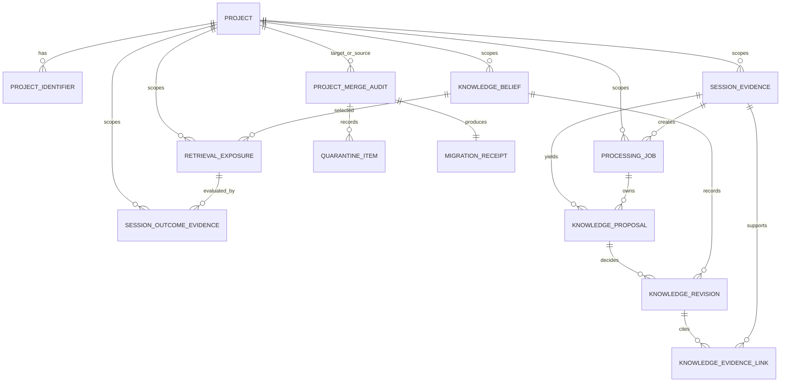

# Data Model: Engram Architectural Recovery

**Status**: Target contract for implementation; not an applied schema.  
**Authority**: The recovery constitution and `spec.md` govern this model. Existing models and
migrations are observed inputs, not target authority.

## Model Boundaries

- PostgreSQL holds authoritative durable records.
- Project Identity resolves before any project-scoped record is read or written.
- Evidence, active knowledge, revisions, state, and projections are separate models with one owner
  each.
- Vectors, graph records, summaries, clusters, search caches, and dashboards are projections; they
  may reference authority but must never become authority.
- Adjacent issues, documents, credentials, collections, code intelligence, and Loom retain native
  models and are not implicitly transformed into knowledge.



## Canonical Project Identity

### Project

| Field | Rules |
|---|---|
| `project_key` | Immutable UUID primary identity. Never derived from path, name, remote, or hash. |
| `anchor_project_id` | Immutable V3 anchor UUID; unique for active projects. |
| `display_name` | Mutable display metadata; not an identifier. |
| `scope` | `repository` or explicitly declared `directory`. |
| `status` | `active`, `merged`, or `retired`. |
| `created_at`, `updated_at` | Audit timestamps. |

**Invariants**: Every new project-scoped authoritative record references exactly one active
`project_key`; global records are explicitly global and may use a null key only when their native
contract permits it. A merged project redirects identity resolution but is never silently reused.

### Project Identifier

| Field | Rules |
|---|---|
| `identifier_id` | Immutable row identity. |
| `project_key` | Required Project foreign key. |
| `scheme` | `anchor_v3`, `binding_v2`, `git_remote_relative_v2`, `git_hash_v2`, `path_hash_v1`, `legacy_slug`, `non_git_anchor_v2`, or `manual_alias`. |
| `normalized_value` | Credential-stripped, normalized value. |
| `source`, `provenance` | How and why identifier was observed or accepted. |
| `status` | `active`, `redirected`, or `retired`. |
| `first_seen_at`, `last_seen_at` | Observation history. |

**Uniqueness**: `(scheme, normalized_value)` has one owner at a time. Identifier collision is a
merge-plan conflict, never an opportunistic overwrite.

### Project Merge Audit

A merge audit records `merge_id`, source keys, target key, evidence class, conflict policy,
before/after table counts, fingerprints, privacy result, actor, start/end timestamps, rollback
boundary, and a pointer to the migration receipt. It is append-only after execution.

## Durable Session and Work Records

### Session Evidence

| Field | Rules |
|---|---|
| `evidence_id` | Immutable UUID. |
| `project_key`, `session_key` | Required project and supported host session identity. |
| `principal_ref`, `privacy_scope` | Required authorization/privacy context or explicit anonymous/global policy. |
| `source_adapter`, `payload_version` | Versioned origin. |
| `transcript_ref` or redacted content reference | Retained according to privacy/retention policy; raw secret content is forbidden. |
| `payload_fingerprint` | Idempotency fingerprint scoped to source, project, session, and payload semantics. |
| `observed_at`, `accepted_at` | Source and acceptance timing. |
| `provenance` | Host, client instance, anchor descriptor, and acquisition facts. |

**Uniqueness**: `(source_adapter, project_key, session_key, payload_fingerprint)` identifies one
logical accepted event. A duplicate returns the original receipt and does not create a duplicate
job or proposal.

### Processing Job

| Field | Rules |
|---|---|
| `job_id`, `kind` | Immutable job identity and work type. |
| `project_key`, `evidence_id` | Required scope and causal source when evidence-backed. |
| `idempotency_key` | Unique within job kind and project. |
| `state` | Durable state machine below. |
| `lease_owner`, `lease_expires_at` | Worker ownership only; lease expiration makes work available without changing its meaning. |
| `attempt_count`, `next_attempt_at` | Retry policy state. |
| `last_error_code`, `last_error_summary` | Redacted diagnostics. |
| `received_at`, `started_at`, `completed_at` | Lifecycle timestamps. |
| `terminal_reason` | Required for terminal failure, quarantine, or completion-with-no-proposals. |

**Processing state machine**:

```text
received -> normalized -> extracting -> proposed -> reconciling -> completed
       \-> retryable_failure -> normalized|extracting|reconciling
       \-> terminal_failure
       \-> quarantined
```

Only valid worker transitions may advance state. `retryable_failure`, `terminal_failure`, and
`quarantined` retain the evidence and diagnostic. Timers only discover eligible jobs.

## Knowledge Core

### Knowledge Proposal

A proposal is a bounded candidate claim extracted from one or more evidence records. It contains
`proposal_id`, `project_key`, evidence references, content, normalized subject, type, scope,
privacy, applicability, confidence, extraction method/version, content fingerprint, and
`reconciliation_state`.

A proposal may be created without a provider only when deterministic extraction establishes the
same bounded contract. It is never automatically rendered to a user until reconciliation records a
terminal decision.

### Knowledge Belief

A belief is the one current reusable proposition for a resolved subject, scope, privacy,
applicability, and validity context. It contains `belief_id`, `project_key`, canonical normalized
proposition identity, current content, type, status, confidence, privacy/principal scope,
applicability, validity interval, created/updated timestamps, and `current_revision_id`.

**Uniqueness**: At most one `active` belief exists for one canonical proposition plus compatible
applicability and privacy context. Historical and superseded beliefs remain addressable.

### Knowledge Revision

A revision is append-only history of a belief decision. It contains `revision_id`, `belief_id`,
optional `proposal_id`, operation, before/after representation references, rationale, actor or
workflow identity, timestamp, and conflict provenance.

Allowed operations: `create`, `strengthen`, `weaken`, `revise`, `supersede`, `suppress`,
`restore`, `expire`, `archive`, `destroy`, `reject_noise`, `reject_policy`, `no_op_duplicate`, and
`contradiction_pending`.

### Knowledge Evidence Link

A link identifies the evidence that supports, contradicts, or contextualizes a revision. It stores
`revision_id`, `evidence_id`, link role, weight or certainty, provenance, and timestamp. A belief
may never gain confidence without a link or an explicitly recorded policy action.

### Reconciliation Decision Rules

| Decision | Required result |
|---|---|
| `create` | New active belief and create revision. |
| `strengthen` | Existing belief remains active; support revision/link added. |
| `revise` | Existing proposition gains changed content/applicability with history preserved. |
| `supersede` | New/updated belief becomes active; incompatible predecessor is superseded. |
| `contradiction_pending` | No activation; exception-review item and rationale retained. |
| `reject_noise` | No belief mutation; rejection reason retained. |
| `reject_policy` | No belief mutation; policy/privacy reason retained. |
| `no_op_duplicate` | No semantic change; idempotent decision retained. |

## Retrieval, Exposure, and Outcome

### Retrieval Exposure

An exposure records one rendered belief packet for a concrete task or query. It includes
`exposure_id`, `project_key`, session/task identifier, query fingerprint and source,
belief/revision identity, pre-ranking filter result, score components, selection rationale,
render budget, rendering timestamp, delivery receipt, privacy/principal context, and idempotency
key.

**Invariants**: One automatic delivery produces exactly one exposure record. An empty result has a
separate explicit receipt and never masquerades as exposure of unrelated recent content.

### Session Outcome Evidence

Outcome evidence includes `outcome_id`, `project_key`, session/task identifier, optional exposure
references, `outcome` (`success`, `partial`, `failure`, `abandoned`, `unknown`), `certainty`
(`observed`, `explicit`, `inferred`, `timeout`), source adapter, observed timestamp, idempotency
fingerprint, explanatory evidence references, and conflict disposition.

**Invariants**: Process exit alone maps only to `unknown` or `abandoned` per timeout policy. A
conflicting repeat outcome is retained and referred to an explicit conflict policy; it does not
silently overwrite the first observation.


### Capability Health

Capability Health records a named external or operational capability with `configured`,
`available`, `degraded`, `paused`, or `failed` state; last probe, last successful use, error class,
queue impact, operator action, and measurement scope. Health does not control whether durable
work is accepted.

## Migration, Quarantine, and Retention

### Migration Receipt

A receipt binds a migration operation to source version, target version, schema set, feature/release,
source and target identities, per-object-family before/after counts, semantic payload-preservation
or quarantine result, redacted fingerprints, provenance/privacy/revision checks, conflict and
quarantine counts, idempotency key, backup/export reference, rollback boundary, verifier,
observation window, and terminal result. Every migration metric records numerator, denominator,
scope, window, evidence reference, and `not_computable` when its denominator is zero.

### Quarantine Item

A quarantine item records unresolvable or unsafe data without silently assigning ownership. Fields
include `quarantine_id`, object family, stable source reference, candidate project identifiers,
reason code, privacy class, discovered timestamp, owner, required decision, target release, and
terminal disposition. A quarantine item has no automatic deletion path.

### Retention Rules

- Evidence, revisions, merge audit, exposure, and outcome records use explicit retention policy;
  purge/destruction is exceptional, audited, and never a side effect of supersession or archive.
- Credentials remain sealed; migrations and collision handling compare only metadata and never
  plaintext secret material.
- Projection records are rebuildable and may be discarded only after proving their authority source
  survives.
- State Plane records are current continuation data, not beliefs. The continuity-slot memory row is
  retired only after state migration, receipt, and observation proof.

## Identity Merge Conflict Classes

| Class | Deterministic policy |
|---|---|
| Equivalent row | Deduplicate by stable content and provenance fingerprint; retain all evidence links. |
| Same external ID, different content | Preserve distinct revisions or create a conflict; never discard silently. |
| Current state conflict | Choose newest causally valid state; preserve older state as history; timestamp alone is insufficient. |
| Settings conflict | Carry identical/one-sided values; require a recorded winner for contradiction. |
| Credential conflict | Compare metadata only; require operator action for competing secret material. |
| Issue/document collision | Namespace or report collision; retain native identifiers/provenance. |
| Cross-project relation | Rewrite only after both endpoints have canonical project keys. |
| Privacy/principal conflict | Choose equal or stricter scope; widening requires explicit authorization. |

## Current-to-Target Compatibility Map

| Current observed family | Target authority | Compatibility posture |
|---|---|---|
| Text `project`, legacy IDs, binding aliases | Project + Project Identifier | Read/translate during sunset; no new selector-only minting. |
| `session_transcripts` plus timer-driven dream work | Session Evidence + Processing Job | Import/replay through bounded adapter; retain source rows until receipt/observation. |
| Candidate status and review/bulk flows | Knowledge Proposal + Revision + exception review | Preserve evidence; map semantic decisions; quarantine undecidable rows. |
| Active memory rows/lifecycle fields | Knowledge Belief + Revision | Legacy read compatibility during AR-5/AR-6; new knowledge writes use reconciliation. |
| Injection/citation records | Retrieval Exposure + Outcome Evidence | Preserve provenance; citations remain optional evidence. |
| Continuity slot memory record | State Plane | Remove only after state migration and observation gate. |
| Graph/vector/summary/metamemory rows | Rebuildable projections | Keep only with named consumer/rebuild contract; otherwise export/delete after evidence. |
