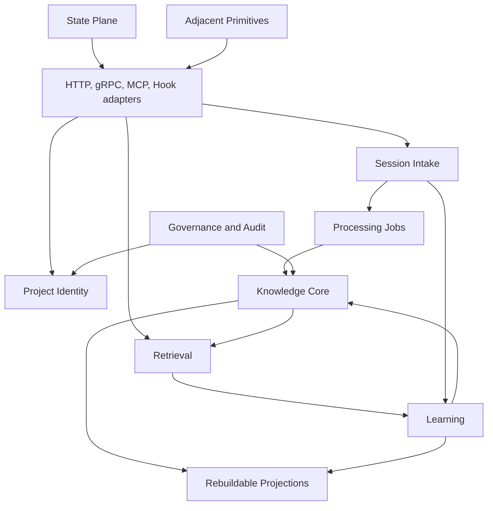

# Implementation Plan: Engram Architectural Recovery

**Branch**: `spec/engram-architectural-recovery` | **Date**: 2026-08-22 | **Spec**: `spec.md`  
**Constitution**: `.specify/memory/constitution.md` version 1.0.0 at plan acceptance. Constitution 2.0.0 current-order revalidation appears in [Current-order revalidation](#current-order-revalidation).
**Status**: AR-0 implementation authority only; implementation remains unauthorized.

## Summary

Recover one observable default product loop:

```text
canonical project resolution
  -> durable session evidence
  -> durable processing job
  -> bounded knowledge proposal
  -> reconciliation and revision
  -> task-aware retrieval
  -> bounded rendered packet and exposure
  -> automatic outcome evidence
  -> utility/lifecycle review
```

The target is a Go modular monolith with PostgreSQL authority. Existing transport adapters keep
compatibility only at their edges; target domain workflows do not branch by architecture era.
Recovery is delivered through the operator-required AR-1 through AR-7 installed release map. AR itself has no working-surface design or replacement network-service scope. Feature 011 owns the separately accepted operator work under Constitution 2.0.0.

## Technical Context

**Language/Version**: Go 1.26.6; JavaScript hooks and TypeScript client/UI consumers remain
compatibility boundaries.  
**Primary Dependencies**: GORM/gormigrate, PostgreSQL driver, gRPC/protobuf, Chi HTTP router,
MCP proxy/daemon modules, existing provider ports.  
**Storage**: PostgreSQL 17 is authoritative; existing cache/vector/graph/search structures are
projections or compatibility inputs until classified.  
**Testing**: Go unit/integration tests, cross-language descriptor vectors, real-PostgreSQL migration
fixtures, fault injection, transport compatibility, curated retrieval corpus, installed dogfood,
and clean-install/upgrade proof.  
**Target Platform**: Existing server, gRPC, MCP daemon, and hook clients; no deployment topology
change is authorized by AR-0.  
**Project Type**: Persistent agent-memory modular monolith with HTTP/gRPC/MCP and local-hook
adapters.  
**Performance Goals**: AR-1 establishes current denominators; AR-6 sets measured retrieval and
session-start p50/p95/p99 budgets before any release claims them. The acceptance floor is bounded
packets, zero privacy/cross-project leakage, 90% top-five relevant corpus recall, and explicit
degraded behavior rather than invented latency targets.  
**Constraints**: No application implementation in AR-0; no live database/deployment/profile
mutation; no architecture-era flag as a target product mode; all migration contraction follows
expand, backfill, verify, observe, and contract.  
**Scale/Scope**: Existing multi-project durable data, multiple transport clients, and historical
identity variants. AR-1 must measure current live denominators and use a redacted production-like
fixture before data migration.

## D3 Program Calibration

**Rung**: D3. This artifact is the multi-session, multi-consumer recovery program contract. Wrong
identity, migration, or knowledge authority would affect durable data, installed clients, privacy,
and later release boundaries; the artifact remains implementation authority across AR-1 through
AR-7.

**Operator ceiling escalation**: The program requires seven explicit installable release slices
(AR-1 through AR-7). The D3 five-iteration ceiling is satisfied at the architectural decision level
below; the seven release slices remain separate operational checkpoints because merging their
migration/contraction boundaries would weaken rollback safety.

### Phase 0: KEEP / ADAPT / DISCARD Map

| Existing component or family | Disposition | Research tier | Reason / owning release |
|---|---|---:|---|
| Go server, HTTP, gRPC, MCP proxy | ADAPT | Full | Retain transport shell; route adapters into named workflows. AR-1..AR-6. |
| PostgreSQL/GORM migration authority | KEEP | Full | Durable storage remains authoritative; future changes are additive first. AR-2..AR-7. |
| `projects` V2 aliases and resolver | ADAPT | Full | Compatibility input for V3 inventory/migration, not target tenant key. AR-1..AR-3. |
| Go/JS path/remote/hash identity derivation | DISCARD after compatibility | Full | Replaced by shared V3 anchor descriptor and server key. AR-2..AR-7. |
| Session stop transcript callback | ADAPT | Full | Preserve durable intake intent; replace gated async semantics. AR-4. |
| SessionEnd/OpenClaw automatic outcome URLs | DISCARD/REPLACE | Full | Fresh source confirms unregistered endpoints. AR-1 exposes; AR-4 replaces. |
| Dream timer/idle/count orchestration | DISCARD after job cutover | Full | Timer cannot define demand. AR-4/AR-5. |
| Candidate/review/bulk operations | ADAPT | Full | Useful audit/review logic moves into proposal/revision exception workflow. AR-5. |
| Legacy memory rows and lifecycle | ADAPT | Full | Preserve data through beliefs/revisions and migration adapter. AR-5/AR-6. |
| Static session-start context | ADAPT then DISCARD normal path | Full | Minimal state/policy survives; recent dump does not. AR-6. |
| Worker and MCP retrieval authorities | ADAPT | Full | Converge to one task-aware workflow. AR-6. |
| VNext/V7/maturity flags | DISCARD | Full | Architecture-era switch inventory and removal after evidence. AR-1..AR-7. |
| State Plane services | KEEP/ADAPT | Full | Current continuation remains state, not memory; absorb continuity slot. AR-3/AR-7. |
| Graph, summaries, meta-memory, clusters | QUARANTINE then KEEP-AS-PROJECTION or DISCARD | Deferred | AR-7 terminal consumer/rebuild decision; no core write authority. |
| Issues, documents, vault, collections | KEEP as adjacent | Full identity touchpoints | Maintain native contracts and scoped identity convergence. AR-3. |
| Code intelligence | KEEP as adjacent | Deferred | Detach cognitive/V7 coupling; preserve current consumers. AR-3/AR-7. |
| Loom | KEEP as adjacent | Deferred | Preserve daemon job primitive, not core evidence owner. AR-4/AR-7. |
| Existing operator UI shell | KEEP, no new design | Deferred | UI changes only for honest removal of backed-out capability. AR-7. |
| Retired HTTP 410 endpoint and dead MCP/resource stubs | DISCARD or explicit retirement | Full | Consumer inventory determines compatibility response/removal. AR-1/AR-7. |

### Target Module Boundaries and Dependency Rules



| Target module | Owns | May depend on | Must not depend on |
|---|---|---|---|
| Project Identity | anchor, descriptor, canonical key, identifiers, merge plans/audit | storage port, audit | retrieval, knowledge, transports |
| Session Intake | evidence acceptance, fingerprints, job creation, adapter receipts | Identity, storage/job port | knowledge truth, providers |
| Knowledge Core | proposals, beliefs, revisions, links, reconciliation, lifecycle | Identity value types, storage | transports, projection writes |
| Retrieval | query capture, filters, scoring, optional reranking, budget/render | Knowledge Core, capability port | direct handler flags, raw project selectors |
| Learning | exposure, outcome, utility/review proposals | Identity, storage, Knowledge Core command port | direct belief mutation |
| State Plane | current session/task/project continuation | Identity, storage | belief ranking/history |
| Governance and Audit | exceptions, destructive actions, privacy exceptions, import/export audit | Identity, Knowledge Core | second candidate authority |
| Projections | vectors, graph, summaries, clusters, caches | authoritative records/events | authoritative writes |
| Adjacent Primitives | issues, docs, vault, collections, code intelligence, Loom | Identity compatibility boundary | implicit knowledge conversion |

### Scope Validation Invariant

Every project-scoped job claim, mutation, merge, import, export, cache write, and retrieval
selection MUST first establish canonical project, principal, privacy, source/provenance, and
authorization context. A persisted job lease proves work ownership only; it never substitutes for
scope validation. The only caller-supplied project exceptions are explicit administrative targets
or read filters defined by the V3 contract; each requires a named authorization rule, audit
correlation, privacy-safe response, and no authority to mint, redirect, or mutate a project outside
the resolved scope.

### Current-to-Target Call-Path Map

| Current path | Target path | Disposition |
|---|---|---|
| Hook Go/JS selector derivation → V2 registration → `projects` aliases | V3 anchor descriptor → `ResolveProject` → canonical key in application context | Move/replace AR-2; compatibility sunset AR-7. |
| Stop hook → `/api/hooks/session-end` → gated transcript async write | `AcceptSessionEvidence` → durable receipt + `ProcessingJob` | Reshape AR-4. |
| SessionEnd/OpenClaw outcome URL → no server route | `RecordSessionOutcomeEvidence` versioned adapter contract | Replace AR-4; dead contract visible AR-1. |
| Sleep cycle → idle/count gate → dream extraction → candidate | `ProcessPendingEvidence` → proposal → reconciliation | Replace AR-4/AR-5. |
| Candidate promotion/review/bulk → independent memory effects | `ReviewKnowledgeException` and `ReconcileKnowledgeProposal` | Move/reshape AR-5. |
| gRPC session start + HTTP context inject + MCP recall | `RetrieveKnowledgeForTask` → bounded render → `RecordRetrievalExposure` | Converge AR-6. |
| Reserved continuity memory slot | State Plane continuation record | Migrate state ownership with an AR-3 receipt; complete replacement observation in AR-6; delete only in AR-7 after that observation. |
| VNext/V7/runtime flag readers | startup capability/configuration object plus health | Contract AR-7 after replacement. |
| Graph/meta-memory/vector/cache direct shapes | projection consumer and rebuild contract | Decide AR-7; no core authority. |

### Integration Simulations

1. **Normal work**: V3 descriptor resolves once → evidence is durably accepted → job leases work →
   proposals reconcile into beliefs/revisions → a later task query retrieves a bounded packet →
   exposure is recorded → session completion creates outcome evidence → Learning proposes
   review/utility action → Knowledge Core records any belief revision. Every failure ends in an
   explicit retained job/evidence/outcome state.
2. **Provider degradation**: V3 resolution and evidence acceptance succeed even when extraction,
   embeddings, or reranking are unavailable → job is pending/retryable with capability health →
   lexical query remains available where valid → no static recent dump or invented outcome hides
   the degradation.
3. **Identity convergence**: inventory identifies every selector/data family → an approved merge
   manifest adds typed keys and backfills a bounded group → receipt verifies count/provenance/privacy
   → compatibility reads translate known legacy identifiers → observation sees zero legacy-only
   writes → only then does contraction remove legacy paths.
4. **Rollback**: prior compatible readers remain available before contraction; a failed backfill
   retains job state and audit; a completed merge uses redirect/audit/backup evidence rather than
   ad hoc reverse mutation; post-contraction recovery is restore plus forward reinstall.

### MoSCoW and Architectural Iteration Cut

| Priority | Scope |
|---|---|
| Must | Canonical identity, durable evidence/jobs, reconciliation/beliefs, task-aware retrieval/exposure, automatic honest outcomes, migration/rollback, architecture-era contraction, adjacent continuity. |
| Should | Graph/projection rebuild contracts, rule-policy consolidation, capability-health surface, meaningful installed dogfood metrics. |
| Could | Additional non-core projection improvements after consumer evidence. |
| Won't | New operator working-surface design, graph product, broad temporal UI, SaaS expansion, new cognitive family, unrelated modernization. |

| Architectural iteration | Installable releases | Value statement | Binding constraints | Migration/compatibility | Research debt | Appetite |
|---|---|---|---|---|---|---|
| I1: Truth and safe edges | AR-1 | The installed system stops hiding broken contracts and exposes trustworthy baseline denominators. | No identity merge/deletion before inventory. | Additive metrics/inventory only; previous binary/schema meaning remains. | Live client/row census and production-like fixture. | A few implementation sessions. |
| I2: Identity authority | AR-2, AR-3 | New writes converge on explicit identity, then historical data converges without loss. | V3 must precede every new scoped workflow; typed keys before contraction. | Expand → dual compare → approved merge/backfill → observe. | Accepted merge groups and conflict counts. | Needs decomposition across two releases. |
| I3: Durable knowledge intake | AR-4, AR-5 | Accepted work becomes durable, revisable knowledge instead of timer-gated candidate accumulation. | Intake before providers; reconciliation before activation. | Legacy transcripts/memory read adapter; no destructive legacy removal. | Provider/dogfood reliability and semantic mapping. | Needs decomposition across two releases. |
| I4: Relevant learning delivery | AR-6 | Agents receive bounded knowledge for their actual task and outcomes become learning evidence. | Task query/exposure before utility claims; static injection only retires after parity. | Shadow retrieval then adapter cutover; legacy aliases only at boundary. | Measured corpus and latency baseline. | A few implementation sessions. |
| I5: Direct architecture | AR-7 | The running system expresses one architecture with no maturity-era branch. | Contract only after observation/backup/zero drift. | Terminal deletion/projection decision and restore boundary. | Final consumer/rebuild audit. | Needs decomposition. |

## Release Map and Rollback Boundaries

| Release | Closes | Major scope | Exit evidence | Rollback boundary |
|---|---|---|---|---|
| AR-1 | Sessions can appear complete while a dead callback and fragmented metrics hide missing learning. | Truth metrics, dead-loop visibility, no new selector-only tenant, inventories, fixture/backup procedure. | Installed receipt shows truthful denominators and no silent completion-hook failure. | Previous binary; additive metric/inventory data remains. |
| AR-2 | Supported clients cannot present one explicit project anchor or receive one canonical key. | V3 anchor/descriptor, resolver, typed nullable keys, dual write/read, compatibility adapters. | Cross-client vectors and dogfood dual representation agree. | Outer compatibility adapter only; additive identity rows remain. |
| AR-3 | Historical project data remains fragmented and cannot be safely merged. | Merge manifest, backfill, quarantine, redirects, adjacent identity cutover, state migration. | Counts/provenance/privacy/idempotency/rollback rehearsal pass; no new legacy-only writes. | Dual representation before contraction; audit/backups authoritative. |
| AR-4 | Work can disappear between hook, provider, timer, and restart. | Session evidence/jobs, durable acknowledgment, replay/outbox, outcome evidence, health/backlog telemetry. | Terminal-state/replay/restart/dogfood evidence; dead outcomes retired. | Pause workers; retain evidence and compatibility readers. |
| AR-5 | Engram accumulates notes rather than revisable knowledge. | Proposals, beliefs/revisions, reconciliation, exception review, legacy mapping, shadow comparison. | Full decision fixture and real revision/supersession evidence. | Pause reconciliation; retain proposals/revisions for recovery. |
| AR-6 | Context is static and feedback cannot explain utility. | Task capture, one retrieval path, bounded render, exposure, learning, corpus, shadow/cutover. | Retrieval/leakage/bound/outcome dogfood gates; static dump not normal. | Last accepted belief projection at adapter boundary; no parallel writes restored. |
| AR-7 | The codebase still carries competing architecture eras. | Remove flags/legacy identity/injection/candidate paths/continuity slot/dead routes; terminal projection decisions; full proof. | Gates A-I, zero unclassified inventory entries, clean install/upgrade/restore/dogfood proof. | Before contraction: application rollback. After contraction: rehearsed backup/restore and forward reinstall. |

## Schema and Migration Sequence

1. **Inventory** every project-bearing field, payload, cache, import/export, and job reference;
   classify source truth and create a redacted fixture.
2. **Expand** V3 Project/Identifier/Merge Audit and nullable typed keys; add evidence/job/knowledge
   tables and all indexes/constraints through forward migrations only.
3. **Compatibility** resolves known legacy identifiers at adapters; new domain workflows consume
   canonical keys; dual comparison observes mismatch without repository-local dual writes.
4. **Backfill** uses durable, idempotent, rate-bounded jobs; unresolved data becomes quarantine.
5. **Verify** per object family: counts, semantic payload-preservation or explicit quarantine,
   redacted fingerprints, provenance, privacy, revision history, foreign keys, duplicate delivery,
   and rollback receipts per bounded merge/backfill group.
6. **Cut over** authoritative reads/writes to typed keys and new workflows at application boundaries.
7. **Observe** at least one installed release with drift counters and legacy-client telemetry.
8. **Contract** legacy columns, selectors, flags, routes, packages, tests, mocks, caches,
   manifests, imports/exports, docs, navigation, and projections only after all preceding proof is
   green.

## Removal Ledger and Closure Rule

The AR-0 evidence set contains an itemized package/route/hook/tool/projection/adjacent inventory
and a separate test/mock/current-documentation claim ledger. Every entry names a disposition,
owner, evidence, and target release. Every `compatibility-temporary` or
`quarantine-pending-proof` entry additionally names a measurable `closure_rule` and independent
`closure_verifier`; terminal keep/move/projection/adjacent/delete/historical entries remain subject
to their disposition-specific release evidence but do not falsely claim a temporary closure gate.
`compatibility-temporary` closes only after its declared replacement, nonzero observed consumer
denominator, sunset condition, rollback evidence, and exact source/config scan pass.
`quarantine-pending-proof` closes only through a recorded safe disposition, never by silence or
calendar expiry.

Each flag deletion is a coupled removal of reader, default, configuration/manifests, cache or
payload key, tests, mocks, current docs, routes, tools, UI/navigation claim, package seam, and
release assertion. Every obsolete current-documentation statement is either removed or moved to a
clearly labeled historical archive with source/consumer status; it must not remain next to current
guidance without that status.

## Validation Strategy

- **Invariants**: identity resolution, ownership, uniqueness, state transitions, reconciliation,
  privacy, and idempotency.
- **Contracts**: shared Go/JavaScript identity vectors; versioned adapter payload/error tests;
  schema validation for anchor/merge/migration receipts.
- **Integration**: real PostgreSQL fixture, job lease/crash/retry/replay, migration/backfill,
  consumer compatibility, and projection rebuild tests.
- **Fault injection**: duplicate events, server restart, lease loss, provider timeout, malformed
  anchor, conflicting outcome, identity collision, interrupted backfill, and restore.
- **Behavior corpus**: positive, negative, stale, superseded, cross-project, privacy, and empty
  retrieval queries plus all reconciliation outcomes.
- **Installed evidence**: fresh install, supported upgrade, dogfood observation, exact built payload,
  release receipt, and SonarQube exact-head gate before publication.

## Evidence Gate Matrix

| Gate | Required behavioral evidence | Metric/receipt binding | Independent verifier |
|---|---|---|---|
| Identity | Cross-client anchor vectors, ambiguous/copy refusal, typed-key comparison | Per-family migration receipt and identity-convergence metrics | Migration verifier independent of maker |
| Evidence/jobs | Durable acknowledgment, duplicate replay, restart, lease/failure state | Evidence/job receipt with terminal-attribution denominator | Durable-work checker |
| Reconciliation | All eight decisions, one-active-belief, revision/evidence links | Corpus result and reconciliation receipt | Knowledge-domain checker |
| Retrieval/outcome | Task trigger, scope filters, bounded packet, exposure, outcome certainty | Corpus, exposure/outcome coverage, installed dogfood receipt | Retrieval/privacy checker |
| Contraction | Source/config/docs/test/mock/cache/manifest/route/tool/UI removal scan | Exact-head release receipt plus observation/rollback evidence | Independent release verifier |

No gate is passed by source presence, a flag state, a mock screen, a hash, or a zero denominator alone.

## Observability and Operability

Durable records, not in-process counters, provide intake backlog, oldest pending age, terminal
failures, proposal decisions, belief revisions, retrieval query coverage, exposure count, outcome
coverage, identity convergence, merge/quarantine counts, and capability health. Every metric names
its numerator, denominator, scope, window, freshness, source, and exclusion policy. A zero
denominator is `not_computable`, never green, complete, or zero-risk. Current-process counters and
cumulative records MUST remain separate metric families until a written semantic mapping proves
they share the same event class, window, and denominator. No release accepts a green aggregate with
unaccounted missing work.

## Not Yet Specified

The program deliberately defers these decision tickets until the named release needs them:

| Decision ticket | Type | Deferred until | Why it is deferred |
|---|---|---|---|
| Graph keep-versus-delete per consumer | research | AR-7 | Consumer/rebuild value depends on recovered core observation. |
| Meta-memory/cluster/summary product value | research | AR-7 | They are projections; no early architecture decision is forced. |
| Exact provider model/budget configuration | task | AR-4/AR-6 | Capability health contract is fixed; provider selection is deployment policy. |
| Final latency thresholds | research | AR-6 | Measured baseline is required before a threshold can be accepted. |
| Production merge groups and credential metadata conflicts | grilling | AR-3 | Requires operator-approved manifest and live fixture evidence. |
| Operator working-surface redesign | task | Separate Feature 011 under Constitution 2.0.0 | This AR plan remains recovery-only. The separate feature owns current-order surface work without changing AR evidence or release outcomes. |

## Constitution Check: Pre-Design

| Gate | Result | Evidence |
|---|---|---|
| One product loop | PASS | Summary and target workflows name one evidence-to-outcome path. |
| Default product behavior | PASS | Flag contraction and capability-health posture are explicit. |
| Stable identity before scoped access | PASS | V3/typed-key sequence precedes new domain writes. |
| Authority separation | PASS | Data model separates state, evidence, belief, revision, and projections. |
| Durable work state | PASS | Processing Job is required before provider/retry work. |
| Reconciliation before accumulation | PASS | Proposal decisions and active-belief invariant are mandatory. |
| Task-aware bounded retrieval | PASS | Query-first/exposure/budget contract is required. |
| Honest feedback | PASS | Outcome certainty/unknown semantics are mandatory. |
| Evidence-backed removal | PASS | Phase 0 and removal ledger require consumer/rollback/receipt. |
| Meaning-conserving migrations | PASS | Expand/backfill/verify/observe/contract sequence is explicit. |
| Small installed releases | PASS | AR-1..AR-7 have outcome and rollback boundaries. |
| Core before surface | PASS | In this AR plan, recovery scope excludes surface redesign. Constitution 2.0.0 separately admits Feature 011 without reopening this historical AR boundary. |
| Behavioral evidence | PASS | Fixture, dogfood, installed proof, and receipts are required. |
| No copied demolished implementation | PASS | Outcome recovery is new-contract based. |

## Constitution Check: Post-Design

PASS. `research.md`, `data-model.md`, and contracts are required to preserve every pre-design gate;
no plan step selects a second product workflow, a maturity flag, an unanchored identity, or a
contraction before compatibility and observation evidence.

## Current-order revalidation

This annotation preserves the accepted AR-0 plan and its historical Constitution 1.0.0 evidence. Its no-working-surface statements bind AR scope only. They do not prohibit the separately accepted Feature 011 under Constitution 2.0.0.

Feature 011's early Code/basic-collection milestone may admit Book Context planning. It does not complete Feature 011 or admit Book Context implementation. Full Feature 011 completion includes the named collection consumers and S4 daemon job control. Book Context implementation follows that completion, and Working Agent Memory R1 remains after the Book Context product result. All other core-only gates remain unchanged because they define AR scope, not the current cross-feature order.

## Project Structure

### Documentation (this feature)

```text
specs/001-engram-architectural-recovery/
├── spec.md
├── plan.md
├── research.md
├── data-model.md
├── quickstart.md
├── contracts/
├── checklists/
├── evidence/
├── analysis/
├── tasks.md
└── IMPLEMENTATION-SESSION-PROMPT.txt
```

### Source Code (current and target map)

```text
cmd/engram-server/          # server entry
cmd/engram/                 # daemon/client entry
internal/proxy/             # current identity derivation (migration input)
internal/grpcserver/        # gRPC adapter and identity boundary
internal/worker/            # HTTP adapters, current orchestration, schedules
internal/mcp/               # server tool boundary
internal/db/gorm/           # current models/stores/migrations
internal/handlers/          # daemon modules (engramcore, Loom, code intelligence)
internal/{crystallization,lifecycle,feedback,retrieval,ruleinjection}/
plugin/engram/hooks/        # JavaScript adapter boundary
plugin/openclaw-engram/     # compatible client boundary
proto/engram/v1/            # shared transport contract
ui/                         # existing Vue dashboard; no new design in recovery
apps/operator-console/       # separate deployable Nuxt console; inventory and cleanup only
```

**Structure Decision**: Implementation moves useful current logic into named target domain modules
under `internal/` without preserving VNext/V7/milestone package names. `ui/` and
`apps/operator-console/` are distinct existing surfaces; AR-1 inventories both and AR-7 may only
remove or honestly retire claims backed by deleted capability, never redesign either. No source
restructure is authorized by AR-0; tasks assign each move to one release and one ownership boundary.

## Complexity Tracking

| Violation or risk | Why needed | Simpler alternative rejected because |
|---|---|---|
| Seven named release slices exceed D3's default five-iteration ceiling | Operator explicitly requires AR-1..AR-7 to preserve separate migration/rollback/observation boundaries. | Collapsing releases hides cutover risk and violates the binding delivery contract. |
| V3 compatibility period | Existing installed clients and historical selectors need safe convergence. | Immediate selector deletion risks inaccessible durable data and clients. |
| Dual compare at application boundary | Required to measure semantic migration before authoritative cutover. | Repository-local independent dual writes create divergent authority. |
| Quarantine ledger | Some live historical data/payload identity cannot be safely inferred from source alone. | Name/path similarity silently misassigns tenant and privacy ownership. |

## D3 Handoff

Next invocation: `architect AR-1 truth-and-fences --of 001-engram-architectural-recovery` at D2,
with an appetite of a few implementation sessions. It must first discharge the AR-1 research debt:
read-only production/client/row inventory and a redacted legacy fixture under explicit operational
authorization. It must not implement AR-2+ scope or redesign the working surface.
