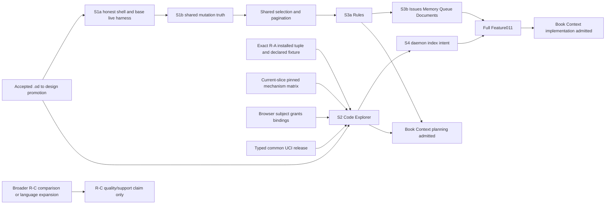

# Implementation Plan: Operator Code Console

**Branch**: `ui/operator-code-console-r1` | **Spec**: [spec.md](spec.md)
**Input**: Approved Feature011 specification and Constitution 2.0.0; UCI Feature010 current seams; Web UI recovery packet; r11 roadmap; pinned SocratiCode and Graphify mechanism handoffs.

## Summary

Deliver the separately accepted browser presentation for existing Engram authority without a second graph, storage bypass, or HTTP-MCP transport. The first requested user result is not the shell: an ordinary installed agent session **and** a browser independently choose authorized worktrees, run a real semantic query, traverse a bounded code graph, and exact-read a cited span from the same pinned View. The browser is R-B and uses the exact R-A tuple named by the live fixture.

S1a is an independently installable enabling slice: it removes eager shell body loads and closed-settings traffic while showing unknown rather than inventing a total. S1b removes false rollback/verified-success claims from all twelve direct mutation consumers. S2 is the read-only Code Explorer. S3 supplies Rules-first selection/pagination/operations, then bounded Issues, Memory, Queue, and Documents consumers. S4 makes browser index demand durable and daemon-owned. Book Context planning requires **accepted S2 and accepted Rules**; Book implementation requires full Feature011, including S3b and S4.

## Planning Calibration

**Rung**: D2. This package corrects Feature011 planning, not UCI core, IAM, Book Context, or r11 as a whole. Browser grant issuance, common release, tab isolation, migration registry, and live fixture ownership are each explicit because a wrong boundary affects multiple consumers.

## Technical Context

- **Runtime**: Go server/UCI and TypeScript/Vue/Nuxt browser console. PostgreSQL/pgvector remains the authority; no new deployable service.
- **Code authority**: UCI Source/Checkout/immutable View and exact stored source read remain sole authority. `internal/worker` is a typed presentation/composition adapter, never direct `ci_*` SQL or an MCP proxy.
- **Browser identity**: a persistent real BrowserSubject, exact Source+Checkout grant, server-issued `tab_binding_id`, and current per-document proof. Browser `sessionStorage` retains only a resume pair; the server-owned one-time reload token is not an authorization or tab-classification artifact. Console Code uses the declared opener/navigation bootstrap classifier only to route fresh/copy/reload behavior; binding/proof identify a document within an authenticated subject, while the grant and UCI ContextRef remain separate read authority.
- **Release**: common UCI release maps `mcp_keycard` and `browser_subject` callers separately. It reauthorizes immediately before contextual response serialization and records non-content exposure for status/query/graph/read/released intent result.
- **Testing**: focused Go vectors plus disposable PostgreSQL, real authenticated Go server, built Nuxt, installed ordinary agent/daemon, live Playwright A/B worktrees, and concurrent MCP. Existing mock Playwright remains interaction-only.
- **Bounds**: reuse UCI query/graph/read budgets; reject invalid oversized values; no client page length is a total. Exact source remains bounded persisted View bytes, not a disk fallback.

## Constitution Check

| Gate | Plan disposition |
|---|---|
| Typed, pinned, authorized context | Every code request uses exact Source/Checkout/View. Labels, paths, Space, branch, tab, and legacy project do not authorize it. |
| One authority and truthful release | HTTP calls existing UCI application and common release; no second graph/index, raw SQL UI, or HTTP MCP. |
| Durable work | S4 persists intent, tracks idempotency/ACK/retry/terminal state, and requires resulting View readback. |
| Separate feature and release scope | Constitution permits this surface after UCI technical acceptance. This correction makes no release, deployment, publication, or UCI reacceptance claim. |
| Migration meaning and privacy | Additive schema follows one allocator. No source body/query/absolute locator/credential is stored in grant, binding, operation, or exposure metadata. |

## Current Source Grounding

| Observed seam | Planning consequence |
|---|---|
| `internal/worker/uci_application.go:19-21,41-44,104-149,152-172` returns pre-exposure View responses; semantic query becomes eligible only at complete selected-View embedding coverage; read has no disk fallback. | S2 uses the composed UCI application and cannot label lexical/degraded output semantic. |
| `internal/mcp/tools_code_intel.go:780-892` reauthorizes exact context and records exposure before response serialization. `internal/uci/exposure.go:109-121,409-468,552-572,679-685` currently models keycard/session and only search/graph/read. | UCI release owner extracts a transport-independent typed caller port; browser identity and `code_status`/`code_index_result` are explicit extensions, not fake keycards or mislabeled search. |
| `internal/db/gorm/uci_context_store.go:30-32,77-146,177-223` lists/authorizes only recorded checkout owner. | `CodeGrantApplication` adds an exact grant authority and issuer check against `ci_checkouts.owner_principal`; it does not reinterpret role/label/Space. |
| `internal/worker/middleware.go:464-494` creates `auth.Session(user.Role)` for real DB/authentik browser sessions, while `internal/auth/identity.go:146-171` has no session principal. `internal/db/gorm/audit_store.go:40-53` provides transactional audit append. | Auth/grant owner carries persisted user identity to BrowserSubject and commits issuance/revocation with audit; disabled/HMAC/master/keycard paths remain excluded. |
| `internal/uci/context_resolver.go:14-16,39-52` makes selection client-scoped convenience; browser storage may be copied by an opener. | Browser Binding Application owns binding persistence, one deterministic document-lease/resume transition, collision rotation, and binding-proof validation. Browser proof identifies a document but cannot authorize a code read. |
| `internal/worker/service.go:880-928,1657-1807` composes stores and owns `setupRoutes`; `internal/db/gorm/migrations.go:15-23` owns ordered gormigrate registry. | Composition owner exclusively registers routes; migration-registry owner allocates one ordered migration entry after owner inputs. Handler/auth owners never edit either shared file. |
| `apps/operator-console/layouts/default.vue`, `SettingsModal.vue`, and `playwright.config.ts` contain eager shell/settings paths and mock browser harness. | S1a owns shell/locales plus base live harness/config/package script. S2 contributes scenario tests through that harness only. |
| `apps/operator-console/composables/useOperatorApi.ts:410-440` calls refresh/rollback together; exact direct consumers are the twelve `useOperator*.ts` paths enumerated in `collection-operations.md`. | S1b changes shared union once, then domains migrate their own consumers in a single atomic integration cutover. |

## Architecture Decisions

1. **HTTP presentation reuses UCI, not MCP.** `internal/worker` validates DTOs and calls one UCI application. Common release reauthorizes, validates, records required exposure, and then serializes. Existing MCP framing/vectors remain compatible.
2. **Source owner grants exactly.** `CodeGrantApplication` exposes `POST /api/code/grants` and `POST /api/code/grants/{grant_ref}/revoke`. It allows the issuer only when its real BrowserSubject principal equals the existing tuple’s `owner_principal`; grant and audit commit together. No admin role, Space, path, or label substitutes for that predicate.
3. **Server-issued binding preserves reload without trusting lifecycle close.** Browser Binding Application gives each document a binding ID plus current proof, carries both on every binding-bound request/lease operation, and owns the one-time server resume token. Console Code classifies actual bootstrap: opener means fresh/cleared storage, supported no-opener `navigate` copied pairs handshake to collision, only supported no-opener `reload` resumes, and every other signal clears to fresh unselected state. Navigation metadata and the cookie are not proof or authority. A valid reload retains its pin after close or bounded lease expiry, while document-lease expiry retains the binding/pin and only binding/session expiry destroys them. Every use still reauthorizes independently.
4. **Release categories are explicit.** Context discovery/binding/grant administration and non-contextual intent admission use ordinary authorization only. Status, search, graph, source, continuation underlying results, and resulting intent View metadata use common release/exposure. Denials and release failure disclose no contextual fields.
5. **Mutation truth is one client vocabulary, not rollback fiction.** `OperatorMutationResult` names observed commitment/readback truth. Shared owner changes only the seam; each domain owner owns its specified composable/readback adapter.
6. **Selection is shared, action authority is not.** Tokens freeze one authorized target set. Rules, Issues, Memory, Queue, and Documents retain their own action matrix/postcondition; there is no universal bulk engine or secret reveal.
7. **Daemon intent is durable but not execution.** Only daemon owner may ACK/claim/execute/publish. HTTP acceptance is never completion; released resulting View is the readback boundary.
8. **Mechanism adaptation is fixed for this slice and bounded for broader R-C.** The pinned matrix governs S2’s supported fixture/limitations. Broader parity, new language/relation, and comparator claims need separate source-oracle evidence; neither blocks a limited current-slice S2.

## r11 Roadmap Alignment and Residual Basis

| Result | Feature011 contribution | Required evidence | Finite residual boundary |
|---|---|---|---|
| R-A ordinary agent core | Consumes the installed UCI candidate; provides normal agent side of S2. | Exact server/daemon/parser/profile/console tuple; ordinary agent non-lexical RU semantic query after complete embedding coverage; relation and exact View read. | Watcher p95 discrepancy classification, provider/profile readiness, and exact installed tuple remain in `research.md` R-10. |
| R-B real GUI vertical | S1a/S1b enable honest interaction; S2 is Code Explorer; S3/S4 complete Feature011. | Live Go/PostgreSQL/browser A/B plus MCP: grants, binding collision/reload, same-View semantic search/graph/read, normal watcher A update, B isolation, revocation/release failure. | Preview is controlled/non-production. It is not release or a Sonar substitute. |
| R-C mechanism and target profile | Presents only declared coverage/limitations; no generic parity. | Fixed current-slice Go and bounded TS/TSX alias/re-export fixture. Expansion requires source oracle, lexical baseline, aligned profile, and independent judge. | Engram is conditionally supported only for frozen fixture; nvmd-ai and NovaScript are deferred until their own evidence packets. |

`research.md` R-10 is the authoritative finite residual ledger: watcher variance, consumer tuple, provider readiness, Sonar administrator debt, target-project dispositions, optional comparator, and preview versus release boundary. No row creates a calendar forecast or authorizes an external effect.

## Dependency Graph

The current-slice matrix, not broader R-C comparison, gates S2. The graph expresses the Book conjunction: Rules alone never admits planning, and S2 plus Rules never admits Book implementation. S2/S3 work may run in parallel only after ownership reservation below.

## Exclusive Ownership and Handoffs

| Writer zone | Sole writer | Exact files/surfaces | Handoff |
|---|---|---|---|
| Auth/grants | Auth/grant owner | `internal/auth/identity.go`, authenticated browser middleware/session carrier, `CodeGrantApplication`, grant store/audit tests | Supplies canonical BrowserSubject, exact Source-owner issuance/revoke, and `CanRead(source, checkout)`; never daemon authorization. |
| Browser Binding Application | Browser Binding Application owner | tab-binding persistence and migration declaration; document lease/resume/collision state machine; binding guard; focused Go state-machine/persistence tests | Receives canonical BrowserSubject/session carriage from Auth/grants; hands a transition/guard port to HTTP, a store/wiring declaration to composition, and the documented headers/results to the Code UI. It cannot issue grants, serialize routes, invoke UCI, own the UI bootstrap classifier, or edit shared harness config. |
| Migration registry | Migration-registry owner | `internal/db/gorm/migrations.go` only | Receives additive migration requests from grants, bindings, selection, and intents; allocates one next ID/order and owns registry edit. No other owner picks a number or edits the registry. |
| Service composition and route registration | UCI composition owner | `internal/worker/service.go`, `internal/worker/uci_context.go`, injection/wiring, `setupRoutes` | Reviews handler registration contract and adds the one call in `setupRoutes`; HTTP owner supplies handler package and route-registration function but never edits `service.go`. |
| UCI response release | UCI release owner | `internal/uci` release caller/mapper, `internal/mcp/tools_code_intel.go`, exposure vectors | Preserves MCP behavior and exposes typed browser/MCP release with explicit metadata operations. |
| HTTP DTO/handlers | Operator-code HTTP owner | `internal/worker/handlers_operator_code.go`, handler DTO/unit tests | Calls composed UCI/release only; hands one reviewed registration function to composition owner; owns no query/graph/source policy. |
| S1a shell and base live harness | Console shell/harness owner | `layouts/default.vue`, settings components, relevant locales, `apps/operator-console/package.json`, `playwright.live.config.ts`, shared live fixture/bootstrap | Supplies built-console/live-route trace harness before S1a acceptance. Code owner adds S2 scenario assertions without changing harness config/script. |
| S2 typed Code UI | Console Code owner | `useOperatorCode.ts`, Code page/components, bootstrap classifier (`window.opener` plus `PerformanceNavigationTiming.type`), tab resume storage/current document proof, code-specific live browser scenario tests | Records supported browser engine/version and bootstrap signals, consumes the Browser Binding Application transition/guard contract and HTTP DTOs only, and falls back ambiguous state to fresh unselected binding. Cannot edit binding persistence, MCP binding, grant store, UCI graph, or shared harness config/script. |
| Shared mutation result | Console mutation owner | `useOperatorApi.ts`, union and seam tests | Freezes one union then hands each listed consumer to its domain owner; integration owner accepts all twelve in one S1b cutover. |
| S1b consumer migration | Named domain owners | `useOperatorAccess.ts`, `useOperatorBooks.ts`, `useOperatorDocuments.ts`, `useOperatorDomainRegistry.ts`, `useOperatorHealthSettings.ts`, `useOperatorIssues.ts`, `useOperatorKeycards.ts`, `useOperatorMemoryLab.ts`, `useOperatorProjects.ts`, `useOperatorQueue.ts`, `useOperatorRules.ts`, `useOperatorSecrets.ts` | Each migrates only its result adapter/readback; no owner changes the shared union. Exact inventory is repeated in `collection-operations.md`. |
| Selection/pagination | Collection shared owner | `useOperatorSelection.ts`, cursor/page-size/accessibility tests | Produces typed selection only; does not authorize actions. |
| Rules, then later domains | Rules owner; then named domain owner | Rules handler/store/transaction; then Issues/Memory/Queue/Documents handlers/composables/tests | Rules first; later domains consume shared seam one at a time with their own action/postcondition. |
| Daemon intent | UCI daemon owner | intent persistence, ACK/claim/status/private daemon integration | Provides safe state/result to HTTP release; never browser path or credential. |
| Design source | Design-source owner | `.od` and curated `design/operator-console` promotion | Promotes accepted flow before app parity evidence; no raw export overwrite. |

## Ordered Slices and Evidence

| Slice | Prerequisites and contribution | Acceptance proof | Rollback boundary |
|---|---|---|---|
| S1a | Accepted design flow; shell/lazy settings/base live harness. | Built console against real Go API proves no shell-only memory-body or closed-settings traffic, unknown ≠ zero, hard reload/focus/keyboard, responsive/zoom/i18n. | UI/harness-only revert; no grant/UCI/data mutation. |
| S1b | Shared union plus all twelve domain consumer handoffs. | Mixed commit/failure, known commit/readback failure, response loss before/after commit, access loss, and callback load-error prove no false rollback/replay. | One client-contract cutover; pending server effects persist for safe readback. |
| S2 | Current-slice mechanism gate, R-A exact tuple, grant/owner/audit, Browser Binding Application, typed release, HTTP adapter, design flow. | Ordinary agent and A/B browser/MCP execute declared semantic query → relation → exact View read; actual opener/navigation signals drive fresh opener, browser duplicate collision, normal/late/crash reload, ambiguous fallback, proof/token replay, and document versus binding/session expiry through the single binding table; normal watcher changes A alias target/caller unchanged to new A View while B stays unchanged; denial/revocation/recorder failure disclose nothing. | Disable/revert additive HTTP/UI/grant/binding seam; retain MCP/UCI Views and audit. |
| S3a | S1b selection/cursor contract. | >200 Rules: explicit/page/frozen filter/exclusions; permission/version change; authorized postconditions; scope reorder is all-or-none. | Rules adapter/handler boundary; transactional reorder has no partial state. |
| S3b | S3a shared seam; one domain at a time. | >100 Issues and each action matrix prove pagination, selection, partial/readback/status/retry-only-unfinished and forbidden action refusal. | Per-domain revert without weakening shared truth. |
| S4 | S2 context/release/binding and intent contract. | Online daemon records ACK/execution/released readable new View; offline remains queued/unavailable; released index result preserves authorization. | Stop new admission; retain durable intent/recovery and no browser filesystem action. |

## Integration Order and Cutover

1. Design source promotes accepted flow.
2. S1a shell/harness owner makes real route-trace harness available; S1a acceptance does not wait for S2/R-C expansion.
3. Mutation owner freezes union; named owners migrate the exact twelve consumers; integration lands one S1b cutover.
4. Auth/grant, Browser Binding Application, release, and HTTP owners deliver their narrow contracts. The binding owner supplies its guard/transition port to HTTP and persistence declaration to composition; migration-registry owner lands ordered additive schema only after their declarations, and composition owner alone wires stores and routes.
5. Code owner lands S2 through the live harness; integrator records the exact ordinary-agent/browser/MCP tuple and S2 fixture.
6. Selection then Rules land; S2 + accepted Rules admits Book planning only. Later domain lanes and S4 complete Feature011; only then is Book implementation admissible.

## Contract-to-Surface Map

| Requirement group | Contract | Primary surfaces | Acceptance |
|---|---|---|---|
| FR-001–003, 020–023 | This plan S1a and design promotion | shell/settings/locales/base live harness | Traffic trace, reload, responsive/a11y/i18n. |
| FR-004–009 | `browser-context-and-grants.md`, `operator-code-http.md` | identity/grants/audit, UCI release, composition/handlers, Code UI | Owner issue/revoke, tab collision/reload, A/B/MCP isolation, release mapping, View/source coherence. |
| FR-010–015, 021–022 | `collection-operations.md` | shared mutation/selection, Rules then domains | Exact twelve consumer cutover, >200 Rules/>100 Issues, atomic reorder, per-item/readback/unknown. |
| FR-016–017 | `index-intents.md` | UCI durable intent/daemon, HTTP status, Code UI | ACK/new released View and offline queued/unavailable. |
| r11 current/broader mechanism | `mechanism-adaptation.md`, `research.md` R-10 | UCI R-A fixture, R-C evaluation, UI capability state | Pinned matrix/current S2 fixture; separate expansion evidence. |

## Migration and Explicit Omissions

Grant, tab-binding, selection-token, and intent persistence are additive. Each owning domain submits its migration declaration to the migration-registry owner, who rereads `migrations.go`, allocates the one next ordered migration, and commits registry change. Existing owner-only UCI authorization remains default-deny until valid grant support exists. MCP calls the extracted release helper with existing vectors before HTTP maps browser callers. Legacy collection routes remain only until named caller migration; no alias retains false-rollback semantics.

This work excludes UCI core repair/reacceptance, Sonar execution, release/deploy/publication, secrets, raw SQL UI, HTTP MCP, new graph DB/service/process, upstream embedding/port, benchmark transfer, Book/M1 implementation, generic IAM, browser implied authority, arbitrary code-fact edits, bulk secret reveal, Queue review-packet action, automatic View switching, and browser access to workstation path/credential.

## Remaining Risks

All remaining risks are finite and owned in `research.md` R-10. The only planning-time risks are the stated external/evidence boundaries: watcher measurement classification, tuple/provider proof, Sonar administrator re-entry, deferred target profiles, and optional comparator availability. None changes approved product scope or blocks the documented current-slice plan without its named closure condition.

## Review Finding Closure Matrix

| Finding | Line-level correction locations | Closure |
|---|---|---|
| 1 — supplied mechanism evidence | `contracts/mechanism-adaptation.md:3-31`; `research.md:73-79`; `plan.md:57,65,79-81,121` | Pinned commits, licenses, URLs, `OBSERVED`/`INFERRED` labels, all six required mechanisms, native seams, proof cases, and explicit rejected last-writer/main-checkout/benchmark transfer are fixed current-slice evidence. |
| 2 — executable grant lifecycle | `contracts/browser-context-and-grants.md:3-34`; `data-model.md:16-17,35-46,78-83`; `research.md:5-13`; `quickstart.md:11,44` | `CodeGrantApplication` issue/revoke HTTP seam requires exact existing Source-owner principal and same-transaction audit; fixture uses it and cannot seed/bypass authority. |
| 3 — browser/MCP release and metadata | `contracts/operator-code-http.md:5-57`; `contracts/index-intents.md:9-17`; `data-model.md:20-21`; `research.md:15-23`; `plan.md:40,53` | Typed caller mapping forbids fake browser keycards and classifies discovery, selection, status, query, graph, read, continuation, intent admission, and released intent result. |
| 4 — copied tab storage isolation | `contracts/browser-context-and-grants.md:36-75`; `data-model.md:9,18,35-48,81,85`; `research.md:25-33`; `quickstart.md:42,46-50`; `plan.md:20,43,52,102-108,122` | One deterministic binding table requires binding ID plus current document proof on binding-bound requests/leases. Actual `window.opener` plus `PerformanceNavigationTiming.type` routes fresh opener, supported duplicate/copy, and reload; cookie is not tab evidence and ambiguous signals fail closed to fresh. Server-owned one-time resume retains normal reload pin after close/lease expiry; replay/expiry fail closed. Document lease expiry retains binding/pin; only session/binding expiry destroys them. |
| 5 — exclusive ownership and exact callers | `plan.md:97-114,126-133,147`; `contracts/browser-context-and-grants.md:36-57`; `research.md:25-33,59-65`; `quickstart.md:42-50` | Browser Binding Application exclusively owns binding persistence/state machine/focused tests and hands off to Auth, HTTP, composition, and UI. Migration registry and route registration remain exclusive; S1a creates the live config/script/bootstrap and S2 consumes it for scenario assertions only; shared mutation/domain and twelve-consumer handoffs remain unchanged. |
| 6 — Book conjunction and R-C gates | `plan.md:8-10,57,69-95,121,133`; `contracts/mechanism-adaptation.md:25-31`; `research.md:75-79`; `quickstart.md:68` | Graph requires S2 **and** Rules for Book planning; full Feature011 for implementation. Current-slice matrix gates S2 while broader R-C gates only expansion claims. |
| 7 — ordinary agent and normal watcher evidence | `quickstart.md:40-49`; `plan.md:8,63-64,121,132`; `contracts/mechanism-adaptation.md:20-23` | S2 runs ordinary installed agent plus browser/MCP, waits for semantic readiness, performs TS alias/re-export A change via normal watcher/reconcile, preserves B, and retains pinned old A View until explicit transition. |
| 8 — finite r11 residual ledger | `research.md:81-90`; `plan.md:59-67,151-153`; `contracts/mechanism-adaptation.md:27-31` | Watcher classification, exact consumer tuple, provider readiness, Sonar administrator debt, Engram/nvmd-ai/NovaScript disposition, comparator availability, and preview/release boundary have owners and closure conditions without dates. |
