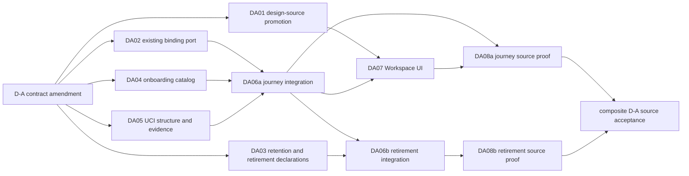

# Implementation Plan: Operator Workspace — D-A

**Spec**: [spec.md](spec.md)
**Input**: D-A amendment, Constitution 3.0.0, the 2026-09-17 operator-workspace audit, and accepted D2/UX/QA handoffs.

## Summary

D-A delivers one ordinary operator result: from Home, choose a readable Repository and Working copy, understand the selected Indexed snapshot, search or browse it, open source, follow a direct/reverse derived relation, and inspect its evidence. It simultaneously removes the executable manual graph and plaintext-book writers while retaining their historical readers and records.

This is a D2 amendment to Feature 011, not a replacement UCI system or a plan for D-B/D-C. The prior honest-shell/scaffold definition is superseded as the first acceptance boundary. Truthful state presentation remains a supporting quality requirement; it is not a substitute for the journey.

## Planning calibration and decision

**Rung**: D2. This artifact lives across implementation owners and changes the browser/UCI/retirement handoff. A wrong decision can expose source, strand a historical job, or preserve a retired writer. It is bounded to one independently installable D-A outcome, not the future data-library or Book Context program.

**Decision**: Reuse existing UCI catalog, pinned-context, search, graph, source descriptor, index-intent, common release, and the existing `BrowserBindingApplication`/`BrowserTabBindingStore` lifecycle. Add only the presentation/read seams needed for ordinary-user selection, bounded structure, relation evidence, and owner-scoped onboarding. Retire old writers at admission and startup boundaries; preserve data and named readers. Do not add a universal graph, a second index, a second database, a replacement binding subsystem, or a renamed legacy importer.

**Alternatives rejected**:

1. Add only a `/code` link and hide Graph/Books — fails readable identity, ordinary onboarding, evidence, and executable retirement.
2. Build a new workspace backend, graph/library model, or browser-binding lifecycle — duplicates working authority and expands D-A into D-B/D-C.
3. Delete graph/book storage — breaks historical readers, versioned Documents, provenance, and retrieval behavior.
4. Retain a flag-controlled editor/importer — permits resurrection of expressly retired workflows.

## Technical context and guardrails

- **Authority**: PostgreSQL/pgvector remains authoritative storage; UCI retains Source, Checkout, immutable View, query, relation, source-descriptor, reauthorization, and exposure ownership. `internal/worker` is an adapter, never a `ci_*` query path or HTTP-MCP proxy.
- **Existing browser binding**: `internal/worker/browser_binding_application.go` already owns handshake, resume, guard, renew, close, pin, session destruction, document proof, and lease transitions over `internal/db/gorm/browser_tab_binding_store.go`. D-A maps this existing port to one owner and tests/wires it; it does not recreate the subsystem.
- **Identity**: Repository, Working copy, and Indexed snapshot labels are presentation only. Every contextual request remains bound to server-resolved Source/Checkout/View, a current BrowserSubject/grant, and existing binding/document proof.
- **Data preservation**: Versioned Documents, Rules, Issues, historical `knowledge_nodes`/`knowledge_edges`, book-job provenance, UCI graph, and applied migrations remain. No DROP, replay of unavailable book plaintext, automatic graph reclassification, or destructive cleanup belongs to D-A.
- **Truthful presentation**: Ready, Updating, Needs indexing, Failed, Newer snapshot available, no accessible source, denied, partial/unsupported, and genuine empty result remain distinct. Index intent acknowledgement is not completion.
- **Deployment decision**: Supported secure-origin/authenticated-browser versus explicitly supported single-user HTTP/no-auth remains unresolved. Source-level work stays neutral and preserves authority; installed acceptance and a real onboarding/recovery action wait for the recorded decision.

## Frozen interfaces for implementation owners

| Boundary | D-A contract | Owner | Compatibility and proof |
|---|---|---|---|
| Existing browser binding | `BrowserBindingApplication` plus `BrowserTabBindingStore` owns handshake/resume/guard/renew/close/pin and stores only opaque proof/resume material and optional pinned ContextRef. | Browser Binding owner | Preserve its existing transition table and fail-closed proof/lease semantics. Supplies the typed port to the integrator; does not write HTTP handler/route registration. |
| Workspace catalog | A server-filtered catalog presents Repository, Working copy, and Indexed snapshot display metadata plus opaque selection references. Existing unnamed checkouts are not fabricated as human labels; owner naming is part of onboarding. | Browser onboarding/catalog | Labels do not authorize; duplicate branch names remain distinguishable without exposing locators. |
| Grant onboarding | A persistent browser subject can use an owner-scoped chooser to issue/revoke the exact existing Source/Checkout grant. The browser never enters raw IDs or becomes owner via an admin role. | Browser onboarding/catalog | Exact owner-principal equality, enabled target subject, and transactional audit remain mandatory. |
| View-pinned structure | A bounded structure read accepts current tab proof, normalized relative prefix, opaque continuation, and bounded limit; it returns display paths/entity references, coverage/limitations, and next cursor only for the selected View. | UCI read-model | No empty fake search, disk fallback, global totals inferred from a page, or locator disclosure. |
| Relation evidence | Graph/relation DTOs retain released edge evidence references. Opening evidence invokes the existing authorized source-descriptor/read boundary in the same View and labels evidence granularity honestly. | UCI read-model and release | A neighbor may open even when absent from the search page; source entity evidence is not renamed exact reference-site evidence. |
| Shared handler and routes | `OperatorCodeHTTPAdapter`, `service.go`, `uci_context.go`, `mcp/server.go`, and `migrations.go` are one serialized integration table. | Single integrator | Producer owners hand off ports/declarations; no producer writes this route/handler table. |
| Workspace UI | Home and NAV lead to one context bar and investigation flow. It uses Repository / Working copy / Indexed snapshot as task labels; IDs stay secondary disclosed evidence. | Console workspace | Keyboard/200% zoom/RU-EN and independent tabs are part of the delivered contract. |
| Retired admissions | Manual graph create/delete and plaintext book intake have no UI, HTTP, MCP, flag, worker-startup, or tool-list/dispatch re-entry. | Retirement owner | Historical readers/data are retained; UCI code graph is out of the removal set. |

## D-A migration and retirement order

1. Build and approve the consumer map for each retired workflow: UI → route/tool → application → writer/job → storage → named readers/exports. Preserve live readers; do not infer deletion from a package name.
2. In the existing single-container deployment, stop new old-version intake and ensure no old book-writer process remains live before touching residual jobs. This is a quiescence precondition, not a new lease or heartbeat subsystem; a `pending`/`processing` row cannot be safely replayed because plaintext is not durable in the row.
3. After quiescence, idempotently mark residual nonterminal book jobs `failed` with an interrupted-by-retirement reason; preserve rows, partial historical documents, and `source_book_job_id`; never call the old compensation deletion path. The fixture reruns the transition and proves unchanged preserved records.
4. T006b, executed only after T006a, removes manual graph mutation registration/dispatch and book admission/startup after receiving the retirement declaration. Retain `internal/retrieval/hybrid.go` Tier2 `Traverse`, historical graph reads, `/api/context/search`, `internal/graph`, and UCI graph where the approved consumer map requires them.
5. Prove an old route/tool/flag cannot resurrect writing after restart, then prove historical document/version/provenance and named retained readers. Physical contraction is a separately authorized future change.

## Ordered implementation slices and dependency graph

| Slice | Contribution and owned surfaces | Dependencies | Acceptance evidence |
|---|---|---|---|
| **DA01 — design source** | Update private `.od` D-A source, promote the reviewed allowlist into `design/operator-console/`, and keep runtime parity evidence separate. | This amendment | Promoted snapshot shows selection-first Workspace and retired writers; no raw export writes runtime files. |
| **DA02 — existing binding port** | Verify/extend only the existing `BrowserBindingApplication` and `BrowserTabBindingStore` contract/tests; supply its port/declaration without a replacement subsystem. | This amendment | Handshake/resume/proof/lease/pin transitions stay fail-closed and an unselected copy/reload cannot inherit authority. |
| **DA03 — retention and retirement declarations** | Map and retain `internal/retrieval/hybrid.go` Tier2 `GraphStoreInterface.Traverse`, historical graph reads, and current `/api/context/search` ownership; retire manual graph/plaintext-book admissions; supply declarations to integration. | This amendment and approved consumer maps | Existing single-container quiescence, failed-with-reason residual job, preserved `source_book_job_id`/partial documents, rerun idempotence, and retained readers. |
| **DA04 — onboarding/catalog** | Owner-scoped grant chooser and non-authorizing display metadata through existing browser-grant/catalog boundaries. | This amendment | Owner issues/revokes, non-owner/admin-only attempts fail, and readable labels distinguish two working copies without locators. |
| **DA05 — read model/evidence** | Bounded View-pinned structure and evidence-preserving relation/source navigation. | This amendment | Same-View page/continuation, off-page neighbor, exact released evidence, and non-disclosure on denial. |
| **DA06a — journey integration** | Apply binding/catalog/read-model declarations to the shared handler, routes, composition, and migration table. | DA02, DA04, DA05 | One integrated journey candidate proves no direct storage/MCP/path escape. |
| **DA06b — retirement integration** | After DA06a, apply retirement declarations to the same shared files and registry. | DA03, DA06a | Old writer re-entry remains absent while named readers survive. |
| **DA07 — Workspace UI** | Home/NAV entry; context bar; selected-context status/search/structure/source/relation/evidence; remove old navigation. | DA01, DA06a | Blind normal-homepage walkthrough, accessible relation list, narrowed layout, RU/EN. |
| **DA08a — journey source proof** | Record independently the normal Home/Workspace/source/relation/evidence journey, including real-provider non-lexical >50 proof. | DA06a, DA07 | Journey proof records without waiting for retirement wiring. |
| **DA08b — retirement source proof** | Record independently the quiescence, residual-job, old-writer-negative, and retained-reader proof. | DA06b | Retirement proof records without waiting for UI journey evidence. |
| **Composite D-A source acceptance** | Combine DA08a and DA08b only when both are green; keep release closed until the origin decision and installed DA01–DA04 proof. | DA08a, DA08b | Bounded source acceptance followed by separately authorized installed result. |

## Exclusive writer zones and dispatch boundary

| Writer zone | Sole owner | Shared-file restriction |
|---|---|---|
| Private design and curated promotion | Design-source owner | The current public snapshot/manifest is not hand-edited; promotion is the only snapshot writer. |
| Existing binding application/store | Browser Binding owner | `browser_binding_application.go`, `browser_tab_binding_store.go`, and focused binding tests; hands its port to integration and does not edit handler/routes. |
| Grant/catalog DTOs and browser onboarding | Browser onboarding/catalog owner | Does not edit `handlers_operator_code.go`, UCI query/graph/source policy, or shared registration. |
| UCI structure/evidence contracts | UCI read-model owner; release owner for release mappings | Does not edit browser UI, handler/routes, or migration registry. |
| Manual graph/book retirement | Retirement owner | Maps and preserves `internal/retrieval/hybrid.go` Tier2 `Traverse`, historical graph reads, `/api/context/search`, `internal/graph`, and UCI graph; supplies declarations but does not edit shared files. |
| Shared handler, registration, and migration | Single integrator | Sole writer for `handlers_operator_code.go`, `service.go`, `uci_context.go`, `mcp/server.go`, and `migrations.go`; executes T006a journey wiring, then T006b retirement wiring serially after producer handoff. |
| Home/NAV/Workspace UI/locales | Console workspace owner | Consumes the integrated DTOs; does not alter binding persistence, source authority, or retirement worker ownership. |

DA01–DA05 may proceed in parallel only inside these writer zones. The same integrator executes DA06a journey wiring before DA06b retirement wiring; DA07 consumes DA06a. DA08a records journey proof after DA06a/DA07, DA08b records retirement proof after DA06b, and composite source acceptance requires both. Green child work does not prove D-A.

## Requirements-to-surface map

| Requirement group | Primary surfaces | Slice | Proof |
|---|---|---|---|
| FR-001–004, FR-007, FR-012 | Home/NAV, existing binding, catalog/grants, status/index intent, Workspace UI | DA02, DA04, DA06a, DA07, DA08a | Homepage discovery, readable identity, binding/grant/tab isolation, distinct readiness/permission states. |
| FR-005–008 | UCI query/structure/graph/source descriptors, release, journey adapter, Workspace relation/source UI | DA05, DA06a, DA07, DA08a | Same-View source/relation/evidence, off-page neighbor, real-provider proof, no disclosure. |
| FR-009–011 | Graph/book UI, HTTP/MCP admissions, worker startup, book status/storage, named retained readers | DA03, DA06b, DA08b | Single-container quiescence, idempotent failed-with-reason job, no old writer, and preserved Tier2/search/UCI readers. |
| FR-013 | `.od` source, curated promotion, Workspace components/locales | DA01, DA07, DA08a | Design promotion and keyboard/narrow/RU-EN journey proof. |
| FR-014 | Deployment/origin decision plus installed normal-homepage environment | Composite DA08a + DA08b | Source acceptance after both independent proofs; release stays closed pending decision and installed DA01–DA04 proof. |

## Explicit omissions and open decision

D-B collection organization/correction and D-C quality queue/Book Context are not tasks, prerequisites, or hidden acceptance for D-A. Existing Rules, Issues, Documents, and historical graph/book readers remain preserved surfaces; their new product capabilities need separately accepted scope.

The only open D-A product decision is the supported browser/origin policy. DA08a and DA08b may record their independent exact-candidate proofs as soon as their dependencies are green; composite source acceptance is recorded only after both. The release gate remains closed until the decision and installed normal-homepage DA01–DA04 proof are recorded. This does not authorize a weaker ACL or block neutral source/read/retirement work.

## Validation plan

Implementation owners retain focused evidence only: existing binding-port tests; owner-grant/catalog tests; bounded UCI structure/evidence tests; single-container quiescence plus idempotent failed-with-reason residual-job proof; and retained-reader regressions. DA08a independently requires one real-provider non-lexical conceptual query over more than 50 candidates; lexical/degraded output is `NOT_PROVEN`. DA08b independently records the retirement/history lane. Composite source acceptance requires both, and release remains closed until the origin decision and installed DA01–DA04 proof. Mock interaction cannot prove discovery, provider behavior, watcher publication, owner execution, or installed acceptance. Broader suites, release, deployment, and Sonar remain outside this contract-amendment task.
