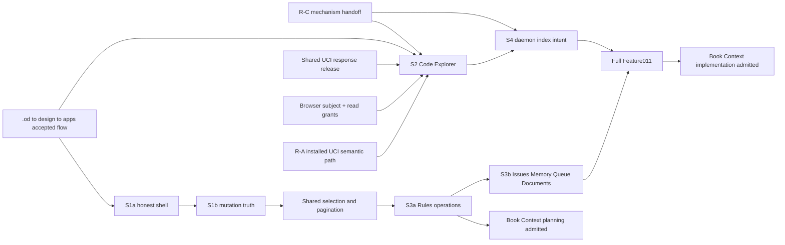

# Implementation Plan: Operator Code Console

**Branch**: `ui/operator-code-console-r1` | **Date**: 2026-09-10 | **Spec**: [spec.md](spec.md)
**Input**: Approved Feature 011 specification, Constitution 2.0.0, UCI Feature 010 contracts/current seams, Web UI recovery packet, and r11 mechanism-adaptation and roadmap briefs.

## Summary

Deliver the separately accepted browser presentation for existing Engram authority without creating a second graph, storage bypass, or HTTP-MCP transport. The first requested user result is not the shell: an ordinary installed agent session **and** a browser can independently choose authorized worktrees, run a real semantic query, traverse a bounded code graph, and read an exact source span from the same pinned View. The browser portion is R-B; it is eligible only when R-A has supplied an installed semantic-capable UCI candidate for the same two-worktree fixture.

S1a is an independently installable enabling slice: it removes eager shell body loads and closed-settings traffic, while showing unknown rather than inventing a total. It does not satisfy the requested Code Intelligence result. S1b removes false rollback and false verified-success claims from all current mutation callers. S2 delivers the read-only Code Explorer. S3 supplies Rules-first selection/pagination and collection operations, then the bounded Issues, Memory, Queue, and Documents consumers. S4 makes browser index requests durable and daemon-owned. Book Context planning may begin after accepted S2 plus Rules; Book implementation remains blocked until full Feature 011, including S4.

## Planning Calibration

**Rung**: D2. This plan is the Feature 011 subsystem package, not a redesign of UCI, IAM, Book Context, or the entire r11 program. A wrong browser-grant, release, or mutation boundary affects multiple server and browser consumers across sessions; each is therefore made explicit with one owner and an integration order.

**Risk-selected challenge disposition**: Current source evidence already proves the three material risks that shape this plan: browser sessions do not carry a UCI principal, UCIApplication returns pre-exposure results, and current mutation handling equates a refresh callback with verified truth. The plan binds these risks to narrow owners and live acceptance instead of opening a duplicate upstream-research or UCI-reacceptance pass.

## Technical Context

**Language/Version**: Go 1.26.6+ server and UCI domain; TypeScript 5.5, Vue 3.4, Nuxt 3.13 browser console.
**Primary Dependencies**: Existing GORM, PostgreSQL 17, pgvector, UCI application/context resolver/exposure recorder, Nuxt UI, Vue, Playwright. No upstream code-intelligence application, subprocess engine, graph server, Qdrant, raw-SQL UI adapter, or HTTP MCP is introduced.
**Storage**: PostgreSQL remains authoritative for UCI context/projections, explicit browser read grants, frozen selection tokens, and index intents. Browser tab state is session-bound convenience state and never grants access. Browser `sessionStorage` only retains its opaque tab key across hard reload.
**Testing**: Focused Go unit/integration tests; disposable PostgreSQL-backed live Go API; built Nuxt console plus Playwright. Existing `npm run test:browser` is mock-interaction evidence only because `playwright.config.ts` launches `scripts/mock-operator-api.mjs`.
**Target Platform**: Existing authenticated HTTP server and supported browsers at 1440, 980, and 390 CSS pixels plus 200% zoom; RU and EN exercised, zh regression retained. R-A's installed UCI proof remains Windows-native and two-real-worktree based.
**Project Type**: Existing Go modular monolith with a Nuxt browser client; no new deployable network service.
**Performance/Bounds**: Reuse UCI result/graph budgets and retain their stop reason. Browser collection lists use opaque cursors and server bounds; the first acceptance fixture exceeds 200 Rules and 100 Issues. No page length is represented as a server total.
**Security Constraints**: Authenticate a persistent browser subject; require an active Source+Checkout read grant before listing labels or reading code; reauthorize immediately before serialization; append non-content UCI exposure before contextual response data; do not disclose an unauthorized identifier, count, relation, source span, local path, daemon credential, or workstation secret.

## Constitution Check

### Pre-design — PASS

| Gate | Plan disposition |
|---|---|
| III, VII: typed, pinned, authorized code context | Every Code request is an explicit Source/Checkout/View context; labels, path, Space, browser tab, and legacy project do not authorize it. |
| IV, VII, XIII: one UCI authority and truthful release | HTTP is a presentation adapter over the existing UCI application and shares one transport-independent release operation; no second graph/index, raw SQL, or HTTP MCP. |
| V: durable work | S4 uses a persisted index intent with idempotency, owner ACK, retry, terminal/degraded state, and resulting View readback. |
| XI, XII: separate surface feature and release scope | Constitution 2.0.0 §XII admits this separately accepted feature after UCI technical acceptance. Each slice has a rollback boundary; no release, deployment, publication, or UCI technical reacceptance is performed by this plan. |
| X: migration meaning | Browser grants and selection state are additive; no schema or migration number is reserved. Existing UCI ownership remains restrictive until the new explicit grant is active. |
| Secret and privacy constraints | No source body/query/absolute locator/credential is stored in operation or exposure metadata. Browser never receives a remote working-copy path or daemon secret. |

### Post-design — PASS

The contracts below preserve the pre-design gates: the auth-grant seam is narrower than a role bypass, the release seam is common to MCP and HTTP, tab context is non-authoritative, selection tokens do not grant authority, mutations never call a local snapshot a rollback, and only a daemon owner can turn an index intent into a new View.

## Current Source Grounding

| Observed seam | Planning consequence |
|---|---|
| `internal/worker/uci_application.go:19-21,104-253` composes UCI services and deliberately returns pre-exposure query/read/graph responses. Semantic retrieval is eligible only after selected-View embedding completion. | S2 must reuse this application and cannot claim semantic success from a lexical/degraded response. |
| `internal/mcp/tools_code_intel.go:780-892` reauthorizes the exact context and records exposure before contextual data is serialized. | Extract one UCI-owned transport-independent release operation; MCP and HTTP call it, with one behavior test vector set. |
| `internal/db/gorm/uci_context_store.go:30-32,77-146,177-223` authorizes only the recorded checkout owner and lists only owner contexts. | Add an explicit browser read-grant authority; do not reinterpret owner, Source label, or Space membership. |
| `internal/worker/middleware.go:464-494` creates `auth.Session(user.Role)` without a principal; `internal/auth/identity.go:146-157` distinguishes ordinary session from disabled-auth identity. | The auth/grant owner derives a stable authenticated browser subject from a real persisted user session, preserves role separately, and rejects disabled-auth/new HMAC synthetic browsing. |
| `apps/operator-console/layouts/default.vue:5-14,61-69` creates memory and queue loaders for shell labels; it always mounts `SettingsModal`. `SettingsModal.vue:27-58,394-424` constructs settings composables and immediately refreshes model surfaces when models is selected. | S1a removes unused shell loaders and defers construction of settings-owned loaders until opening while retaining focus, Escape, route, and cleanup behavior. |
| `apps/operator-console/composables/useOperatorApi.ts:410-440` treats a callback invocation as `success` and restores local snapshots on any thrown request/refresh. | S1b replaces this union and migrates each direct caller in the same cutover. |
| `useOperatorRules.ts:105-130,222-247` loads a fixed 200 rows and implements reorder as parallel single-row PATCH calls. `handlers_rules.go` has no expected-version input although `behavioral_rules_store.go:161-188` increments Version. | S3 adds real pagination, expected versions, and one transactional scope reorder; it never labels parallel PATCH as atomic. |
| `useOperatorIssues.ts:278-325,488-516` loads `limit=100` and bulk-updates with parallel PATCH. | Issues follows Rules only after shared selection/result truth and a domain-owned server operation contract exist. |
| `apps/operator-console/playwright.config.ts:27-56` starts a mock API. `design/operator-console/PROMOTION-CONTRACT.md:3-56` establishes `.od → design/operator-console → apps/operator-console` and refuses routine app overwrite. | Mock tests remain interaction evidence; a live harness is required. Design changes follow the established one-way promotion contract. |

## Architecture Decisions

1. **HTTP presentation reuses UCI, not MCP.** `internal/worker` owns typed HTTP DTO validation and calls the existing UCI application. A shared UCI release helper reauthorizes and records exposure after application work but before serialization. It replaces no MCP behavior and leaves the current MCP response schema compatible.
2. **Grant checks are additive and exact.** A real browser session supplies a canonical browser subject. An active grant names one Source and one Checkout in its realm. It authorizes read operations only; indexing, local filesystem access, view publication, and workstation ownership remain daemon/UCI responsibilities.
3. **One tab has one non-authoritative context binding.** The browser creates an opaque tab key stored only in `sessionStorage`; the server binds it to the authenticated session and a selected ContextRef for convenience. Every request still carries or resolves the exact context and is reauthorized. MCP bindings and other browser tabs cannot observe or mutate it.
4. **Mutation truth is a shared client contract, not a fabricated server rollback.** The shared TypeScript union describes observed commitment/readback truth. Existing legacy actions lacking durable status stay `outcome_unknown` after ambiguous transport loss and are not replayed. New multi-item collection actions add domain-owned operation status where retry/readback is needed.
5. **Selection is shared, action authority is not.** A selection token freezes one authorized domain/filter target set and explicit exclusions. Rules, Issues, Memory, Queue, and Documents each validate their own action and postcondition; no universal bulk executor or bulk secret reveal is created.
6. **Daemon intent is durable but not execution.** A browser creates an idempotent index intent. Only the existing daemon owner may acknowledge, claim, execute, and publish a View. HTTP `202` or persisted intent does not equal success.
7. **Mechanism adaptation is native and evidence-bound.** R-C research contributes pinned source/test/issue evidence for mechanism changes. SocratiCode and Graphify are comparison/reference sources only, never embedded applications, required engines, or production subprocesses.

## r11 Roadmap Alignment and Forecast Basis

| Result | Feature011 contribution | Completion evidence | Forecast basis and unknowns |
|---|---|---|---|
| R-A: ordinary agent core | Consumes, but does not repair or reaccept, the installed UCI candidate. S2 requires its semantic-capable two-worktree route. | Existing UCI accepted evidence plus a current candidate-bound ordinary-session exercise before S2 claims the combined result. | Basis: UCI application/query/graph/read seams are present; unknown: live installed semantic profile/provider readiness and current R-A integration candidate. |
| R-B: real GUI vertical | S1a/S1b enable honest interaction; S2 is the read-only vertical; S3/S4 complete ordered collection/index obligations. | Built console + real Go API + disposable PostgreSQL: two browser tabs, two worktrees, concurrent MCP client, semantic search, bounded graph, exact source, and truthful states. | Basis: Nuxt console, UCI composition, and browser harness exist; unknown: explicit browser-grant schema/handler, extracted release helper, live harness wiring, and owner ACK integration. |
| R-C: working-project coverage and mechanism adaptation | Displays UCI-declared coverage/limitations and consumes only accepted UCI mechanisms. It does not claim C#/Vue support or implement upstream parity. | Separate mechanism-research handoff supplies pinned evidence and R-C fixtures; S2 presents supported/partial/unsupported state honestly. | Basis: r11 requires native adaptation; unknown: pinned reference findings, target language/relation profile, comparator availability, and measured quality. No calendar forecast is valid before assigned executors estimate those unknowns. |

**Pinned research handoff boundary**: No reference-source claim is fabricated in this plan. `contracts/mechanism-adaptation.md` records the exact evidence record required from the separately assigned R-C researcher. Absence of that record blocks parity and language-expansion claims, not S1a/S1b or a limited S2 over already accepted UCI behavior.

## Dependency Graph



R-C constrains any mechanism expansion but does not redefine the accepted UCI core. S2 is the first requested cross-surface product result; S1a is enabling and S1b is integrity work. S2 and S3 may be implemented in parallel only after the ownership matrix has reserved every shared file.

## Exclusive Ownership Matrix

| Writer zone | Sole writer | Surfaces owned | Integration handoff |
|---|---|---|---|
| Auth and grants | Auth/grant owner | `internal/auth/identity.go`, authenticated browser middleware/session carrier, grant store and grant validation | Exposes canonical browser subject plus exact `CanRead(source, checkout)` to UCI composition; does not change daemon owner authorization. |
| Service composition | UCI composition owner | `internal/worker/service.go`, `internal/worker/uci_context.go`, UCI application injection | Installs exactly one UCI application/release dependency in HTTP service; no second query/semantic instance. |
| UCI response release | UCI release owner | `internal/uci` release port/helper, `internal/mcp/tools_code_intel.go`, UCI response validation vectors | Exposes one pre-exposure-to-released response operation for MCP and HTTP. |
| HTTP DTO and handler | Operator-code HTTP owner | `internal/worker/handlers_operator_code.go` and handler tests/routes | Validates bounded DTOs and calls composed UCI; owns no UCI query, graph, source, or authorization policy. |
| Browser typed context | Console Code owner | `apps/operator-console/composables/useOperatorCode.ts`, code page, tab/session storage handling, Code UI browser tests | Sends opaque tab binding and explicit context to HTTP; cannot alter MCP context. |
| Shared mutation result | Console mutation owner | `apps/operator-console/composables/useOperatorApi.ts` and all 13 current direct caller migrations | Publishes the discriminated result union; domain owners supply postcondition/readback adapters. |
| Selection and pagination | Collection shared owner | `useOperatorSelection.ts`, cursor/page-size seam, selection UI/accessibility tests | Produces typed domain selection only; does not authorize actions. |
| Rules domain | Rules owner | Rules handler/store/transaction tests and Rules adapter | Implements version-checked actions and atomic reorder; first S3 consumer. |
| Issues, Memory, Queue, Documents domains | Named collection-domain owner | Their handlers/composables/domain tests, one domain lane at a time after Rules | Reuses selection/result seam while retaining own allowed action matrix and postcondition. |
| Daemon intent | UCI daemon-owner | Intent persistence, owner ACK/claim/status and private daemon integration | Returns only safe status/result View to HTTP owner; never gives browser a path or credential. |
| Design source | Design-source owner | `.od` source and curated `design/operator-console` promotion artifacts | Promotes reviewed design before app parity evidence; runtime owner integrates without raw export overwrite. |

No owner writes another zone's primary file. The integration owner lands zones in the sequence below and resolves interface changes with the named adjacent owner before merge.

## Ordered Slice and Rollback Map

| Slice | Contribution and prerequisites | Acceptance and integration proof | Rollback boundary |
|---|---|---|---|
| S1a — honest shell/lazy settings | Honest Graph, Books, and Rules shell. Depends only on design-flow handoff and current console seams. | Built candidate against real Go API records zero memory-body requests and zero closed-settings-owned requests; unknown differs from zero; hard reload, keyboard, focus, 1440/980/390, 200% zoom, RU/EN and zh regression pass. | UI-only revert; no grant, data, migration, UCI, or server mutation. |
| S1b — shared mutation truth | Replace false `success`/`rollback` outcome in every current direct `runOperatorMutation` caller: Access, Books, Documents, Domain Registry, Health Settings, Issues, Keycards, Memory Lab, Projects, Queue, Rules, and Secrets. | Mixed success/failure, post-commit network loss, failed readback, access loss, and callback load-error prove correct union state and no known-success replay. Each migrated caller has a consumer-visible result path. | Revert client-contract cutover as one slice; no claim that a local snapshot reversed server state. Pending/unknown server effects are preserved and read back rather than deleted. |
| S2 — Code Explorer | Browser grant, UCI release helper, HTTP adapter, typed tab context, and accepted design flow; consumes R-A semantic-capable candidate. | One ordinary agent session, two browser tabs, and two real worktrees: authorized semantic search → bounded graph/relation list → exact source span in the same View; hard reload keeps the tab's selected context; a new View prompts rather than swaps; deny/revoke/mismatched continuation reveals nothing. | Additive HTTP/UI/grant changes are disabled or reverted together; existing MCP behavior and UCI views remain untouched. Revoke grants instead of deleting UCI context/projection data. |
| S3a — Rules-first collection operations | S1b plus shared selection/cursor contract. | More than 200 Rules: explicit/page/frozen-filter selection with exclusions; version/grant change after preview yields per-item conflict/denial; enable/disable/delete/edit have authorized postconditions; one scoped reorder changes all rows or none. | Revert Rules adapter/handler as one bounded release; transactional reorder has no partial database state. |
| S3b — Issues, Memory, Queue, Documents | S3a shared seam, one domain owner at a time. | More than 100 Issues and each stated domain action matrix prove pagination, selection, partial result, status/readback, retry-only-unfinished, and forbidden-action rejection. | Each domain addition reverts independently without weakening shared result/selection truth or broadening another domain's action matrix. |
| S4 — durable daemon-owner indexing | S2 context/release and daemon intent contract. | Online owner records ACK, execution, and a readable new View; offline owner remains queued or unavailable; HTTP acceptance alone never renders complete. | Stop accepting new intents, retain durable records/readback, and let the daemon's existing lease/retry policy resolve in-flight work; no browser-initiated filesystem action. |

## Integration Order

1. Design-source owner accepts the new flow and promotes it to `design/operator-console`; runtime parity changes wait for that snapshot.
2. S1a lands as the UI-only enabling release.
3. Shared mutation owner migrates all 13 direct callers in one S1b cutover; domain owners validate their readback predicates before their UI result is enabled.
4. Auth/grant owner and UCI release owner deliver their narrow contracts independently. Composition owner wires them once; HTTP owner consumes only that seam.
5. Console Code owner lands S2 with the live browser/Go/PostgreSQL harness. The integrator exercises the combined ordinary-session/browser result against the exact UCI candidate.
6. Selection owner lands reusable cursor/selection semantics. Rules owner is first consumer, followed by isolated domain lanes for Issues, Memory, Queue, and Documents.
7. Daemon owner adds S4 after S2 has a real context and response-release path.
8. After S2 plus accepted Rules, Book Context may enter planning. Only after S3b and S4 complete does its implementation become admissible.

## Contract-to-Surface Map

| Requirement group | Contract | Primary surfaces | Acceptance |
|---|---|---|---|
| FR-001–003, 020–023 | Plan S1a and design promotion contract | shell layout, settings modal, Books labeling, locales, browser harness | Traffic trace, hard reload, responsive/a11y/i18n evidence. |
| FR-004–009 | `browser-context-and-grants.md`, `operator-code-http.md` | auth/session, UCI authorizer/release, worker handler, Code composable/page | Two-worktree/tab/MCP isolation, authorization/revocation, View coherence, source span. |
| FR-010–015, 021–022 | `collection-operations.md` | shared mutation/selection, Rules then domain handlers/composables | >200 Rules, >100 Issues, atomic reorder, per-item/readback/unknown behavior. |
| FR-016–017 | `index-intents.md` | UCI durable intent/daemon owner, HTTP status, Code UI | Online ACK/new View and offline queued/unavailable. |
| r11 native mechanism adaptation/R-C boundary | `mechanism-adaptation.md` | UCI mechanism owner and QA handoff; UI capability presentation | Pinned evidence record before parity/language expansion claim; supported/partial/unsupported UI state. |

## Project Structure

```text
specs/011-operator-code-console/
├── plan.md
├── research.md
├── data-model.md
├── quickstart.md
└── contracts/
    ├── operator-code-http.md
    ├── browser-context-and-grants.md
    ├── collection-operations.md
    ├── index-intents.md
    └── mechanism-adaptation.md

internal/auth/                         # browser subject and explicit grant owner
internal/uci/                          # UCI context/release and daemon-intent owners
internal/worker/                       # one HTTP presentation/composition owner
internal/mcp/                          # existing MCP release consumer
internal/db/gorm/                      # authoritative grant/selection/intent persistence
apps/operator-console/                 # Nuxt presentation, typed context, result, selection
apps/operator-console/tests/browser/   # mock interaction evidence
apps/operator-console/playwright.live.config.ts # planned real-backend browser evidence
 design/operator-console/              # curated design snapshot, never a runtime overwrite source
```

**Structure Decision**: retain the modular monolith and existing Nuxt application. Add only feature-local adapters/composables and additive domain records where the contract requires durability. The browser has no embedded UCI graph/cache; it renders bounded UCI responses.

## Migration and Cutover

Grant, selection-token, and intent persistence are additive. The implementation owner re-reads the migration registry immediately before creating migrations and uses the next assigned numbers; this plan reserves none. Existing owner-only UCI authorization stays default-deny until a valid explicit browser grant is persisted. The UCI release helper is extracted by parallel change: existing MCP calls it first with unchanged vectors, HTTP is added only after those vectors pass. Existing legacy collection routes continue only until their caller is migrated; no compatibility alias may retain old false-rollback semantics. Destructive removal, legacy graph deletion, UCI projection rewrite, Book migration, or secret migration is outside this feature.

## Explicit Omissions

- No UCI core repair, UCI technical reacceptance, Sonar waiver, release, deployment, publication, secret operation, raw SQL UI path, or HTTP MCP.
- No new graph database, daemon/service/process, upstream SocratiCode/Graphify embedding, wholesale port, or parity claim.
- No Book catalog/edition/reader/concept/attachment/agent-application implementation and no further Working Agent Memory R1 work.
- No administrator/Space/path/legacy-project implied code permission; no browser discovery of ungranted context labels/counts; no browser workstation path or credential.
- No arbitrary manual code-fact edits, bulk secret reveal, Queue review-packet action, lifecycle/ingestion control, generic cross-domain bulk engine, or automatic view switch.

## Unresolved Technical Risks

| Risk | Owner and safe posture |
|---|---|
| R-A installed semantic profile may be unavailable/degraded at S2 integration time. | UCI/R-A owner supplies exact candidate proof; S2 renders degraded/unsupported truth and does not mislabel lexical results as semantic. |
| Real session identity currently lacks a UCI principal. | Auth/grant owner adds a narrow stable browser-subject mapping; S2 cannot use disabled auth, HMAC admin, or an implied role grant. |
| Release extraction can drift MCP semantics. | UCI release owner ports existing test vectors and runs MCP/HTTP parity tests over equivalent pre-exposure responses. |
| Live browser fixture requires an actual Go/PostgreSQL authentication/grant route. | HTTP/auth owners build it with disposable data; mock-only Playwright remains explicitly insufficient. |
| Rules and Issues current bulk implementations are parallel single-item requests. | Domain owners replace them with their own operation contracts; no optimistic rollback is evidence of database rollback. |
| R-C reference findings are not yet pinned in this feature. | Mechanism research handoff records evidence before any supported-language/parity expansion; current Feature011 scope remains limited to accepted UCI coverage. |
