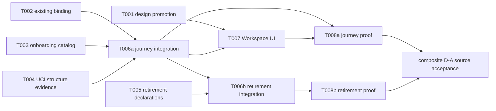

# Tasks: Operator Workspace — D-A

**Input**: [spec.md](spec.md), [plan.md](plan.md), [data-model.md](data-model.md), [quickstart.md](quickstart.md), and [contracts/](contracts/)

**Prerequisites**: The D-A amendment is accepted in the exact implementation candidate. Each owner rereads its candidate paths before modifying them. D-B and D-C work is not admitted by this task graph.

**Tests**: Each task carries the smallest proof that distinguishes its claimed behavior. Mock browser tests are interaction evidence only. The acceptance task owns ordinary-user and retirement/history evidence; this documentation slice runs none of those tests.

**Task convention**: Each task declares its sole writer zone, dependencies, focused proof, and an atomic commit. A `[P]` task has no incomplete task dependency and does not share a writable path with another ready task.

## Phase 1: Design and producer contracts

- [ ] T001 [P] Promote the accepted D-A Workspace design from private `.od` through `design/operator-console/` under `design/operator-console/PROMOTION-CONTRACT.md`; update the selection-first Repository → Working copy → Indexed snapshot flow and remove the obsolete search → graph → Source and manual graph/book workflow instructions. **Owner zone**: Design-source owner. **Depends on**: none. **Proof**: promotion manifest proves reviewed source/allowlist bytes; no raw export writes `apps/operator-console/`. **Atomic commit**: `feat(011): promote D-A workspace design`. (FR-013)

- [ ] T002 [P] Verify and, only where D-A requires it, extend the existing binding port in `internal/worker/browser_binding_application.go`, `internal/db/gorm/browser_tab_binding_store.go`, and their focused tests. Preserve the existing handshake/resume/guard/renew/close/pin/session-destroy transition model and hand its typed port/declaration to T006a; do not create a replacement binding subsystem or edit the shared adapter/route table. **Owner zone**: Browser Binding owner. **Depends on**: none. **Proof**: focused binding tests cover handshake, resume, proof, lease, pin, duplicate/copy, and denied/revoked behavior without a copied document inheriting authority. **Atomic commit**: `feat(011): bind existing browser workspace lifecycle`. (FR-003, FR-007)

- [ ] T003 [P] Define and implement owner-scoped browser onboarding plus non-authorizing repository/working-copy display metadata in `internal/worker/code_grant_application.go`, `internal/db/gorm/browser_read_grant_store.go`, `internal/db/gorm/browser_code_context_store.go`, `internal/db/gorm/uci_context_models.go`, and focused owner/catalog tests. Supply DTO/route declarations to T006a; do not edit the shared adapter/route table. **Owner zone**: Browser onboarding/catalog owner. **Depends on**: none. **Proof**: only the exact persistent Source owner issues/revokes; an administrator/non-owner cannot; two working copies have distinct readable labels without locator or UUID entry. **Atomic commit**: `feat(011): add workspace onboarding catalog`. (FR-002, FR-007)

- [ ] T004 [P] Define and implement bounded View-pinned structure and relation-evidence application/store seams in `internal/uci/query.go`, `internal/uci/query_response.go`, `internal/db/gorm/uci_projection_store.go`, `internal/db/gorm/uci_graph_source_descriptor.go`, `internal/worker/uci_application.go`, and focused UCI/store tests. Supply the application/DTO declaration to T006a; do not edit the shared adapter/route table. **Owner zone**: UCI read-model owner. **Depends on**: none. **Proof**: a selected View returns bounded structure/page continuation; an off-page direct/reverse neighbor opens released evidence in the same View; missing precision is labeled and denial releases nothing. **Atomic commit**: `feat(011): expose workspace evidence navigation`. (FR-003, FR-005, FR-006, FR-008)

- [ ] T005 [P] Build the approved manual-graph and plaintext-book consumer maps, then retire owned UI/HTTP/MCP/worker admissions in `apps/operator-console/pages/graph.vue`, `apps/operator-console/composables/useOperatorGraph.ts`, `apps/operator-console/pages/books.vue`, `apps/operator-console/composables/useOperatorBooks.ts`, `internal/worker/handlers_graph.go`, `internal/mcp/tools_graph.go`, `internal/worker/handlers_books.go`, `internal/books/pipeline.go`, `internal/db/gorm/books_store.go`, and focused retirement tests. **Precondition**: in the existing single-container deployment no old book-writer process remains live before the idempotent residual-job transition; do not add a lease/heartbeat subsystem. **Preserve**: `internal/retrieval/hybrid.go` Tier2 `GraphStoreInterface.Traverse`, historical graph reads, current `/api/context/search` ownership, `internal/graph`, and UCI graph. **Handoff**: supply reviewed declarations to T006b; do not edit shared integration files. **Proof**: each mapped writer is unavailable through UI, old HTTP/MCP call, legacy flag, and restart; residual job is `failed` with retirement reason while `source_book_job_id`/partial documents remain, rerun is idempotent, and named readers remain readable. **Owner zone**: Retirement owner. **Depends on**: none. **Atomic commit**: `feat(011): retire manual graph and plaintext intake`. (FR-009, FR-010, FR-011)

**Producer handoff**: T002 supplies the existing binding port; T003 catalog/grant declarations; and T004 structure/evidence declarations to T006a. T005 supplies retirement declarations to T006b. One integrator owns both serialized shared-file steps.

---

## Phase 2: Serialized shared integration and ordinary Workspace UI

**Goal**: Wire the existing browser-binding journey first, then wire retirement in the same D-A release without concurrent shared-file edits.

- [ ] T006a Integrate reviewed binding, catalog, and read-model declarations in `internal/worker/handlers_operator_code.go`, `internal/worker/service.go`, `internal/worker/uci_context.go`, `internal/mcp/server.go`, `internal/db/gorm/migrations.go`, and minimal shared handler/registration tests. **Owner zone**: Single integrator. **Depends on**: T002, T003, T004. **Proof**: composition evidence shows browser routes delegate to existing binding/grant/UCI/release ports; no direct `ci_*` access, HTTP MCP, or raw locator appears. **Atomic commit**: `feat(011): wire D-A workspace journey`. (FR-003, FR-005–FR-008)

- [ ] T006b Integrate T005 retirement declarations into the same `internal/worker/handlers_operator_code.go`, `internal/worker/service.go`, `internal/worker/uci_context.go`, `internal/mcp/server.go`, and `internal/db/gorm/migrations.go` writer table. **Owner zone**: the same Single integrator. **Depends on**: T005, T006a. **Proof**: no old writer remains registered or starts; named readers remain; the single-container quiescence precondition and idempotent failed-with-reason residual-job fixture hold. **Atomic commit**: `feat(011): wire D-A retirement`. (FR-009–FR-011)

- [ ] T007 [US1] Implement the Home/NAV Workspace entry and selected-context UI in `apps/operator-console/pages/index.vue`, `apps/operator-console/composables/useOperatorOverview.ts`, `apps/operator-console/composables/useNav.ts`, `apps/operator-console/pages/code.vue`, `apps/operator-console/composables/useOperatorCode.ts`, `apps/operator-console/components/code/`, and `apps/operator-console/i18n/locales/{ru,en,zh}.json`. Remove Graph/Books from ordinary navigation; T005 exclusively retires their old operator forms and routes. **Owner zone**: Console workspace owner. **Depends on**: T001, T006a. **Proof**: browser interaction checks show homepage discovery, keyboard context selection, distinct readiness states, same-View source/relation/evidence, 1440/980/390 layout, 200% zoom, RU/EN, and zh navigation regression. **Atomic commit**: `feat(011): deliver workspace investigation`. (FR-001–FR-006, FR-012, FR-013)

---

## Phase 3: Independently recordable D-A source evidence

**Goal**: Record journey and retirement evidence independently on the exact candidate. Composite D-A source acceptance exists only after both records are green; the release gate remains closed until the deployment decision and installed proof exist.

- [ ] T008a Record DA01/DA02/DA04 journey source proof using existing live console/UCI fixtures. **Owner zone**: Integration/QA owner. **Depends on**: T006a, T007. **Proof**: normal Home discovery, two readable worktrees, coverage/freshness, direct/reverse off-page relation evidence, tab/grant/new-View isolation, accessibility/RU-EN, and one real-provider non-lexical conceptual query over more than 50 candidates. Lexical/degraded output is `NOT_PROVEN`. **Atomic commit**: `test(011): prove D-A workspace journey`. (SC-001–SC-004, SC-006)

- [ ] T008b Record DA03 retirement source proof using the approved legacy writer consumer-map denominator. **Owner zone**: Integration/QA owner. **Depends on**: T006b. **Proof**: old writer negative calls/restart, single-container quiescence, idempotent failed-with-reason residual job, preserved `source_book_job_id`/partial documents, and named retained readers. **Atomic commit**: `test(011): prove D-A retirement preservation`. (SC-005)

**Composite source acceptance**: Record D-A source acceptance only after both T008a and T008b are green. Keep release closed until the browser/origin decision and installed normal-homepage DA01–DA04 walkthrough are recorded. (SC-007)

## Dependency graph and writer serialization

- T001–T005 are parallel only while owners stay inside their listed surfaces.
- The same integrator serially owns T006a then T006b and is the only writer for `handlers_operator_code.go`, `service.go`, `uci_context.go`, `server.go`, and `migrations.go` in both steps.
- T007 owns Home/NAV/Workspace/locales and consumes T006a. T008a may record journey proof after T006a/T007; T008b may record retirement proof after T006b. Composite source acceptance requires both; all remain one D-A release.
- D-B collection/correction and D-C quality queue/Book Context have no T-number in this graph. They require their own accepted slice after D-A.

## Requirement and proof coverage

| Requirement / criterion | Tasks | Required behavior proof |
|---|---|---|
| FR-001–FR-004, FR-007, FR-012, SC-001, SC-003 | T002, T003, T006a, T007, T008a | Homepage discovery, readable identity, existing binding/grant/tab isolation, selected View/status, and explicit newer View. |
| FR-005–FR-008, SC-002, SC-004 | T004, T006a, T007, T008a | Bounded structure/search, direct/reverse off-page neighbor, released evidence, real-provider non-lexical >50 proof, no direct storage/MCP/path escape. |
| FR-009–FR-011, SC-005 | T005, T006b, T008b | Single-container quiescence, writer denial after route/tool/flag/restart, idempotent residual-job failure, and preserved historical consumers/data. |
| FR-013, SC-006 | T001, T007, T008a | Promoted D-A source and accessible/RU-EN Workspace journey. |
| FR-014, SC-007 | T008a + T008b | Composite source acceptance after both independent evidence records; release remains closed pending decision and installed DA01–DA04 proof. |

## Implementation strategy

1. Freeze D-A design and producer ports with T001–T005.
2. Integrate the binding/catalog/read journey in T006a, then the retirement declarations in serialized T006b.
3. Build the ordinary Workspace journey in T007 against T006a. Record T008a journey evidence without waiting for T006b, and record T008b retirement evidence after T006b.
4. Record composite source acceptance only when T008a and T008b are green. Keep release closed until the origin decision and installed walkthrough. Do not start D-B/D-C, release, deployment, or broad test campaigns from this task graph.
