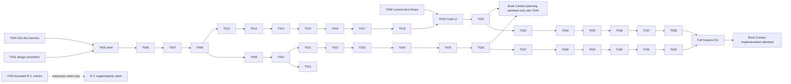

# Tasks: Operator Code Console

**Input**: [spec.md](spec.md), [plan.md](plan.md), [research.md](research.md), [data-model.md](data-model.md), [quickstart.md](quickstart.md), and [contracts/](contracts/)

**Prerequisites**: The Feature 011 specification and plan are independently approved. Implementers must begin in this exact feature worktree, preserve the scope exclusions in the specification, and use the exact ownership handoffs below.

**Tests**: Every slice has a focused behavior proof because the specification requires live cross-surface evidence. Mock-browser checks remain interaction evidence only; the S1a live harness and the S2/S3/S4 disposable-fixture proofs establish connection and readback behavior.

**Task convention**: Each task declares its sole writer zone, predecessor tasks, focused behavior proof, and one mandatory atomic commit. A task marked `[P]` has no incomplete task dependency and does not share a writable file with another ready task. Do not merge a task that touches a file owned by another zone.

## Phase 1: Dependency-resolved ready lanes

**Purpose**: Open only the independently safe work that does not require shared runtime ownership. This phase deliberately does **not** create a global foundation gate: the S1a shell/harness lane and mechanism-test preparation have distinct ready work.

- [ ] T001 [P] Promote the accepted flow through `.od/` and `design/operator-console/` under `design/operator-console/PROMOTION-CONTRACT.md`, without raw-export overwrite of `apps/operator-console/`; **Owner zone**: Design-source owner; **Depends on**: none; **Proof**: promotion manifest proves the accepted design source and curated snapshot while `npm run test:parity` still validates the runtime contract; **Atomic commit**: `feat(011): promote accepted operator-console flow`. (FR-020, SC-008)
- [ ] T002 [P] Create the S2 current-slice mechanism fixture and its focused checks in `tests/uci/acceptance/operator_code_current_slice_test.go` and `tests/fixtures/operator-code-current-slice/`, covering the declared Go relation, bounded TS/TSX alias/re-export chain, retrieval/coverage limitation labels, same-View exact-read expectation, and normal A watcher/B isolation observation without changing shared runtime files; **Owner zone**: R-A measurement/evidence owner; **Depends on**: none; **Proof**: the fixture declares the exact R-A tuple inputs and fails when a claimed semantic/graph/view limitation is omitted or the changed A target is confused with unchanged B; **Atomic commit**: `test(011): add current-slice code fixture`. (FR-005, FR-006, FR-009, SC-002)
- [ ] T003 [P] Add bounded R-C source-oracle checks in `tests/uci/acceptance/operator_code_rc_mechanism_test.go` and `tests/fixtures/operator-code-rc-oracle/` for the exact identifier, Russian concept query, dependency, reverse impact, worktree switch, and no-answer cases; record an unavailable optional comparator as `parity_not_checked` and reject transferred benchmark/parity/support language without a declared expansion packet; **Owner zone**: R-C evaluator; **Depends on**: none; **Proof**: tests distinguish the frozen Engram current fixture from deferred nvmd-ai/NovaScript and never make a comparator absence look like a parity pass; **Atomic commit**: `test(011): bound mechanism adaptation oracle checks`. (FR-009, FR-018, SC-008)
- [ ] T004 [P] Establish the S1a-owned live browser harness in `apps/operator-console/playwright.live.config.ts`, `apps/operator-console/package.json`, `apps/operator-console/tests/live/fixture-bootstrap.ts`, and `apps/operator-console/tests/live/route-trace.ts`; target built Nuxt plus a real authenticated Go API and disposable PostgreSQL, and prohibit `scripts/mock-operator-api.mjs` from this configuration; **Owner zone**: Console shell/harness owner; **Depends on**: none; **Proof**: `npm run test:browser:live` starts the declared real fixture, records route traffic, and proves it did not start the mock server; **Atomic commit**: `test(011): add live operator-console harness`. (FR-001, FR-003, FR-018, SC-008)

**Ready frontier after task generation**: T001, T002, T003, and T004 may start now. T004 is the S1a base-harness half; S1a begins without waiting for R-C expansion. S1b waits for S1a’s live-harness ownership handoff. S2 remains ordered behind its named security-critical owners rather than joining this frontier.

---

## Phase 2: User Story 1 — Open an honest console shell (Priority: P1, S1a)

**Goal**: Graph, Books, and Rules open an honest shell that requests only needed data, says `unknown` rather than inventing a total, defers closed Settings work, and keeps the existing Books capability truthful.

**Independent test**: Against the real S1a harness, fresh Graph, Books, and Rules navigations with Settings closed produce the documented route trace, preserve keyboard/focus behavior, and render the required truth states at every required viewport/locale.

- [ ] T005 [US1] Implement truthful shell route loading and bounded-or-unknown count presentation in `apps/operator-console/layouts/default.vue`, `apps/operator-console/composables/useOperatorShell.ts`, `apps/operator-console/pages/graph.vue`, `apps/operator-console/pages/books.vue`, `apps/operator-console/pages/rules.vue`, and `apps/operator-console/tests/browser/surface-integrity.spec.ts`; **Owner zone**: Console shell/harness owner; **Depends on**: T001, T004; **Proof**: live trace shows zero memory-body requests made only for shell counts and the rendered label distinguishes authoritative bounded count, `unknown`, and zero; **Atomic commit**: `feat(011): make console shell traffic truthful`. (FR-001, FR-002, SC-001)
- [ ] T006 [US1] Defer settings-owned domain/config/model requests until Settings opens while preserving open-by-keyboard, Escape, focus restoration, error handling, and cleanup in `apps/operator-console/components/SettingsModal.vue`, `apps/operator-console/composables/useSettingsModal.ts`, and `apps/operator-console/tests/browser/settings-modal.spec.ts`; **Owner zone**: Console shell/harness owner; **Depends on**: T005; **Proof**: S1a live trace is empty for settings-owned traffic while closed and records only normal authorized requests after opening, with keyboard/focus scenarios passing; **Atomic commit**: `feat(011): defer closed settings traffic`. (FR-003, SC-001)
- [ ] T007 [US1] Add distinct truthful state rendering and honest legacy Books wording in `apps/operator-console/components/HonestyBadge.vue`, `apps/operator-console/components/SectionStub.vue`, `apps/operator-console/pages/books.vue`, `apps/operator-console/i18n/locales/ru.json`, `apps/operator-console/i18n/locales/en.json`, `apps/operator-console/i18n/locales/zh.json`, and `apps/operator-console/tests/browser/truth-accessibility.spec.ts`; **Owner zone**: Console shell/harness owner; **Depends on**: T006; **Proof**: fixtures exercise `loading`, `empty`, `denied`, `error`, `stale`, `partial`, `unsupported`, `timeout`, and `offline` with an action/limitation for each, and Books calls plaintext-to-chunks a legacy import capability rather than Book Context readiness; **Atomic commit**: `feat(011): render truthful console and legacy book states`. (FR-021, FR-023, FR-024, SC-009, SC-011)
- [ ] T008 [US1] Add the S1a live acceptance scenarios in `apps/operator-console/tests/live/honest-shell.spec.ts` and extend `apps/operator-console/tests/browser/responsive-navigation.spec.ts` for hard reload, 1440/980/390 CSS-pixel widths, 200% zoom, RU/EN, and zh regression; **Owner zone**: Console shell/harness owner; **Depends on**: T007; **Proof**: one retained S1a run links browser trigger to route trace and rendered shell/state outcome, explicitly labels mock checks as interaction-only, and passes the layout/locale cases; **Atomic commit**: `test(011): prove honest shell live behavior`. (FR-001, FR-002, FR-003, FR-021, FR-022, SC-001, SC-008, SC-009, SC-010, SC-011)

---

## Phase 3: User Story 2 — Trust the result of a collection change (Priority: P1, S1b)

**Goal**: Every current direct mutation caller reports one honest result vocabulary and never calls an optimistic reset a server rollback.

**Independent test**: A disposable real-domain fixture proves mixed outcomes, known commit plus callback readback error, loss before and after commitment, access loss, and a retry payload that excludes known-success targets for the shared contract and every direct caller.

- [ ] T009 [US2] Replace the shared mutation seam with the discriminated `OperatorMutationResult` vocabulary in `apps/operator-console/composables/useOperatorApi.ts` and `apps/operator-console/tests/browser/current-readback.spec.ts`; **Owner zone**: Console mutation owner; **Depends on**: T008; **Proof**: seam tests distinguish `committed_verified`, `committed_verification_pending`, `partial`, `failed`, and `outcome_unknown`, retain request reference for uncertain work, and fail on rollback wording or automatic unknown replay; **Atomic commit**: `feat(011): establish truthful mutation result union`. (FR-013, FR-014, SC-005)
- [ ] T010 [US2] Execute the one S1b cutover for every direct consumer—`apps/operator-console/composables/useOperatorAccess.ts`, `apps/operator-console/composables/useOperatorBooks.ts`, `apps/operator-console/composables/useOperatorDocuments.ts`, `apps/operator-console/composables/useOperatorDomainRegistry.ts`, `apps/operator-console/composables/useOperatorHealthSettings.ts`, `apps/operator-console/composables/useOperatorIssues.ts`, `apps/operator-console/composables/useOperatorKeycards.ts`, `apps/operator-console/composables/useOperatorMemoryLab.ts`, `apps/operator-console/composables/useOperatorProjects.ts`, `apps/operator-console/composables/useOperatorQueue.ts`, `apps/operator-console/composables/useOperatorRules.ts`, and `apps/operator-console/composables/useOperatorSecrets.ts`—using the frozen T009 union and each domain’s authorized readback adapter; **Owner zone**: S1b integration owner, after named domain-owner handoffs; **Depends on**: T009; **Proof**: inventory test asserts exactly these twelve callers consume the new union, no helper definition is counted as a thirteenth caller, and no caller presents a local reset as server rollback; **Atomic commit**: `feat(011): migrate all mutation result callers`. (FR-013, FR-014, FR-015, SC-004, SC-005)
- [ ] T011 [US2] Add focused S1b real-domain evidence in `apps/operator-console/tests/live/mutation-result.spec.ts` and `apps/operator-console/tests/browser/current-readback.spec.ts` for mixed commit/failure, callback load `error` after known commit, response loss before/after commitment, access loss, and safe retry; **Owner zone**: Console mutation owner; **Depends on**: T010; **Proof**: each rendered outcome links request reference, authoritative effect/readback, and retry payload; only uncertain commitment yields `outcome_unknown`, and known-success targets are absent from retry; **Atomic commit**: `test(011): prove mutation truth across callers`. (FR-013, FR-014, FR-015, SC-004, SC-005, SC-008)

---

## Phase 4: User Story 3 — Explore one authorized source state (Priority: P1, S2)

**Goal**: An authenticated browser subject receives exact Source/Checkout grants, obtains a server-issued per-document binding, selects one pinned View, and sees only common-released code facts from that View.

**Independent test**: A disposable two-worktree/two-tab/concurrent-MCP fixture uses a real ordinary agent and browser to perform the declared semantic query, bounded relation, and exact source read; it proves no cross-context output or disclosure on every named refusal/release failure.

- [ ] T012 [US3] Carry a canonical enabled persisted browser user into `internal/auth/identity.go`, `internal/worker/middleware.go`, `internal/worker/code_grant_application.go`, `internal/db/gorm/browser_read_grant_store.go`, `internal/worker/code_grant_application_test.go`, and `internal/db/gorm/browser_read_grant_store_test.go`; implement exact realm/Source/Checkout issuance and revocation with same-transaction audit, Source-owner principal equality, and `CanRead(source, checkout)` default-deny semantics; **Owner zone**: Auth/grant owner; **Depends on**: T008; **Proof**: focused Go tests allow only the matching persisted Source owner, audit issue/revoke atomically, deny admin/disabled-auth/keycard/Space/path fallback, and prove a granted human reads only its granted checkout; **Atomic commit**: `feat(011): add exact browser code grants`. (FR-004, FR-005, FR-018, SC-003)
- [ ] T013 [US3] Register the Auth/grant owner’s additive schema declaration in the sole migration registry file `internal/db/gorm/migrations.go`, with migration tests in `internal/db/gorm/browser_read_grant_migration_test.go`; **Owner zone**: Migration-registry owner; **Depends on**: T012; **Proof**: disposable PostgreSQL migration test proves grant/audit constraints and rollback boundary without a destructive migration or a hand-picked migration number by another writer; **Atomic commit**: `feat(011): register browser grant migration`. (FR-004, FR-018, SC-003)
- [ ] T014 [US3] Implement the sole browser-binding state machine, persistence, guard port, and focused tests in `internal/worker/browser_binding_application.go`, `internal/db/gorm/browser_tab_binding_store.go`, `internal/worker/browser_binding_application_test.go`, and `internal/db/gorm/browser_tab_binding_store_test.go`; enforce binding ID plus current document proof, one-time resume material, fresh-opener/collision, normal and pending reload, lease expiry, replay, and session/binding-expiry transitions without grant issuance or route serialization; **Owner zone**: Browser Binding Application owner; **Depends on**: T013; **Proof**: Go tests execute every contract-table branch and prove collision rotates only the new document, lease expiry retains pin, replay/refusal discloses no context, and session/binding expiry destroys it; **Atomic commit**: `feat(011): add server-issued code tab bindings`. (FR-004, FR-005, FR-006, FR-018, SC-002, SC-003)
- [ ] T015 [US3] Register the Browser Binding Application owner’s additive binding schema declaration in `internal/db/gorm/migrations.go` with `internal/db/gorm/browser_tab_binding_migration_test.go`; **Owner zone**: Migration-registry owner; **Depends on**: T014; **Proof**: PostgreSQL migration/replay test preserves only opaque proof/resume digests and the documented binding/pin lifecycle; **Atomic commit**: `feat(011): register browser binding migration`. (FR-004, FR-005, FR-018, SC-003)
- [ ] T016 [US3] Extract the transport-independent typed UCI release mapper in `internal/uci/exposure.go`, `internal/uci/release.go`, `internal/mcp/tools_code_intel.go`, `internal/uci/exposure_test.go`, and `internal/uci/release_test.go`; preserve existing `mcp_keycard` vectors while adding a non-keycard browser caller and explicit `code_status`/`code_index_result` categories that reauthorize, record non-content exposure, validate release, and close on recorder failure; **Owner zone**: UCI response-release owner; **Depends on**: T015; **Proof**: MCP compatibility vectors remain green; browser/status/index-result, revocation-between-application-and-release, invalid response, recorder failure, and refusal vectors return no contextual fields or exposure receipt; **Atomic commit**: `feat(011): share typed UCI response release`. (FR-005, FR-006, FR-007, FR-008, FR-018, SC-002, SC-003)
- [ ] T017 [US3] Implement the HTTP DTO/handler adapter and route-registration contract in `internal/worker/handlers_operator_code.go` and `internal/worker/handlers_operator_code_test.go`; validate binding/proof/ContextRef and delegate only to binding, grant, composed UCI, and release ports for handshake, resume, lease, contexts, pin, status, search, graph, source, and continuation endpoints; **Owner zone**: Operator-code HTTP owner; **Depends on**: T016; **Proof**: handler tests reject path/label/Space/admin selection, invalid bounds, stale proof, wrong context, and contextual serialization before release, while proving `GET /api/code/contexts` returns only current grant-authorized safe metadata; **Atomic commit**: `feat(011): add operator code HTTP adapter`. (FR-004, FR-005, FR-006, FR-007, FR-008, FR-009, SC-002, SC-003)
- [ ] T018 [US3] Inject the grant, binding, UCI-release, and operator-code handler ports and register the reviewed operator-code route function in `internal/worker/service.go`, `internal/worker/uci_context.go`, and `internal/worker/handlers_operator_code_routes_test.go`; **Owner zone**: UCI composition owner; **Depends on**: T017; **Proof**: composition test proves every registered `/api/code` route is the delegated handler surface, no handler makes direct `ci_*` access or MCP calls, and no other owner edits `service.go`; **Atomic commit**: `feat(011): compose operator code routes`. (FR-004, FR-007, FR-008, FR-018, SC-008)
- [ ] T019 [US3] Build the typed Code Explorer in `apps/operator-console/composables/useOperatorCode.ts`, `apps/operator-console/pages/code.vue`, `apps/operator-console/components/code/CodeContextPicker.vue`, `apps/operator-console/components/code/CodeResults.vue`, and `apps/operator-console/tests/live/operator-code-explorer.spec.ts`; implement one-time opener normalization/readback, bootstrap classification, document-only proof storage, explicit context selection, same-View query/graph/source presentation, provenance/confidence/limitations, and fresh unselected fallback without editing live-harness config or package scripts; **Owner zone**: Console Code owner; **Depends on**: T002, T018; **Proof**: browser scenarios record engine/version, `window.opener`, normalization readback, navigation type, endpoint, transition result, and show no auto-selected context for collision/ambiguous paths; **Atomic commit**: `feat(011): add pinned code explorer`. (FR-004, FR-005, FR-006, FR-008, FR-009, FR-021, SC-002, SC-003, SC-009)
- [ ] T020 [US3] Execute S2 cross-surface acceptance by consuming the retained outputs from `tests/uci/acceptance/operator_code_current_slice_test.go` (T002) and `apps/operator-console/tests/live/operator-code-explorer.spec.ts` (T019), without modifying either producer test; create exactly the immutable non-secret Integration-owned receipt `specs/011-operator-code-console/acceptance/s2-cross-surface-receipt.json` as this task’s only write surface, covering real linked worktrees A/B, ordinary installed agent, concurrent MCP, exact grants, non-lexical Russian semantic query after complete embedding coverage, bounded relation, exact stored span, normal watcher/reconcile A update, B isolation, opener/copy/reload/expiry/replay branches, grant revocation, recorder failure, and all non-disclosure cases; **Owner zone**: Integration owner; **Depends on**: T019; **Proof**: create and immediately read back that exact receipt path; its tuple-bound non-secret contents reference the consumed test outputs, link trigger → browser/MCP/agent request → handler → UCI/release → PostgreSQL/View readback, record semantic versus degraded truth, and make no broader R-C parity/support claim; **Atomic commit**: `test(011): prove authorized same-view code exploration`. (FR-004, FR-005, FR-006, FR-007, FR-008, FR-009, FR-018, FR-019, SC-002, SC-003, SC-008, SC-009)

---

## Phase 5: User Story 4 — Apply safe Rules-first collection operations (Priority: P1, S3)

**Goal**: The console uses shared cursor/selection truth, completes Rules first with atomic reorder, then completes the limited Issues, Memory, Queue, and Documents action matrices one domain at a time.

**Independent test**: Disposable PostgreSQL contains more than 200 Rules and more than 100 Issues; selection, authorization/version change, item result/readback, and restricted actions are proven through actual handler/domain paths.

- [ ] T021 [US4] Implement typed selection, bounded cursor handling, frozen-filter persistence, and client selection accessibility in `internal/worker/handlers_operator_collections.go`, `internal/db/gorm/collection_selection_store.go`, `internal/worker/handlers_operator_collections_test.go`, `internal/db/gorm/collection_selection_store_test.go`, `apps/operator-console/composables/useOperatorSelection.ts`, and `apps/operator-console/tests/browser/collection-selection.spec.ts`; **Owner zone**: Collection shared owner; **Depends on**: T010; **Proof**: tests distinguish `none`, explicit IDs, visible current page, and server-frozen filter/exclusions; reject oversized bounds; clear/reconfirm after filter/context/grant change; and never treat a token as action authority; **Atomic commit**: `feat(011): add truthful collection selection`. (FR-010, FR-011, FR-021, FR-022, SC-004, SC-009, SC-010)
- [ ] T022 [US4] Register the Collection shared owner’s additive selection-token/status schema declaration in `internal/db/gorm/migrations.go` with `internal/db/gorm/collection_selection_migration_test.go`; **Owner zone**: Migration-registry owner; **Depends on**: T015, T021; **Proof**: migration/replay test proves opaque token/status retention, expiry, exact request binding, and no durable raw query/body/unauthorized IDs; **Atomic commit**: `feat(011): register collection selection migration`. (FR-010, FR-011, FR-013, FR-018, SC-004)
- [ ] T023 [US4] Wire only the reviewed shared selection/cursor route function in `internal/worker/service.go`, `internal/worker/uci_context.go`, and `internal/worker/handlers_operator_collections_routes_test.go`; **Owner zone**: UCI composition owner; **Depends on**: T018, T022; **Proof**: route test proves selection handling remains a typed non-authorizing adapter and `service.go` has no simultaneous writer; **Atomic commit**: `feat(011): compose collection selection routes`. (FR-010, FR-011, FR-018, SC-008)
- [ ] T024 [US4] Implement Rules selection operations, per-item postcondition/readback, and all-or-none scoped reorder in `internal/worker/handlers_rules.go`, `internal/db/gorm/behavioral_rules_store.go`, `internal/worker/handlers_rules_test.go`, and `internal/db/gorm/behavioral_rules_store_test.go`; **Owner zone**: Rules owner; **Depends on**: T023; **Proof**: >200-Rule fixture proves authorized enable/disable/delete/field changes, version/permission conflicts, and an injected reorder conflict that leaves the entire scope unchanged; **Atomic commit**: `feat(011): add Rules selection operations`. (FR-011, FR-012, FR-013, FR-014, SC-004, SC-005, SC-006)
- [ ] T025 [US4] Make Rules consume the shared selection/result contract in `apps/operator-console/composables/useOperatorRules.ts`, `apps/operator-console/pages/rules.vue`, and `apps/operator-console/tests/live/rules-operations.spec.ts`; **Owner zone**: Rules owner; **Depends on**: T024; **Proof**: live UI proves page versus frozen-filter selection, explicit exclusions, keyboard/indeterminate header state, per-item truth, and no client-side compensating reorder; **Atomic commit**: `feat(011): connect Rules to truthful selection`. (FR-010, FR-011, FR-012, FR-013, FR-014, FR-022, SC-004, SC-005, SC-006, SC-010)
- [ ] T026 [US4] Retain the Rules-first acceptance receipt through `internal/worker/handlers_rules_test.go` and `apps/operator-console/tests/live/rules-operations.spec.ts`, including selection expiry, permission/version changes after preview, atomic reorder, and authorized postconditions; **Owner zone**: Rules owner; **Depends on**: T025; **Proof**: a real handler/store/readback run establishes the accepted Rules matrix required with S2 before Book Context planning, without starting Book implementation; **Atomic commit**: `test(011): prove Rules-first collection safety`. (FR-012, FR-013, FR-014, FR-019, SC-004, SC-005, SC-006, SC-008)
- [ ] T027 [US4] Implement the bounded Issues action matrix—acknowledge, status, priority, and labels—with selection/version/permission rechecks in `internal/worker/handlers_issues.go`, `internal/worker/handlers_issues_test.go`, `apps/operator-console/composables/useOperatorIssues.ts`, and `apps/operator-console/tests/live/issues-operations.spec.ts`; **Owner zone**: Issues owner; **Depends on**: T026; **Proof**: >100-Issue fixture proves cursor pages, all four selections, partial/denial/conflict result, postcondition/status reconciliation, and no `limit=100` or parallel-PATCH bulk fiction; **Atomic commit**: `feat(011): add safe Issues selection actions`. (FR-010, FR-011, FR-013, FR-014, FR-015, SC-004, SC-005)
- [ ] T028 [US4] Implement bounded Memory suppress, unsuppress, and permitted archival actions in `internal/worker/handlers_memories.go`, `internal/worker/handlers_memories_test.go`, `apps/operator-console/composables/useOperatorMemoryLab.ts`, and `apps/operator-console/tests/live/memory-operations.spec.ts`; preserve visibility/privacy and deny row disclosure after access loss; **Owner zone**: Memory owner; **Depends on**: T027; **Proof**: real-domain scenarios prove per-item version/permission outcomes and safe operation status without privacy widening or Memory R1 work; **Atomic commit**: `feat(011): add bounded Memory selection actions`. (FR-013, FR-014, FR-015, FR-024, SC-004, SC-005)
- [ ] T029 [US4] Implement Queue-candidate promote, reject, and valid-target supersede actions in `internal/worker/handlers_candidate_review.go`, `internal/worker/handlers_candidate_review_test.go`, `apps/operator-console/composables/useOperatorQueue.ts`, and `apps/operator-console/tests/live/queue-operations.spec.ts`; exclude review-packet preview/apply and lifecycle/ingestion controls; **Owner zone**: Queue owner; **Depends on**: T028; **Proof**: real Queue action matrix rechecks a target at execution, returns only permitted item outcome/status, and renders no review-packet or internal lifecycle operator action; **Atomic commit**: `feat(011): add safe Queue candidate actions`. (FR-013, FR-014, FR-015, FR-024, SC-004, SC-005, SC-011)
- [ ] T030 [US4] Implement Documents export or attach of selected permitted versions in `internal/worker/handlers_documents.go`, `internal/worker/handlers_documents_test.go`, `apps/operator-console/composables/useOperatorDocuments.ts`, and `apps/operator-console/tests/live/document-operations.spec.ts`; **Owner zone**: Documents owner; **Depends on**: T029; **Proof**: real-domain tests recheck version/permission for every selected version, return safe operation result/status, and never return a body solely to report operation status; **Atomic commit**: `feat(011): add safe Document selection actions`. (FR-013, FR-014, FR-015, SC-004, SC-005)
- [ ] T031 [US4] Register all post-Rules reviewed domain-operation route functions through `internal/worker/service.go`, `internal/worker/uci_context.go`, and `internal/worker/handlers_collection_operations_routes_test.go`; **Owner zone**: UCI composition owner; **Depends on**: T023, T030; **Proof**: registration test proves Issues, Memory, Queue, and Documents invoke their own domain handlers and no generic cross-domain executor, direct storage bypass, or unauthorized route appears; **Atomic commit**: `feat(011): compose later collection routes`. (FR-015, FR-018, FR-024, SC-008, SC-011)
- [ ] T032 [US4] Execute S3 later-domain acceptance by consuming the retained outputs from `apps/operator-console/tests/live/issues-operations.spec.ts` (T027), `apps/operator-console/tests/live/memory-operations.spec.ts` (T028), `apps/operator-console/tests/live/queue-operations.spec.ts` (T029), `apps/operator-console/tests/live/document-operations.spec.ts` (T030), and `apps/operator-console/tests/browser/collection-selection.spec.ts` (T021), without modifying any producer test; create exactly the immutable non-secret Integration-owned fixture manifest `specs/011-operator-code-console/acceptance/s3-later-domain-fixture-manifest.json` as this task’s only write surface; **Owner zone**: Integration owner; **Depends on**: T031; **Proof**: create and immediately read back that exact manifest path; its retained disposable-fixture contents reference the consumed test outputs and prove every stated matrix, >200 Rules/>100 Issues selection coverage, partial/readback/status/retry-only-unfinished behavior, forbidden-action refusal, all required layouts/locales, and exact trigger-to-handler-to-readback traces; **Atomic commit**: `test(011): prove full collection action matrices`. (FR-010, FR-011, FR-013, FR-014, FR-015, FR-021, FR-022, FR-024, SC-004, SC-005, SC-008, SC-009, SC-010, SC-011)

---

## Phase 6: User Story 5 — Request daemon-owned index work honestly (Priority: P2, S4)

**Goal**: The browser persists an authorized request but neither executes workstation work nor claims completion; only daemon acknowledgement plus released readable View readback completes an intent.

**Independent test**: Online and offline disposable two-worktree fixtures prove idempotent submission/recovery, daemon acknowledgement/claim, truthful terminal state, and released result metadata without paths, credentials, or duplicate execution.

- [ ] T033 [US5] Implement durable `IndexIntent` persistence, idempotency, daemon ACK/claim/status transitions, and private UCI integration in `internal/uci/index_intent.go`, `internal/db/gorm/uci_index_intent_store.go`, `internal/uci/index_intent_test.go`, and `internal/db/gorm/uci_index_intent_store_test.go`; **Owner zone**: UCI daemon owner; **Depends on**: T020; **Proof**: focused tests distinguish submitted/queued/acknowledged/running/completed/unavailable/failed, preserve old View on failure, require published readable resulting View for completion, and expose no browser path or credential; **Atomic commit**: `feat(011): add durable daemon index intents`. (FR-016, FR-017, FR-018, SC-007)
- [ ] T034 [US5] Register the daemon owner’s additive intent schema declaration in `internal/db/gorm/migrations.go` with `internal/db/gorm/uci_index_intent_migration_test.go`; **Owner zone**: Migration-registry owner; **Depends on**: T022, T033; **Proof**: migration/replay test proves request-idempotency binding, safe status fields, ACK metadata, and retained recovery boundary without removing Views/worktrees/source data; **Atomic commit**: `feat(011): register index intent migration`. (FR-016, FR-017, FR-018, SC-007)
- [ ] T035 [US5] Extend the operator-code HTTP adapter in `internal/worker/handlers_operator_code.go` and `internal/worker/handlers_operator_code_test.go` for index-intent submit, status, and retry, using ordinary authorization for acknowledgement and typed common release only when safe resulting-View metadata is present; **Owner zone**: Operator-code HTTP owner; **Depends on**: T017, T034; **Proof**: tests distinguish HTTP acceptance from completion, refuse duplicate/changed idempotency binding, conceal resulting context on revoked grant or release failure, and expose no private daemon data; **Atomic commit**: `feat(011): present daemon index intents safely`. (FR-007, FR-016, FR-017, FR-018, SC-003, SC-007)
- [ ] T036 [US5] Inject the index-intent store/daemon port and register the reviewed route extension in `internal/worker/service.go`, `internal/worker/uci_context.go`, and `internal/worker/handlers_operator_code_routes_test.go`; **Owner zone**: UCI composition owner; **Depends on**: T031, T035; **Proof**: composition test proves the browser handler only delegates to UCI/daemon ports and leaves filesystem, credentials, UCI View publication, and release ownership outside the browser surface; **Atomic commit**: `feat(011): compose daemon intent routes`. (FR-016, FR-017, FR-018, SC-008)
- [ ] T037 [US5] Add truthful index-intent presentation to `apps/operator-console/composables/useOperatorCode.ts`, `apps/operator-console/pages/code.vue`, `apps/operator-console/components/code/IndexIntentStatus.vue`, and `apps/operator-console/tests/live/index-intent.spec.ts`; **Owner zone**: Console Code owner; **Depends on**: T019, T036; **Proof**: browser UI renders queued, acknowledged, running, unavailable, failed, and completed distinctly, retries by intent reference after reload/response loss, and never exposes a local path, credential, or false completion; **Atomic commit**: `feat(011): show durable index intent status`. (FR-016, FR-017, FR-021, SC-007, SC-009)
- [ ] T038 [US5] Execute S4 online/offline daemon acceptance by consuming the retained outputs from `internal/uci/index_intent_test.go` (T033) and `apps/operator-console/tests/live/index-intent.spec.ts` (T037), without modifying either producer test; create exactly the immutable non-secret Integration-owned receipt `specs/011-operator-code-console/acceptance/s4-index-intent-receipt.json` as this task’s only write surface; **Owner zone**: Integration owner; **Depends on**: T037; **Proof**: create and immediately read back that exact receipt path; its retained fixture contents reference the consumed test outputs, record online durable submission → ACK/claim → execution → published new View → authorized common-release readback, offline queued/unavailable with authorized retry only, and post-persistence reload/lost-response with no duplicate execution; **Atomic commit**: `test(011): prove daemon intent readback`. (FR-016, FR-017, FR-018, FR-019, SC-007, SC-008)

---

## Dependency graph and writer serialization

- **S1a / S1b**: T004–T008 are owned by the S1a shell/harness owner. T009–T011 begin only after T008; this prevents S1b from taking the shared live-harness configuration or treating mock evidence as connection proof.
- **S2 ordered security seams**: Auth/grants T012 → grant migration T013 → binding T014 → binding migration T015 → common UCI release T016 → HTTP adapter T017 → composition T018 → Code UI T019 → S2 fixture T020. No later owner edits an earlier owner’s surface.
- **Shared-file writers**: `internal/db/gorm/migrations.go` is written only by the migration-registry owner in serialized T013 → T015 → T022 → T034. `internal/worker/service.go` and `internal/worker/uci_context.go` are written only by the composition owner in serialized T018 → T023 → T031 → T036. `apps/operator-console/playwright.live.config.ts`, `apps/operator-console/package.json`, and the live bootstrap are written only by T004. `apps/operator-console/composables/useOperatorApi.ts` is written only by T009. The locale files and design source are written only by T007 and T001 respectively. `handlers_operator_code.go` is written by the HTTP owner in serialized T017 → T035; `useOperatorCode.ts` is written by the Code owner in serialized T019 → T037. The producer tests remain exclusively with their domain owners: `operator_code_current_slice_test.go` (T002), `operator-code-explorer.spec.ts` (T019), `collection-selection.spec.ts` (T021), the Issues/Memory/Queue/Documents live tests (T027–T030), `internal/uci/index_intent_test.go` (T033), and `index-intent.spec.ts` (T037). T020, T032, and T038 only write their respectively named immutable acceptance receipt or fixture-manifest path and consume those producer outputs read-only.
- **S3 order**: Shared selection T021–T023 precedes Rules T024–T026. Issues → Memory → Queue → Documents (T027–T030) are deliberately one domain at a time; T031 is their sole route-registration handoff.
- **S4 order**: T033–T038 waits for S2’s selected-context/release result and preserves the UCI daemon owner’s exclusive execution/publication boundary.
- **No circular dependencies**: all graph edges move from a lower-numbered prerequisite to a higher-numbered task. T003 is deliberately a non-blocking side branch; it gates only an expanded R-C claim, never the bounded S2 current slice.

## Requirement and proof coverage

| Requirement / criterion | Tasks | Required behavior proof |
|---|---|---|
| FR-001, FR-002, FR-003 | T004–T008 | Real S1a route trace, truthful count, closed/open Settings, reload/focus evidence. |
| FR-004, FR-005, FR-006 | T012–T020 | Exact grant, binding/proof state-machine, independent A/B/MCP contexts, one pinned View. |
| FR-007, FR-008, FR-018 | T016–T020, T035–T038 | Typed common release and non-disclosing failure vectors; no storage/MCP/path/credential bypass. |
| FR-009 | T002, T019–T020 | Current-slice semantic/relation/exact-read fixture with provenance, confidence, and limitation states. |
| FR-010, FR-011 | T021–T026, T027–T032 | Typed selection/cursor/frozen token, exclusion/expiry/reconfirmation, and real-domain pagination. |
| FR-012 | T024–T026 | Rules-first action matrix and transactional scope reorder. |
| FR-013, FR-014 | T009–T011, T024–T032 | Five-outcome union, item outcomes, authorized readback, safe reconciliation, no false rollback/replay. |
| FR-015 | T010, T027–T032 | Exact twelve-caller cutover and bounded later-domain action matrices with forbidden actions absent. |
| FR-016, FR-017 | T033–T038 | Durable intent state, daemon ACK/claim, online/offline behavior, released View result, no browser secret/path. |
| FR-019 | T020, T026, T032, T038 | T020 + accepted Rules T026 admits Book planning; only T032 + T038 completes Feature 011 and admits Book implementation. |
| FR-020 | T001, T005 | Curated design promotion precedes runtime parity changes and preserves loader contract. |
| FR-021, FR-022 | T007–T008, T021, T025–T032, T037 | All nine states with action/limitation; keyboard/header, width/zoom, RU/EN, zh regression. |
| FR-023, FR-024 | T007, T029–T032 | Books legacy capability is truthful; Queue/S6/lifecycle/ingestion controls stay absent. |
| SC-001 | T005–T008 | Live shell/settings traffic trace. |
| SC-002 | T002, T014–T020 | Two-worktree, two-tab, concurrent-MCP same-View fixture plus normal watcher A/B isolation. |
| SC-003 | T012–T020, T035 | Denial/revocation/ambiguity/expiry/replay/recorder-failure non-disclosure vectors. |
| SC-004 | T010, T021–T032 | >200 Rules, >100 Issues, selection forms, all matrices, changed permissions/versions, twelve caller migration. |
| SC-005 | T009–T011, T024–T032 | Mixed/lost-response/readback/access-loss outcomes and retry excludes known successes. |
| SC-006 | T024–T026 | Complete-scope transactional Rules reorder or unchanged scope. |
| SC-007 | T033–T038 | Online ACK/new released readable View and offline queued/unavailable with no false completion. |
| SC-008 | T004, T008, T011, T020, T026, T032, T038 | Retained trigger → request → handler → domain/UCI → effect/readback trail, with mock-only labels. |
| SC-009 | T007–T008, T019–T020, T021, T032, T037 | Distinct truthful rendering across every declared state. |
| SC-010 | T008, T021, T025, T032 | Keyboard/indeterminate selection, all widths/zoom, RU/EN, zh regression. |
| SC-011 | T007–T008, T029–T032 | Honest Books legacy state, Queue candidate-only presentation, no internal callback actions. |

## Implementation strategy

1. **Ready frontier**: Start T001, T002, T003, and T004 only. These reservations make design promotion, the S1a harness, and bounded mechanism test preparation independently valuable without allocating shared runtime files.
2. **Early milestone**: Complete S1a (T004–T008), S1b (T009–T011), S2 (T012–T020), and accepted Rules (T021–T026). This is the only point at which Book Context planning may start; it does not authorize Book implementation.
3. **Full Feature 011**: Complete later domains T027–T032 and S4 T033–T038. Only then may Book Context implementation begin. Working Agent Memory R1 stays retained.
4. **R-C boundary**: T003’s oracle checks are bounded preparation. Use them to support only the frozen current fixture unless a new source-oracle, corpus/profile, lexical-baseline, and independent-judge packet closes an expansion claim.

## Notes

- Do not add UCI technical reacceptance, a second graph, direct `ci_*` access from `internal/worker`, HTTP MCP, browser administrator inference, broad IAM, secret delivery, deployment/release, Book implementation, Memory R1 work, S6 review controls, or a generic bulk executor.
- Each migration owner task rereads `internal/db/gorm/migrations.go` at execution time and allocates the next ordered additive entry; this plan intentionally does not reserve a number.
- Every task’s proof is focused. The root release owner, not this task graph, decides any later broader release, Sonar, or publication gate.